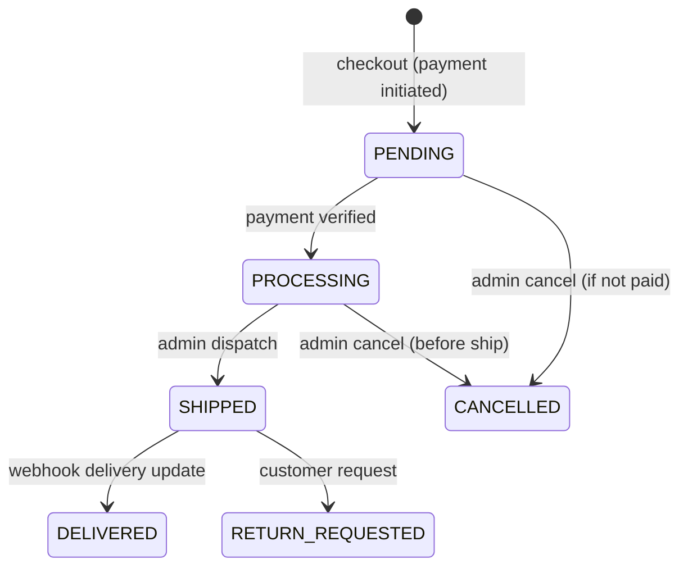

<div align="center">

  # Orders Module
  
  **The ACID‑compliant checkout engine – payment verification, invoice generation, and logistic dispatch.**

  [](#)
  [](#)
  [](#)

</div>

---

## 📖 Table of Contents

- [Base Route](#base-route)
- [Endpoints Overview](#endpoints-overview)
- [Endpoint Details](#endpoint-details)
  - [Customer Endpoints](#customer-endpoints)
    - [POST /checkout](#post-checkout)
    - [POST /verify-payment](#post-verify-payment)
    - [GET /my-order](#get-my-order)
    - [GET /:id/invoice](#get-idinvoice)
  - [Admin Endpoints](#admin-endpoints)
    - [GET /admin](#get-admin)
    - [POST /admin/:id/dispatch](#post-adminiddispatch)
    - [PATCH /admin/:id/status](#patch-adminidstatus)
  - [Webhooks (Public)](#webhooks-public)
    - [POST /webhook](#post-webhook)
    - [POST /shiprocket-webhook](#post-shiprocket-webhook)
- [Validation Rules (Zod)](#validation-rules-zod)
- [Error Responses](#error-responses)
- [Runbook](#runbook)

---

## Base Route  :  `/api/v1/orders`  


Customer endpoints require a valid access token. Admin endpoints require `ADMIN` role. Webhooks are public but cryptographically verified.

---

## Endpoints Overview

| Method | Endpoint | Access | Description |
|--------|----------|--------|-------------|
| **Customer** | | | |
| `POST` | `/checkout` | Private (Bearer) | Create an order, deduct stock, initiate Razorpay payment |
| `POST` | `/verify-payment` | Private (Bearer) | Verify Razorpay payment signature after successful checkout |
| `GET` | `/my-order` | Private (Bearer) | Fetch authenticated user's order history (paginated) |
| `GET` | `/:id/invoice` | Private (Bearer) | Stream PDF invoice for a specific order (IDOR protected) |
| **Admin** | | | |
| `GET` | `/admin` | Admin | Fetch all orders across the platform (fulfillment dashboard) |
| `POST` | `/admin/:id/dispatch` | Admin | Generate AWB via Shiprocket, mark order as shipped |
| `PATCH` | `/admin/:id/status` | Admin | Manually update order status (state machine) |
| **Webhooks** | | | |
| `POST` | `/webhook` | Public (HMAC) | Razorpay payment confirmation webhook |
| `POST` | `/shiprocket-webhook` | Public (API Key) | Shiprocket delivery status updates |

> Rate limits: `standardLimiter` on all endpoints; `checkoutLimiter` (5/hour) on `/checkout`.

---

## Endpoint Details

### Customer Endpoints

#### `POST /checkout`

Convert the user's cart into an order. This is an **ACID transaction** that:
- Validates stock for all items (rolls back if any item is out of stock).
- Calculates final total (after coupon discount).
- Creates an order document (status `PENDING`).
- Dedicates stock (reduces `currentStock`).
- Returns a Razorpay order ID for frontend payment.

**Headers:** `Authorization: Bearer <access_token>`  
**Rate limit:** `checkoutLimiter` (5 per hour per IP)

**Request body:**

```json
{
  "addressId": "64a7b...",
  "paymentMethod": "RAZORPAY",
  "couponCode": "DIWALI500"  // optional
}
```  

**Response (200 OK):**  
```json
{
  "success": true,
  "statusCode": 200,
  "message": "Order created. Proceed to payment.",
  "data": {
    "orderId": "64a7c...",
    "orderNumber": "ORD-12345",
    "razorpayOrderId": "order_xyz123",
    "amount": 850,
    "currency": "INR"
  },
  "timestamp": "2026-05-22T10:30:00.000Z"
}
```  

> The cart is **not cleared** until payment verification. If payment fails, stock remains reserved but can be released after timeout.  

### `POST /verify-payment`

After the frontend completes Razorpay payment, call this endpoint to verify the signature and confirm the order.

**Headers:**  
`Authorization: Bearer <access_token>`  

**Request body:**  

```json
{
  "orderId": "64a7c...",           // Reshma order ID
  "razorpayPaymentId": "pay_xyz",
  "razorpaySignature": "signature_string"
}
```  

**Response (200 OK):**  
```json
{
  "success": true,
  "statusCode": 200,
  "message": "Payment verified. Order confirmed.",
  "data": {
    "orderStatus": "PROCESSING",
    "orderNumber": "ORD-12345"
  },
  "timestamp": "2026-05-22T10:35:00.000Z"
}
```  

> After verification, the user's cart is cleared, and stock is permanently committed. An order confirmation email is queued.  

### `POST /verify-payment`

After the frontend completes Razorpay payment, call this endpoint to verify the signature and confirm the order.

**Headers:**  
`Authorization: Bearer <access_token>`

---

### `GET /my-order`

Fetch the authenticated user's order history with pagination.

**Headers:**  
`Authorization: Bearer <access_token>`

**Query parameters:**

| Param | Type | Default | Description |
|-------|------|---------|-------------|
| `page` | integer | `1` | Page number |
| `limit` | integer | `10` | Items per page (max 50) |
| `status` | string | – | Filter by order status (e.g., `DELIVERED`, `PROCESSING`) |  

**Response (200 OK):**  

```json
{
  "success": true,
  "statusCode": 200,
  "message": "Orders retrieved successfully",
  "data": {
    "orders": [
      {
        "_id": "...",
        "orderNumber": "ORD-12345",
        "orderStatus": "DELIVERED",
        "pricing": { "subtotal": 900, "discount": 50, "totalAmount": 850 },
        "createdAt": "2026-05-20T12:00:00.000Z"
      }
    ],
    "meta": { "total": 15, "limit": 10, "page": 1 }
  },
  "timestamp": "2026-05-22T10:40:00.000Z"
}
```  

### `GET /:id/invoice`

Stream a PDF invoice for a specific order. The endpoint checks that the order belongs to the authenticated user (IDOR protection).

**Headers:**  
`Authorization: Bearer <access_token>`

**URL Parameter:**  
- `id` – Reshma order ID (not `orderNumber`).

**Response:** PDF file stream (`Content-Type: application/pdf`).

**Error:** `403 Forbidden` if order does not belong to user.  

## Admin Endpoints  

### `GET /admin`

Fetch all orders across the platform for the fulfillment dashboard. Supports filtering by status, date range, and pagination.

**Headers:**  
`Authorization: Bearer <admin_access_token>`

**Query parameters:**

| Param | Type | Default | Description |
|-------|------|---------|-------------|
| `page` | integer | `1` | Page number |
| `limit` | integer | `20` | Items per page (max 100) |
| `status` | string | – | Filter by order status |
| `startDate` | ISO date | – | Filter orders created after this date |
| `endDate` | ISO date | – | Filter orders created before this date |

**Response (200 OK):** Paginated list of orders with customer details.  

### `POST /admin/:id/dispatch`

Generate a Shiprocket AWB (airway bill) and mark the order as `SHIPPED`. Requires physical package dimensions.

**Headers:**  
`Authorization: Bearer <admin_access_token>`

**URL Parameter:**  
- `id` – Reshma order ID.  

**Request body:**  

```json
{
  "length": 15,
  "breadth": 10,
  "height": 5,
  "weight": 0.5
}
```  

**Response (200 OK):**  

```json
{
  "success": true,
  "statusCode": 200,
  "message": "Order dispatched successfully",
  "data": {
    "orderStatus": "SHIPPED",
    "trackingNumber": "AWB123456",
    "courierName": "Delhivery"
  },
  "timestamp": "2026-05-22T11:00:00.000Z"
}
```  

> Idempotency: Dispatching an already shipped order returns `409 Conflict`.  

### `PATCH /admin/:id/status`

Manually update the order status (state machine). Useful for marking orders as `DELIVERED` if tracking webhook fails.

**Headers:**  
`Authorization: Bearer <admin_access_token>`

**URL Parameter:**  
- `id` – Reshma order ID.  

**Request body:**  
```json
{
  "status": "DELIVERED"
}
```  

> **Allowed transitions:** `PENDING` → `PROCESSING` → `SHIPPED` → `DELIVERED`. Also `CANCELLED` (before shipment).  

**Response (200 OK):** Returns updated order.  

---  

## Webhooks  

### `POST /webhook`

Razorpay webhook for asynchronous payment confirmation. Uses HMAC signature verification.

**Headers:**  
`x-razorpay-signature: <signature>`

**Request body:** Raw JSON from Razorpay.

**Response (200 OK):**  
```json
{
  "status": "success"
}
```  

### `POST /shiprocket-webhook`

Shiprocket delivery status update webhook. Updates order status to `DELIVERED` or `RETURNED`.

**Headers:**  
`x-api-key: <SHIPROCKET_WEBHOOK_SECRET>`

**Request body:** Shiprocket payload (AWB, current_status, etc.)

**Response (200 OK):**  
```json
{
  "status": "success",
  "received": true
}
```  

> **Note:** Invalid API key returns `401 Unauthorized`.  

---  

## Validation Rules (Zod)

| Endpoint | Field | Rules |
|----------|-------|-------|
| `/checkout` | `addressId` | valid ObjectId, required |
| | `paymentMethod` | enum `["RAZORPAY"]`, required |
| | `couponCode` | string, optional |
| `/verify-payment` | `orderId` | valid ObjectId, required |
| | `razorpayPaymentId` | string, required |
| | `razorpaySignature` | string, required |
| `/admin/:id/dispatch` | `length` | number > 0, required |
| | `breadth` | number > 0, required |
| | `height` | number > 0, required |
| | `weight` | number > 0, required |
| `/admin/:id/status` | `status` | enum `["PROCESSING", "SHIPPED", "DELIVERED", "CANCELLED"]`, required |

> All schemas use `.strict()`.  

---  

## Error Responses

| Status | Code | Example message | When |
|--------|------|----------------|------|
| 400 | `BAD_REQUEST` | `"Negative dimensions not allowed"` | Zod validation fails |
| 401 | `UNAUTHORIZED` | `"Authentication required"` | Missing token |
| 403 | `FORBIDDEN` | `"You do not have permission to view this invoice"` | IDOR on invoice |
| 404 | `NOT_FOUND` | `"Order not found"` | Invalid order ID |
| 409 | `CONFLICT` | `"This order has already been dispatched"` | Duplicate dispatch attempt |
| 409 | `CONFLICT` | `"Insufficient stock for product X"` | Checkout stock validation fails |
| 429 | `TOO_MANY_REQUESTS` | `"Checkout limit exceeded"` | >5 checkouts per hour |  

---  

## Order Status State Machine  



## Runbook

For manual testing with Thunder Client / Postman, see `../../testing/order-runbook.md`. The runbook covers:

- Checkout flow (create order, get Razorpay order ID)
- Payment verification (mock or real)
- Invoice download (IDOR test)
- Admin dispatch (dimensions validation)
- Webhook simulation

---  

## Related Documentation

- [Cart Module](./cart.md) – cart is consumed during checkout.
- [Coupons Module](./coupons.md) – coupon application.
- [Returns Module](./returns.md) – return requests after delivery.
- [Authentication Guide](../authentication.md) – admin token requirements.
- [Error Handling Guide](../error-codes.md) – 409 conflict handling.  

---  

<div align="center">

Secure checkout, seamless logistics – the Reshma‑Core order engine.
</div>  
