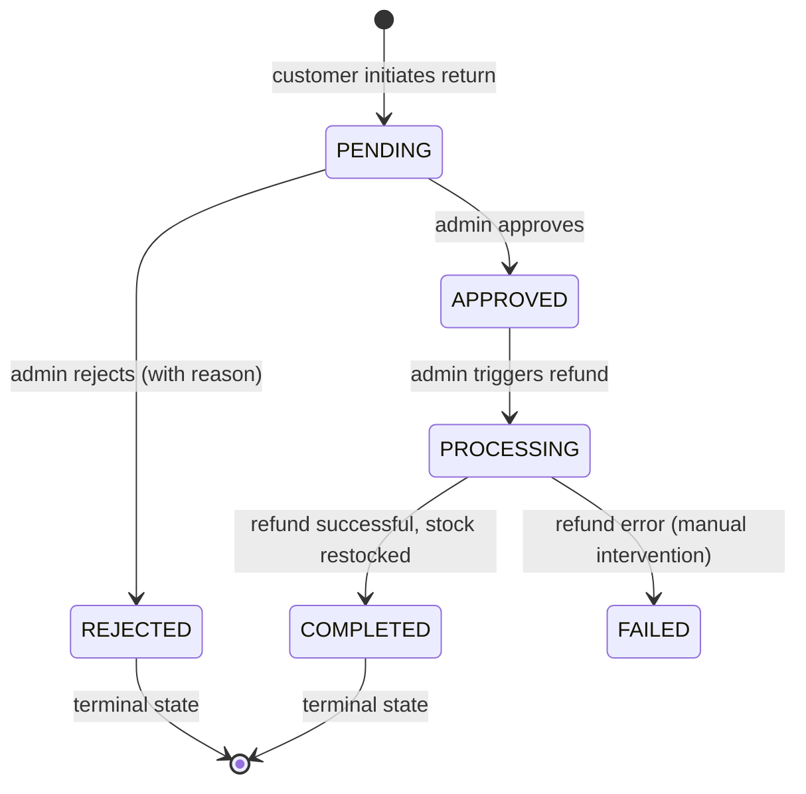

<div align="center">

  # Returns Module
  
  **The RMA (Return Merchandise Authorization) engine – customer initiation, admin arbitration, refund processing, and automated restocking.**

  [](#)
  [](#)
  [](#)

</div>

---

## 📖 Table of Contents

- [Base Route](#base-route)
- [Endpoints Overview](#endpoints-overview)
- [Return State Machine](#return-state-machine)
- [Endpoint Details](#endpoint-details)
  - [Customer Endpoints](#customer-endpoints)
    - [POST /:orderId/initiate](#post-orderidinitiate)
    - [GET /me](#get-me)
  - [Admin Endpoints](#admin-endpoints)
    - [GET /admin](#get-admin)
    - [PATCH /admin/:returnId/arbitrate](#patch-adminreturnidarbitrate)
    - [POST /admin/:returnId/process](#post-adminreturnidprocess)
- [Validation Rules (Zod)](#validation-rules-zod)
- [Error Responses](#error-responses)
- [Runbook](#runbook)

---

## Base Route  :  `/api/v1/returns`  

Customer endpoints require a valid access token (`USER` role). Admin endpoints require `ADMIN` role.

---

## Endpoints Overview

| Method | Endpoint | Access | Description |
|--------|----------|--------|-------------|
| **Customer** | | | |
| `POST` | `/:orderId/initiate` | Private (Bearer) | Initiate a return request for a delivered order |
| `GET` | `/me` | Private (Bearer) | Fetch authenticated user's return history |
| **Admin** | | | |
| `GET` | `/admin` | Admin | Fetch all return requests (arbitration queue) |
| `PATCH` | `/admin/:returnId/arbitrate` | Admin | Approve or reject a return request (with reason) |
| `POST` | `/admin/:returnId/process` | Admin | Execute Razorpay refund and restock inventory |

> Rate limits: `standardLimiter` (100/15min) on all endpoints.

---

## Return State Machine



**Business rules:**  

- Returns can only be initiated within **7 days** of order delivery.
- Certain product categories (`INNERWEAR`) are **non‑returnable** (hygiene policy).
- Fragile items require uploaded images as proof (Cloudinary).    

---  

## Customer Endpoints

### `POST /:orderId/initiate`

Initiate a return request for a specific delivered order. The user can request return for specific items (partial returns allowed). Images are required for fragile items.

**Headers:**  
- `Authorization: Bearer <access_token>`
- `Content-Type: multipart/form-data` (if images included) or `application/json`

**URL Parameter:**  
- `orderId` – valid MongoDB ObjectId of the delivered order.

**Request body (JSON / form-data):**

| Field | Type | Required | Description |
|-------|------|----------|-------------|
| `items` | array | Yes | List of items to return |
| `items[].productId` | string | Yes | Product ID being returned |
| `items[].quantity` | integer | Yes | Quantity to return (≤ purchased quantity) |
| `items[].reason` | string | Yes | `DEFECTIVE`, `WRONG_ITEM`, `SIZE_ISSUE`, `NOT_LIKED` |
| `items[].customerNote` | string | No | Additional details (max 500 chars) |
| `images` | file array | Conditional | Required if any item has `isFragile: true` (max 5 images) |  

**Example request (JSON without images):**  

```json
{
  "items": [
    {
      "productId": "64a7b...",
      "quantity": 1,
      "reason": "DEFECTIVE",
      "customerNote": "The bangle arrived cracked."
    }
  ]
}
```  

**Response (201 Created):**  

```json
{
  "success": true,
  "statusCode": 201,
  "message": "Return request submitted successfully",
  "data": {
    "_id": "64a7c...",
    "returnNumber": "RET-9A4B2",
    "status": "PENDING",
    "items": [...],
    "createdAt": "2026-05-22T10:30:00.000Z"
  },
  "timestamp": "2026-05-22T10:30:00.000Z"
}
```  
**Business validation:**  
- Order must be `DELIVERED` (not `PROCESSING` or `SHIPPED`).
- Return window: `currentDate ≤ order.deliveredAt + 7 days`.
- Hygiene products (`itemType: "INNERWEAR"`) cannot be returned (returns `403 Forbidden`).  

### `GET /me`

Fetch the authenticated user's return request history (paginated).

**Headers:**  
`Authorization: Bearer <access_token>`

**Query parameters:**

| Param | Type | Default | Description |
|-------|------|---------|-------------|
| `page` | integer | `1` | Page number |
| `limit` | integer | `10` | Items per page (max 50) |
| `status` | string | – | Filter by `PENDING`, `APPROVED`, `REJECTED`, `COMPLETED` |  

**Response (200 OK):**  

```json
{
  "success": true,
  "statusCode": 200,
  "message": "Returns retrieved successfully",
  "data": {
    "returns": [
      {
        "_id": "...",
        "returnNumber": "RET-9A4B2",
        "status": "COMPLETED",
        "items": [...],
        "refundAmount": 450,
        "createdAt": "2026-05-20T12:00:00.000Z"
      }
    ],
    "meta": { "total": 5, "limit": 10, "page": 1 }
  },
  "timestamp": "2026-05-22T10:35:00.000Z"
}
```  

---  

## Admin Endpoints

### `GET /admin`

Fetch all return requests across the platform for the arbitration queue. Supports filtering by status.

**Headers:**  
`Authorization: Bearer <admin_access_token>`

**Query parameters:**

| Param | Type | Default | Description |
|-------|------|---------|-------------|
| `page` | integer | `1` | Page number |
| `limit` | integer | `20` | Items per page (max 100) |
| `status` | string | – | Filter by return status |

**Response (200 OK):** Paginated list of returns with customer details, order reference, and images.

---

### `PATCH /admin/:returnId/arbitrate`

Approve or reject a pending return request. If rejecting, an `adminRejectionReason` is required (Zod validation).

**Headers:**  
`Authorization: Bearer <admin_access_token>`

**URL Parameter:**  
- `returnId` – valid MongoDB ObjectId of the return.  

**Request body:**  

```json
{
  "status": "APPROVED"
}
```  

Or for rejection:  

```json
{
  "status": "REJECTED",
  "adminRejectionReason": "Item does not match the original condition"
}
```  

**Response (200 OK):** Returns the updated return object.  
> After approval, the return is ready for refund processing via `/process`.  


### `POST /admin/:returnId/process`

Execute the refund (via Razorpay) and automatically restock the returned items. This is a non‑reversible action.

**Headers:**  
`Authorization: Bearer <admin_access_token>`

**URL Parameter:**  
- `returnId` – valid MongoDB ObjectId (status must be `APPROVED`).

**Request body:** None (empty).  

**Response (200 OK):**  

```json
{
  "success": true,
  "statusCode": 200,
  "message": "Refund processed and inventory restocked",
  "data": {
    "status": "COMPLETED",
    "refundId": "refund_xyz123",
    "refundAmount": 450
  },
  "timestamp": "2026-05-22T11:00:00.000Z"
}
```  

**What happens server‑side:**  
- Calls Razorpay refund API (full or partial).
- Increments `currentStock` for each returned product.
- Updates return status to `COMPLETED`.
- Sends email notification to customer.  

**Error (409):** If refund fails (e.g., insufficient balance in Razorpay), status becomes `FAILED` and requires manual intervention.  

---  

## Validation Rules (Zod)

| Endpoint | Field | Rules |
|----------|-------|-------|
| `/initiate` | `items` | array, min 1 item, required |
| | `items[].productId` | valid ObjectId |
| | `items[].quantity` | integer ≥ 1 |
| | `items[].reason` | enum `["DEFECTIVE","WRONG_ITEM","SIZE_ISSUE","NOT_LIKED"]` |
| | `items[].customerNote` | string, max 500 chars, optional |
| `/admin/:returnId/arbitrate` | `status` | enum `["APPROVED","REJECTED"]`, required |
| | `adminRejectionReason` | required if `status = "REJECTED"` (min 10 chars) |
| `/admin/:returnId/process` | – | No body |

> All schemas use `.strict()` – extra fields are rejected.  

---

## Error Responses

| Status | Code | Example message | When |
|--------|------|----------------|------|
| 400 | `BAD_REQUEST` | `"Admin rejection reason is required when rejecting a return"` | Reject without reason |
| 400 | `BAD_REQUEST` | `"The 7-day return policy window has expired"` | Return initiated too late |
| 401 | `UNAUTHORIZED` | `"Authentication required"` | Missing/invalid token |
| 403 | `FORBIDDEN` | `"Hygiene Policy Violation: This product cannot be returned"` | Innerwear item |
| 403 | `FORBIDDEN` | `"You do not have permission to perform this action"` | Non‑admin on admin route |
| 404 | `NOT_FOUND` | `"Order not found"` | Invalid order ID |
| 409 | `CONFLICT` | `"Return already processed"` | Trying to process an already completed return |
| 409 | `CONFLICT` | `"Return request already exists for this item"` | Duplicate return on same order item |  

---

## Runbook

For manual testing with Thunder Client / Postman, see `../../testing/return-runbook.md`. The runbook covers:

- Initiating a return (within 7 days)
- Admin approval/rejection
- Processing refund and restock
- Edge cases: hygiene policy, 7-day TTL, missing rejection reason  

---  

## Related Documentation

- [Orders Module](./orders.md) – order statuses and delivery dates.
- [Products Module](./products.md) – `isFragile` flag for image requirements.
- [Users Module](./users.md) – customer profiles for return history.
- [Authentication Guide](../authentication.md) – admin token requirements.
- [Error Handling Guide](../error-codes.md) – 403/409 handling.  

---  

<div align="center">

Seamless returns, automated refunds – the Reshma‑Core RMA engine.
</div>  