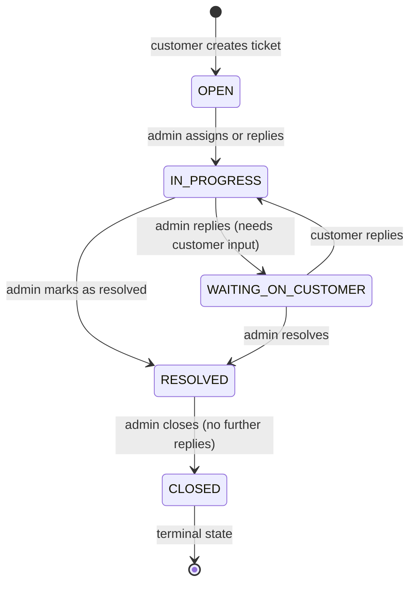

<div align="center">

  # Support Module
  
  **The decentralized, state‑driven ticketing engine – threaded conversations, polymorphic entity linking, and DPDP‑compliant privacy redaction.**

  [](#)
  [](#)
  [](#)
  [](#)

</div>

---

## 📖 Table of Contents

- [Base Route](#base-route)
- [Endpoints Overview](#endpoints-overview)
- [Ticket State Machine](#ticket-state-machine)
- [Endpoint Details](#endpoint-details)
  - [Customer Endpoints](#customer-endpoints)
    - [POST /tickets](#post-tickets)
    - [POST /tickets/:ticketId/reply](#post-ticketsticketidreply)
    - [GET /tickets/me](#get-ticketsme)
  - [Admin Endpoints](#admin-endpoints)
    - [GET /admin/tickets](#get-admintickets)
    - [POST /admin/tickets/:ticketId/reply](#post-adminticketsticketidreply)
    - [PATCH /admin/tickets/:ticketId/state](#patch-adminticketsticketidstate)
- [Validation Rules (Zod)](#validation-rules-zod)
- [Error Responses](#error-responses)
- [Runbook](#runbook)

---

## Base Route  :  `/api/v1/support`  

Customer endpoints require a valid access token with `USER` role. Admin endpoints require `ADMIN` role.

---

## Endpoints Overview

| Method | Endpoint | Access | Description |
|--------|----------|--------|-------------|
| **Customer** | | | |
| `POST` | `/tickets` | Private (Bearer) | Create a new support ticket (with optional linked entity and images) |
| `POST` | `/tickets/:ticketId/reply` | Private (Bearer) | Customer replies to an existing ticket |
| `GET` | `/tickets/me` | Private (Bearer) | Fetch authenticated user's ticket history (paginated) |
| **Admin** | | | |
| `GET` | `/admin/tickets` | Admin | View all tickets across the platform (arbitration queue) |
| `POST` | `/admin/tickets/:ticketId/reply` | Admin | Admin replies to a customer ticket (auto‑shifts state) |
| `PATCH` | `/admin/tickets/:ticketId/state` | Admin | Update ticket status, priority, or assign to an admin |

> Rate limits: `standardLimiter` (100/15min) on all endpoints.

---

## Ticket State Machine

Tickets follow a strict state machine to keep the arbitration queue clean.



**Auto‑state shifts based on sender role:**  

| Sender | Previous Status | New Status |
|--------|----------------|------------|
| Admin (any) | `OPEN`, `IN_PROGRESS`, `RESOLVED` | `WAITING_ON_CUSTOMER` |
| Customer | `WAITING_ON_CUSTOMER` | `IN_PROGRESS` |
| Customer | `OPEN` | stays `OPEN` |
| Customer | `RESOLVED` | stays `RESOLVED` (no auto‑reopen) |  

> Once a ticket is `CLOSED`, any reply attempt returns `403 Forbidden` – user must create a new ticket.  

---  

## Customer Endpoints

### `POST /tickets`

Create a new support ticket. Optionally link to an order, product, or return (polymorphic). Images can be attached (max 3, each ≤10MB).

**Headers:** `Authorization: Bearer <access_token>`  
**Content-Type:** `multipart/form-data`

**Form fields (text):**

| Field | Type | Required | Description |
|-------|------|----------|-------------|
| `subject` | string | Yes | Ticket subject (5‑150 chars) |
| `category` | string | Yes | `ORDER_ISSUE`, `PAYMENT_ISSUE`, `RETURN_ISSUE`, `PRODUCT_INQUIRY`, `TECHNICAL_ISSUE`, `GENERAL` |
| `message` | string | Yes | Initial issue description (10‑3000 chars) |
| `linkedEntity[entityType]` | string | No | `ORDER`, `PRODUCT`, or `RETURN` |
| `linkedEntity[entityId]` | string | No | Valid MongoDB ObjectId of the linked entity |

**File field:**  
- `images` – array of images (max 3, each ≤10MB).  

**Example request (cURL style):**  

```text
subject=Missing item in delivery
category=ORDER_ISSUE
message=I received only 1 bangle set instead of 2.
linkedEntity[entityType]=ORDER
linkedEntity[entityId]=64a7b...
images=@photo1.jpg
```  

**Response (201 Created):**  

```json
{
  "success": true,
  "statusCode": 201,
  "message": "Support ticket created successfully. Our team will respond shortly.",
  "data": {
    "_id": "...",
    "ticketId": "TCK-9A4B2C3D",
    "subject": "Missing item in delivery",
    "category": "ORDER_ISSUE",
    "status": "OPEN",
    "messages": [
      {
        "senderRole": "USER",
        "message": "I received only 1 bangle set instead of 2.",
        "attachments": ["https://res.cloudinary.com/..."],
        "createdAt": "2026-05-22T10:30:00.000Z"
      }
    ]
  },
  "timestamp": "2026-05-22T10:30:00.000Z"
}
```  

> **IDOR protection:** If a linked entity is provided, the server verifies that the user owns the linked order or return before creating the ticket.  

### `POST /tickets/:ticketId/reply`

Add a customer reply to an existing ticket. Attachments allowed.

**Headers:** `Authorization: Bearer <access_token>`  
**Content-Type:** `multipart/form-data`

**URL Parameter:**  
- `ticketId` – the human‑readable ticket ID (e.g., `TCK-9A4B2C3D`), not the MongoDB `_id`.

**Form fields:**

| Field | Type | Required | Description |
|-------|------|----------|-------------|
| `message` | string | Yes | Reply text (2‑3000 chars) |

**File field:**  
- `images` – max 3 images.

**Response (200 OK):** Returns the updated ticket with the new message appended.

> The `senderRole` is hardcoded to `USER` in the controller – customers cannot spoof admin replies.


### `GET /tickets/me`

Fetch the authenticated user's ticket history (paginated).

**Headers:** `Authorization: Bearer <access_token>`

**Query parameters:**

| Param | Type | Default | Description |
|-------|------|---------|-------------|
| `page` | integer | `1` | Page number |
| `limit` | integer | `10` | Items per page (max 50) |
| `status` | string | – | Filter by ticket status |  

**Response (200 OK):**  

```json
{
  "success": true,
  "statusCode": 200,
  "message": "Support tickets retrieved successfully.",
  "data": {
    "tickets": [
      {
        "_id": "...",
        "ticketId": "TCK-9A4B2C3D",
        "subject": "Missing item in delivery",
        "status": "WAITING_ON_CUSTOMER",
        "createdAt": "2026-05-20T10:00:00.000Z"
      }
    ],
    "meta": { "total": 3, "limit": 10, "page": 1 }
  },
  "timestamp": "2026-05-22T10:35:00.000Z"
}
```  

---  

## Admin Endpoints  

### `GET /admin/tickets`

View all tickets across the platform with filtering.

**Headers:** `Authorization: Bearer <admin_access_token>`

**Query parameters:**

| Param | Type | Default | Description |
|-------|------|---------|-------------|
| `page` | integer | `1` | Page number |
| `limit` | integer | `20` | Items per page (max 100) |
| `status` | string | – | Filter by ticket status |
| `priority` | string | – | `LOW`, `MEDIUM`, `HIGH`, `CRITICAL` |
| `category` | string | – | Filter by ticket category |

**Response (200 OK):** Paginated list of tickets with user details (populated) and message preview.

---

### `POST /admin/tickets/:ticketId/reply`

Admin replies to a customer ticket. Auto‑shifts the ticket status to `WAITING_ON_CUSTOMER` (unless already closed).

**Headers:** `Authorization: Bearer <admin_access_token>`  
**Content-Type:** `multipart/form-data`

**URL Parameter:**  
- `ticketId` – human‑readable ticket ID.

**Form fields:** Same as customer reply (`message` + optional images).

**Response (200 OK):** Returns updated ticket with the new admin message.

> After an admin reply, an email notification is sent to the customer (fire‑and‑forget via BullMQ).

---

### `PATCH /admin/tickets/:ticketId/state`

Update ticket status, priority, or assign to another admin. At least one field must be provided.

**Headers:** `Authorization: Bearer <admin_access_token>`  
**Content-Type:** `application/json`

**URL Parameter:**  
- `ticketId` – human‑readable ticket ID.  

**Request body (partial):**  
```json
{
  "status": "CLOSED",
  "priority": "HIGH",
  "assignedAdmin": "64a7b..."
}
```  

**Response (200 OK):** Returns the updated ticket.  

> Assigning an admin is optional – tickets can be unassigned (`assignedAdmin: null`).  

---  

## Validation Rules (Zod)

| Endpoint | Field | Rules |
|----------|-------|-------|
| `POST /tickets` | `subject` | string, 5‑150 chars, required |
| | `category` | enum `TicketCategory`, required |
| | `message` | string, 10‑3000 chars, required |
| | `linkedEntity.entityType` | enum `LinkedEntityType` (`ORDER`, `PRODUCT`, `RETURN`), optional |
| | `linkedEntity.entityId` | valid ObjectId, required if `entityType` present |
| `POST /:ticketId/reply` | `message` | string, 2‑3000 chars, required |
| `PATCH /admin/tickets/:ticketId/state` | `status` | enum `TicketStatus`, optional |
| | `priority` | enum `TicketPriority`, optional |
| | `assignedAdmin` | valid ObjectId, optional |
| | *(at least one field required)* | refine |

> All schemas use `.strict()` – extra fields are rejected.

---  

## Error Responses

| Status | Code | Example message | When |
|--------|------|----------------|------|
| 400 | `BAD_REQUEST` | `"At least one field must be provided for an update"` | Empty state update |
| 401 | `UNAUTHORIZED` | `"Authentication required"` | Missing/invalid token |
| 403 | `FORBIDDEN` | `"This ticket has been closed. Please open a new ticket."` | Reply to closed ticket |
| 403 | `FORBIDDEN` | `"You do not have permission to perform this action"` | Non‑admin on admin route |
| 404 | `NOT_FOUND` | `"The specified order could not be found or does not belong to you"` | Linked entity IDOR check fails |
| 404 | `NOT_FOUND` | `"Support ticket not found"` | Invalid ticket ID |
| 429 | `TOO_MANY_REQUESTS` | `"Too many requests, please try again later."` | Rate limit exceeded |

---  

## Runbook

For manual testing with Thunder Client / Postman, see `../../testing/support-runbook.md`. The runbook covers:

- Customer creating a ticket with linked order
- Customer replying to ticket
- Admin replying (state machine shift to `WAITING_ON_CUSTOMER`)
- Admin updating ticket state (close, escalate priority)
- Edge cases: closed ticket reply, IDOR on linked entity  

---  

## Related Documentation

- [Orders Module](./orders.md) – linked entity type `ORDER`.
- [Products Module](./products.md) – linked entity type `PRODUCT`.
- [Returns Module](./returns.md) – linked entity type `RETURN`.
- [Authentication Guide](../authentication.md) – admin vs customer tokens.
- [Error Handling Guide](../error-codes.md) – 403/404 handling.

---  

<div align="center">

Customer first, privacy compliant – the Reshma‑Core support engine.
</div>  
