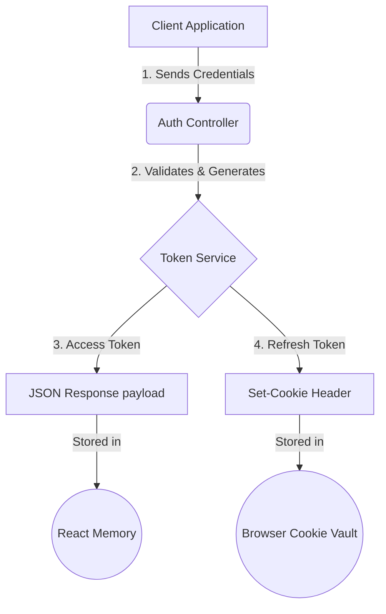
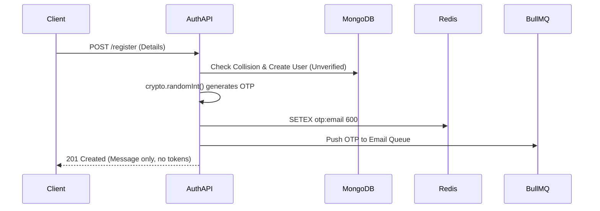
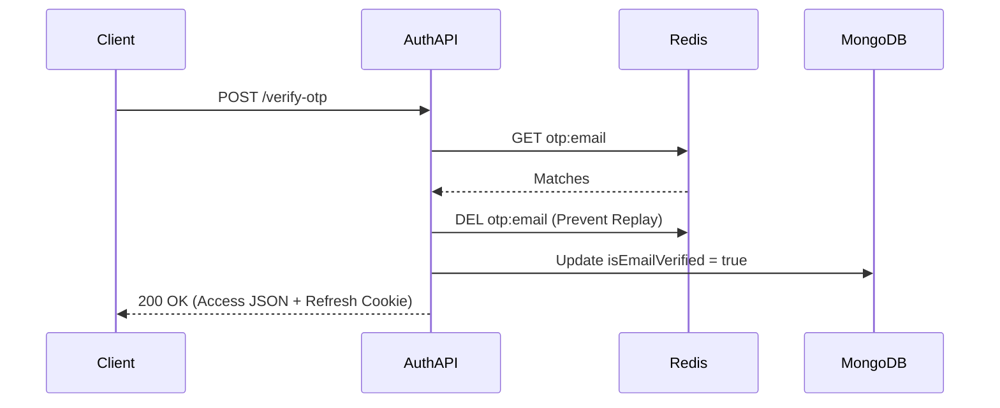
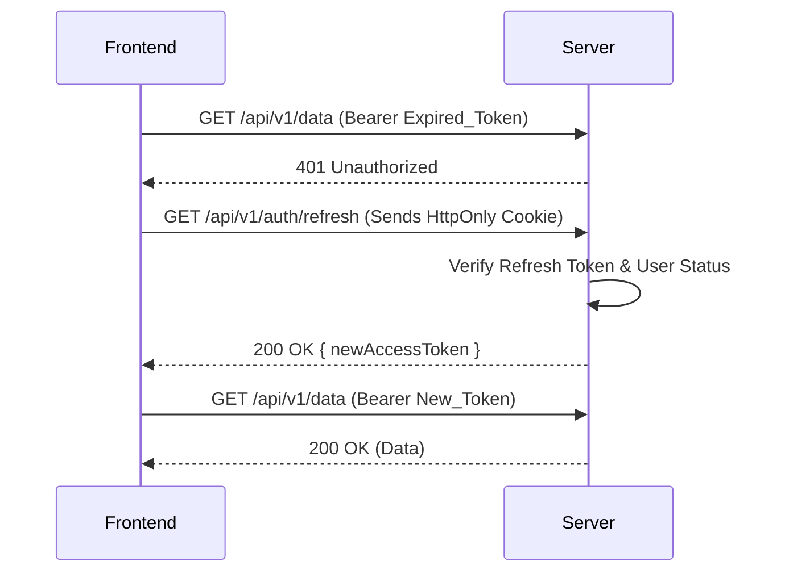
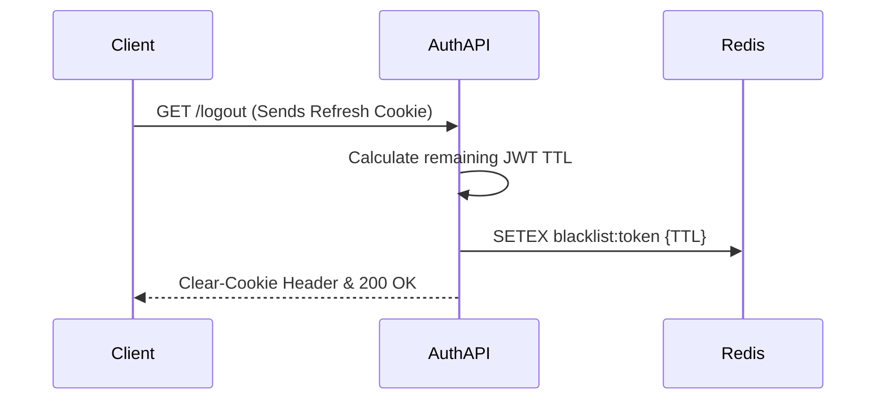
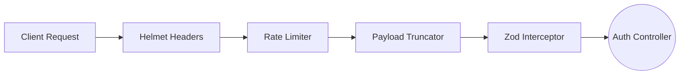

  # Authentication & Security Architecture
  
  **The highly secure, stateless perimeter defending the Reshma-Core platform. Manages identity verification, session persistence, and cryptographic token issuance.**

  
  
  
  

---

## Overview
Reshma-Core utilizes a highly secure, stateless **Two-Token Architecture** combined with a robust **OTP (One-Time Password) Verification Flow**. 

This system is designed to adhere to strict OWASP security standards. It actively mitigates Cross-Site Scripting (XSS), Cross-Site Request Forgery (CSRF), brute-force attacks, and session replay attacks while maintaining a frictionless and seamless user experience.

---

## 1. The Two-Token Security Model
To secure API communications, we strictly prohibit the storage of access tokens in `localStorage` or `sessionStorage` due to severe XSS vulnerabilities. Instead, the session is split across two distinct token types, creating an impenetrable boundary between the application state and the browser cache.

| Token Type | Lifespan | Storage Mechanism | Purpose |
| :--- | :--- | :--- | :--- |
| **Access Token** | 15 Minutes | Frontend Memory (React Context/Zustand) | Attached as a `Bearer` header to authenticate standard API requests. Destroyed instantly upon page refresh. |
| **Refresh Token**| 7 Days | `HttpOnly`, `Secure`, `SameSite=Strict` Cookie | Used silently by the frontend to request a new Access Token. Completely invisible to malicious JavaScript injections. |

### Token Architecture Flow

---

## 2. Core Workflows

### A. Registration & OTP Flow
We utilize a Two-Step asynchronous registration process to prevent database bloat from botnets, ensure data integrity, and keep the main Express thread unblocked.

1. **Initiation:** The user submits registration details. A document is created in MongoDB with the `isEmailVerified` flag set strictly to `false`.
2. **OTP Generation:** A cryptographically secure 6-digit OTP is generated via Node's native `crypto.randomInt()`. 
3. **Caching:** The OTP is cached in **Redis** with a strict 10-minute Time-To-Live (TTL).
4. **Asynchronous Dispatch:** The OTP payload is pushed to the `email-queue` (BullMQ). This allows the HTTP response to return to the client in milliseconds, while a background worker executes the heavy SMTP handshake.
5. **Safe Collision Recovery:** If an unverified user registers again (e.g., recovering from a typo or abandoned session), the system safely overwrites their previous document and issues a new OTP. This prevents frustrating `409 Conflict` errors for genuine users.

### B. Verification Flow
The Verification Flow is the gateway to account activation. It includes strict Replay Attack prevention.

1. User submits the received OTP.
2. The system queries Redis. If the OTP is invalid or expired, it rejects the request.
3. **Replay Mitigation:** The instant the OTP is validated, the Redis key is deleted (`DEL otp:email`). It can never be used twice.
4. The user's MongoDB document is updated to `isEmailVerified: true`.
5. The `NotificationService` triggers the Welcome Sequence (firing both an email and a persistent in-app DB alert).
6. The system issues the initial Two-Token session.

### C. Standard Login Flow
1. User submits credentials. The Zod Interceptor guarantees payload shape and sanitizes inputs (e.g., lowercasing emails).
2. The `AuthService` queries MongoDB, explicitly selecting the hidden `password` field.
3. `bcrypt.compare()` verifies the hash.
4. **Gatekeeper Enforcement:** The system checks two boolean flags:
   - `isActive: true` (Admin ban check)
   - `isEmailVerified: true` (Onboarding check)
5. Telemetry is updated (`lastLogin` timestamp), and the Two-Token session is issued.

### D. Silent Token Refresh Flow
To balance extreme security (15-minute access tokens) with seamless UX, the system utilizes a silent refresh mechanism.

1. The frontend API interceptor (e.g., Axios) detects a `401 Unauthorized` or notes the token expiration.
2. The frontend halts the queued requests and hits `GET /api/v1/auth/refresh`.
3. The browser automatically attaches the `HttpOnly` Refresh Cookie.
4. The server cryptographically verifies the Refresh Token and checks the database to ensure the user hasn't been banned since their last login.
5. A fresh 15-minute Access Token is returned, and the frontend resumes its queued requests.

### E. Secure Logout Flow
Because JWTs are fundamentally stateless, they cannot be "deleted" from the server. Logout requires a hybrid approach.

1. The server extracts the active Refresh Token from the incoming request cookie.
2. **Redis Blacklisting:** The token's signature is pushed to a Redis Blacklist. The TTL of this Redis entry perfectly matches the remaining natural lifespan of the JWT to prevent memory bloat.
3. The server sets an immediate expiration on the client's `HttpOnly` cookie, forcing the browser to destroy it.
4. Future requests using the blacklisted token are caught by the `protect` middleware, which cross-references Redis.

---

## 3. Defense Mechanisms & Request Interceptors

Every request must survive a gauntlet of security middlewares before reaching the presentation layer (`AuthController`).

* **Helmet:** Secures the Express app by setting essential HTTP headers. Defends against MIME sniffing, Clickjacking, and disables the `X-Powered-By` fingerprint.
* **Tiered Rate Limiting (Redis-Backed):**
  * `standardLimiter`: Applied globally to prevent basic DDoS attempts.
  * `authLimiter`: A highly restrictive limit applied exclusively to `/auth` endpoints to neutralize credential stuffing and brute-force password cracking.
* **Payload Truncation:** `express.json({ limit: '10kb' })` physically drops requests with massive payloads, preventing memory exhaustion (OOM) attacks.
* **Zod Validation Interceptor:** Acts as an absolute firewall. It strictly parses the `req.body` against predefined schemas. If an attacker injects arbitrary fields (e.g., `role: "ADMIN"` or `isEmailVerified: true` during registration), Zod strips them out, guaranteeing the Controller receives 100% sanitized data.

---

## 4. Environment Variables Required
The authentication module relies on the strict presence of these environment variables defined in `src/config/env.ts`. The server will intentionally crash on boot if these are misconfigured, utilizing a "Fail-Fast" architecture.

* `JWT_ACCESS_SECRET` / `JWT_ACCESS_EXPIRES_IN` (e.g., `15m`)
* `JWT_REFRESH_SECRET` / `JWT_REFRESH_EXPIRES_IN` (e.g., `7d`)
* `REDIS_URL` (For caching OTPs and Blacklists)
* `GOOGLE_CLIENT_ID` / `GOOGLE_CLIENT_SECRET` (For OAuth integrations)