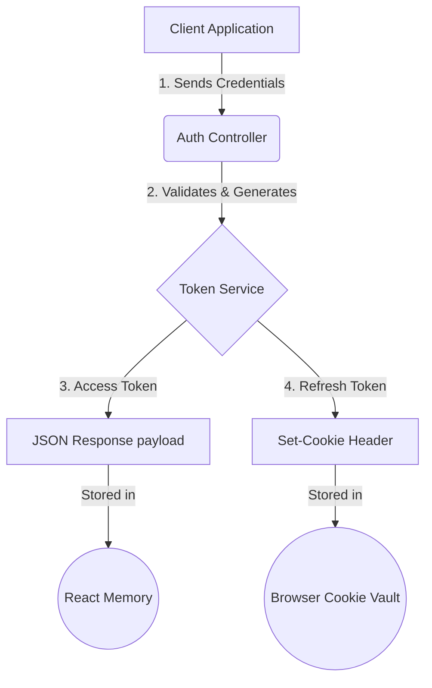
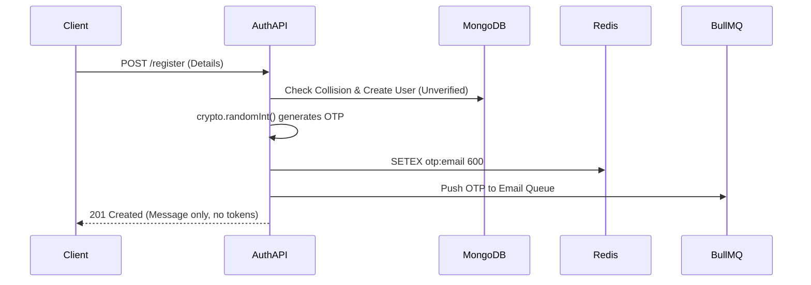
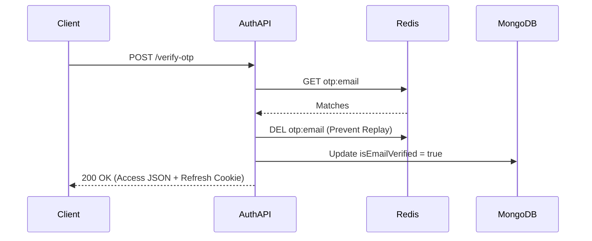
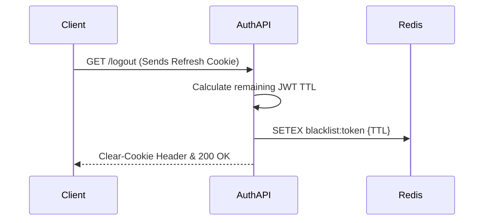
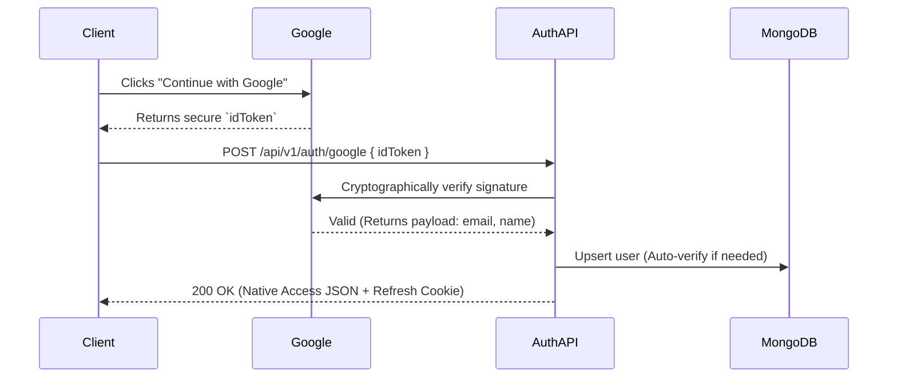
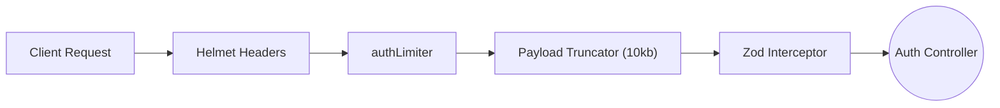

  # Authentication & Security Architecture
  
  **The highly secure, stateless perimeter defending the Reshma-Core platform. Manages identity verification, session persistence, and cryptographic token issuance.**

  
  
  
  

---

## Overview

Reshma-Core uses a **stateless two‑token architecture** combined with an **OTP verification flow**. It adheres to OWASP standards, mitigating XSS, CSRF, brute‑force attacks, and session replay while maintaining a seamless user experience.

All authentication routes are prefixed with `/api/v1/auth` and protected by a dedicated `authLimiter` (10 requests per hour per IP) to prevent brute‑force and credential stuffing.

---

## 1. The Two‑Token Security Model

We **do not** store access tokens in `localStorage` or `sessionStorage`. Instead, the session is split:

| Token Type | Lifespan | Storage Mechanism | Purpose |
| :--- | :--- | :--- | :--- |
| **Access Token** | 15 minutes | Frontend memory (React state / Zustand) | Attached as `Authorization: Bearer <token>` for API requests. Destroyed on page refresh. |
| **Refresh Token** | 7 days | `HttpOnly`, `Secure`, `SameSite=Strict` cookie | Used silently to obtain a new access token. Invisible to JavaScript – immune to XSS. |

### Token Flow

---  

## 2. Core Workflows

### A. Registration & OTP Flow

1. User submits registration details → user created with `isEmailVerified: false`.
2. 6‑digit OTP generated via `crypto.randomInt()` and stored in Redis with 10‑minute TTL.
3. OTP email job pushed to BullMQ (async).
4. **Safe collision recovery:** If an unverified user registers again, we overwrite credentials and issue a fresh OTP (no `409 Conflict`).  

### B. OTP Verification

- User submits OTP → validated against Redis.
- **Replay attack prevention:** Redis key is deleted immediately after successful verification.
- User marked `isEmailVerified: true`, welcome sequence triggered, two‑token session issued.  

### C. Login

- Credentials validated; password field is explicitly selected (`+password`).
- Gatekeepers check `isEmailVerified` and `isActive`.
- `lastLogin` timestamp updated; two‑token session issued.

### D. Silent Token Refresh

- Frontend interceptor detects `401` → calls `GET /auth/refresh`.
- Browser automatically sends HttpOnly refresh cookie.
- Server verifies token, checks user still exists and is active, returns a new access token.

### E. Logout & Redis Blacklisting

- Refresh token extracted from cookie.
- Token signature added to Redis blacklist with TTL equal to its remaining lifespan.
- Cookie cleared on client.  

### F. Google OAuth (Client‑Side Flow)

- Frontend obtains Google `idToken` and sends it to `POST /auth/google`.
- Backend cryptographically verifies the token using `google-auth-library`.
- If user exists (local, unverified), email is auto‑verified.
- If user does not exist, a new account is created with `authProvider: "GOOGLE"`.
- Native two‑token session is issued (Google token discarded).  

---  

## 3. Defense Mechanisms & Request Interceptors  

Every auth request passes through a security pipeline:  

- **Helmet** – sets secure HTTP headers, removes `X-Powered-By`.
- **Rate limiting** – `authLimiter`: 10 requests per hour per IP.
- **Payload truncation** – `express.json({ limit: '10kb' })` prevents OOM attacks.
- **Zod validation** – strict schemas (e.g., `RegisterSchema`, `LoginSchema`) sanitise inputs and strip undocumented fields.  

---  

## 4. HTTP Status Codes (Authentication)

The module uses standard codes from `src/shared/constant/http-codes.ts`:

| Status | Constant | Typical Scenario |
|--------|----------|------------------|
| 200 | `OK` | Login success, token refresh, OTP verification. |
| 201 | `CREATED` | Registration initiated (user created). |
| 400 | `BAD_REQUEST` | Validation failure (Zod), expired/invalid OTP. |
| 401 | `UNAUTHORIZED` | Missing/expired access token, invalid credentials. |
| 403 | `FORBIDDEN` | Email not verified, account deactivated. |
| 409 | `CONFLICT` | Verified email already exists (registration). |
| 429 | `TOO_MANY_REQUESTS` | Rate limit exceeded (10 per hour). |  

---  

## 5. Environment Variables

The following variables are required (validated by `env.ts`):

| Variable | Example | Description |
|----------|---------|-------------|
| `JWT_ACCESS_SECRET` | 64‑char hex | Secret for signing access tokens. |
| `JWT_ACCESS_EXPIRES_IN` | `15m` | Access token lifespan. |
| `JWT_REFRESH_SECRET` | 64‑char hex | Secret for signing refresh tokens. |
| `JWT_REFRESH_EXPIRES_IN` | `7d` | Refresh token lifespan. |
| `REDIS_URL` | `redis://localhost:6379` | Used for OTP storage and blacklist. |
| `GOOGLE_CLIENT_ID` | `xxx.apps.googleusercontent.com` | Google OAuth client ID. |  

---  

## 6. Related Files

| File | Purpose |
|------|---------|
| `auth.controller.ts` | HTTP boundary – receives validated payloads, issues tokens, sets cookies. |
| `auth.service.ts` | Core business logic – OTP generation, Redis interactions, Google verification. |
| `auth.routes.ts` | Route definitions – applies rate limiter, validation, and authentication. |
| `auth.utils.ts` | Token signing and cookie management. |
| `dtos/*.dto.ts` | Zod schemas for registration, login, OTP verification, etc. |
| `protect (auth.middleware.ts)` | JWT verification and user loading (used on protected routes). |
| `../middlewares/rate-limit.middleware.ts` | Distributed rate limiting with Redis. |  

---  

## Next Steps

- See [Middleware & Validation](./middleware-and-validation.md) for a detailed breakdown of the request pipeline.
- Explore the [Notification Module](../modules/notification-module.md) for email queue handling.
- Read the [Environment Variables](../getting-started/environment-variables.md) Guide for full configuration.  

--- 

*The Reshma-Core Team*  