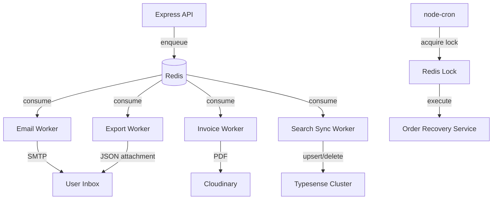

<div align="center">

  # Background Jobs & Cron Architecture
  
  **The decoupled message broker and distributed locking strategy for Reshma-Core.**

  [](#)
  [](#)
  [](#)

</div>

## 1. Process Segregation Strategy

Node.js runs on a single‑threaded event loop. If the Express API gateway compiles complex HTML, renders PDFs, or runs heavy aggregations, the main thread blocks – causing dropped HTTP requests and latency spikes for all users.

Reshma‑Core strictly enforces **process segregation**: all CPU‑intensive, network‑latent, or legally sensitive tasks are offloaded from the Express API to isolated background workers using a **producer/consumer** architecture.

---

## 2. Architectural Decision Record: Why BullMQ + Redis?

Before standardising on BullMQ with Redis, we evaluated two common alternatives.

| Alternative | Why Rejected |
|-------------|---------------|
| **Native in‑memory (`setTimeout`/Promises without `await`)** | Jobs disappear on container crash or restart. No retry mechanism. |
| **Cloud‑native queues (AWS SQS, Google PubSub)** | Vendor lock‑in, high network latency, complex local development (requires cloud credentials). |

**✅ BullMQ + Redis – The Winning Solution**

- **Sub‑millisecond enqueuing** – Redis operates in RAM, keeping API response times fast.
- **Persistence** – Redis snapshots survive container restarts.
- **Enterprise features** – concurrency control, exponential backoff, strict TypeScript integration.
- **No external dependencies for local dev** – runs with a local Redis instance.

---

## 3. Dual Redis Client Strategy

Reshma‑Core uses two distinct Redis connection pools to prevent network starvation.

| Connection | Library | Purpose | Configuration |
|------------|---------|---------|---------------|
| **Primary Cache** | `redis` (node‑redis) | Rate limiting, JWT blacklist, distributed locks, edge cache. | Standard timeouts; fail‑fast for HTTP requests. |
| **Worker Cache** | `ioredis` | BullMQ queues (email, invoice, export, search sync). | `maxRetriesPerRequest: null` – prevents queue stalling if Redis blips. |

**Why two separate clients?**  
The primary client handles low‑latency API operations; the worker client is optimised for long‑running background jobs. If one fails, the other remains unaffected.

---

## 4. Active Background Queues

All queues are defined in `src/shared/queues/` and consumed by worker processes. The API acts as the producer; workers run in separate threads (or separate containers).

### 4.1 Email Queue (`email.queue.ts` + `email.worker.ts`)

**Purpose:** Dispatch all transactional emails (OTP, welcome, order updates, returns, support).  
**Producer:** `NotificationService` calls `dispatchEmailJob(payload)`.  
**Worker behaviour:**  
- Uses `maxRetriesPerRequest: null` on its ioredis connection.
- Retries failed jobs 3 times with exponential backoff (2s, 4s, 8s).
- Compiles HTML templates via `NotificationService.compileEmailTemplate()` (which supports MJML).
- For `DATA_EXPORT` jobs, attaches a JSON file as an email attachment (DPDP compliance).

**Code snippet (producer):**
```typescript
export const dispatchEmailJob = async (payload: EmailJobPayload) => {
  await emailQueue.add(payload.type, payload, {
    attempts: 3,
    backoff: { type: "exponential", delay: 2000 },
    removeOnComplete: true,
  });
};
```  

### 4.2 Invoice Generation Queue (`invoice.queue.ts` + `invoice.worker.ts`)

**Purpose:** Generate PDF tax invoices (CPU‑heavy) and upload to Cloudinary (network‑heavy).  
**Producer:** `OrderService` after successful checkout (fire‑and‑forget).

**Worker behaviour:**
- Concurrency limited to 5 (prevents CPU starvation).
- Uses PDFKit to draw GST‑compliant invoices in memory.
- Streams PDF buffer directly to Cloudinary (no local disk write).
- Updates order document with `invoiceUrl` upon success.
- Retries 3 times with exponential backoff (5s, 10s, 20s).

**Key security:**
- `safeLog()` strips `\r\n` from order IDs before logging (CWE‑117 mitigation).

---

## 4.3 Data Export Queue (`export.queue.ts` + `export.worker.ts`)

**Purpose:** Fulfill DPDP/GDPR “Right to Access” requests – compile user’s entire footprint into a JSON file.  
**Producer:** `UserService` when user requests export (returns `202 Accepted` immediately).

**Worker behaviour:**
- Uses `Promise.all()` with `.lean()` to fetch profile, orders, cart, wishlist, interactions, support tickets concurrently.
- Strips internal fields (`password`, `__v`).
- Builds a structured JSON payload and attaches it to an email via the notification engine.
- Concurrency: 5 (to avoid memory bloat).  

**Code snippet (parallel queries):**  
```typescript
const [profile, orders, cart, wishlist, interactions, tickets] = await Promise.all([
  User.findOne({ _id: userId }).lean(),
  Order.find({ user: userId }).lean(),
  Cart.findOne({ user: userId }).lean(),
  // ... etc
]);
```   
## 4.4 Search Sync Dead Letter Queue (`product.service.ts`)

**Purpose:** Ensure eventual consistency between MongoDB and Typesense.  
**Producer:** `ProductService.syncToSearchEngine()` called after every product create/update/delete.

**Resilience:** If Typesense is unreachable, the job is pushed to `searchSyncQueue` with:
- 10 attempts
- Exponential backoff starting at 5 seconds
- Never blocks the primary database transaction

**Code:**  
```typescript
await searchSyncQueue.add("sync-product", { action: "UPSERT", payload }, {
  attempts: 10,
  backoff: { type: "exponential", delay: 5000 },
});
```   

---  

## 5. Automated Cron Jobs & Distributed Locking

Maintenance tasks must run on a schedule. In a horizontally scaled environment (multiple containers), every instance would otherwise execute the cron job simultaneously, causing race conditions and duplicate operations.

### Order Recovery Sweep (`order-recovery.cron.ts`)

- **Schedule:** Every 15 minutes (`*/15 * * * *`).
- **Purpose:** Scans for `PENDING` orders older than 30 minutes (abandoned checkouts) and atomically restores stock to inventory.

### Redis Distributed Lock (Idempotency Firewall)

The cron job uses a Redis `SET NX` lock to ensure only one container executes the recovery.  

```typescript
const lockKey = "cron:order-recovery-lock";
const acquiredLock = await redisClient.set(lockKey, "locked", {
  EX: 60,   // auto‑release after 60 seconds
  NX: true, // only set if key does not exist
});

if (!acquiredLock) {
  logger.info("Another container already holds the lock – skipping.");
  return;
}
// ... perform recovery ...
```  
- The lock expires automatically after 60 seconds, preventing deadlock if the container dies mid‑job.
- Other containers silently skip execution.  

---  

## 6. Security & Resilience Hardening

| Threat | Mitigation |
|--------|------------|
| Log injection (CWE‑117) | `safeLog()` utility strips `\r\n` from all user‑controlled log inputs. |
| NoSQL injection | Sanitizer (`sanitizer.ts`) removes keys starting with `$` or `.` before validation. |
| Prototype pollution | `Sanitizer.PROHIBITED_KEYS` strips `__proto__`, `constructor`, `prototype`. |
| Queue job loss | BullMQ persists jobs to Redis; retries with exponential backoff. |
| Memory exhaustion | Workers limit concurrency (e.g., invoice worker: 5). |
| Cron race conditions | Redis distributed lock. |  

---  

## 7. Error Handling & Observability

- **Email worker:** Logs job completion/failure to Winston; failed jobs remain in Redis for inspection (`removeOnFail: false`).
- **Invoice worker:** Updates job progress (50%, 80%, 100%) for monitoring.
- **Data export worker:** Throws errors to trigger BullMQ retries; logs failure details.
- **Search sync queue:** Uses a dead‑letter queue; failures are logged but never crash the primary API.

All logging uses `safeLog()` to neutralise CWE‑117.  

---  
## 8. Flow Diagram (Simplified)  


---  

## 9. Related Files

| File | Purpose |
|------|---------|
| `src/config/redis.ts` | Primary Redis client connection. |
| `src/shared/queues/email.queue.ts` | Email queue producer. |
| `src/shared/queues/email.worker.ts` | Email queue consumer. |
| `src/shared/queues/invoice.queue.ts` | Invoice queue producer. |
| `src/shared/queues/invoice.worker.ts` | Invoice queue consumer (PDFKit + Cloudinary). |
| `src/shared/queues/export.queue.ts` | Data export queue producer. |
| `src/shared/queues/export.worker.ts` | Data export queue consumer (parallel queries). |
| `src/modules/products/product.service.ts` | Search sync DLQ (Typesense resilience). |
| `src/shared/cron/order-recovery.cron.ts` | Cron job with Redis distributed lock. |
| `src/modules/notifications/notification.service.ts` | Email template compiler and attachment bridge. |
| `src/shared/utils/sanitizer.ts` | NoSQL injection and prototype pollution sanitisation. |
| `src/shared/utils/cache.utils.ts` | Cache invalidation (used for edge cache, not directly queue but related). |  

---  

## Next Steps

- Understand how the [Order Module](../modules/order-module.md) triggers invoice generation.
- Explore [Edge Cache & Workers](./edge-cache.md) for the Redis proxy shield.
- See [Security Hardening](./security-hardening.md) for the sanitisation pipeline.   

---  

*The Reshma-Core Team*  
