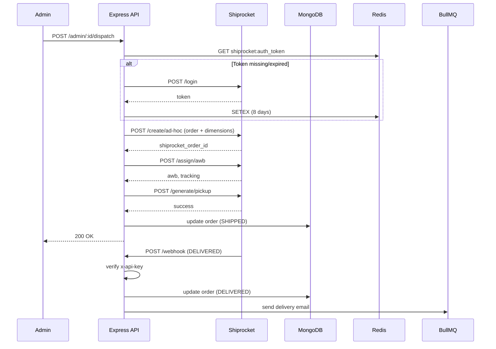

<div align="center">

  # Logistics & Shipping Architecture
  
  **The automated physical fulfillment and courier dispatch engine for Reshma-Core.**

  [](https://shiprocket.in/)
  [](https://redis.io/)
  [](https://axios-http.com/)
  [](https://bullmq.io/)

</div>

---

## 1. Overview

The Logistics module bridges the digital transaction (order confirmation) with physical delivery. It integrates **Shiprocket** – a third‑party logistics (3PL) aggregator – to automate:

- Airway bill (AWB) generation
- Courier allocation (Delhivery, BlueDart, etc.)
- Pickup scheduling
- Real‑time tracking via webhooks

The module is built on a **stateless, idempotent** architecture. All operations are atomic, and the internal database state is updated **only after** external API calls succeed. The system uses a **rolling JWT cache** in Redis to eliminate per‑dispatch authentication overhead.

**Base Route for webhook:** `/api/v1/orders/shiprocket-webhook`  
**Admin dispatch endpoint:** `POST /api/v1/orders/admin/:id/dispatch`

---

## 2. Architectural Decision Record: Rolling JWT Authentication

### Problem
Shiprocket requires a Bearer JWT to authorize REST calls. A naive implementation would call `POST /login` before every dispatch, doubling latency and risking rate‑limit exhaustion (Shiprocket allows limited login attempts per hour).

### Solution – Autonomous Redis Caching (`src/config/shiprocket.ts`)

- Shiprocket JWTs expire after **10 days**.
- The `ShiprocketAuthManager` caches the token in Redis with an **8‑day TTL**.
- When the `ShiprocketService` requests a token, it first checks Redis. If the token is missing or expired, the manager silently refreshes it.

**Benefits:**
- Sub‑millisecond token retrieval for 99% of requests.
- Safe 2‑day buffer before the token actually expires.
- No manual token rotation – fully autonomous.
- Resilience: if the refresh fails, the service continues using the existing token until the next attempt.

**Code example (`shiprocket.ts`):**
```typescript
import { redisClient } from "@config/redis";
import axios from "axios";
import env from "@config/env";

const TOKEN_KEY = "shiprocket:auth_token";
const TTL_SECONDS = 8 * 24 * 60 * 60; // 8 days

export async function getShiprocketToken(): Promise<string> {
  let token = await redisClient.get(TOKEN_KEY);
  if (!token) {
    const response = await axios.post("https://apiv2.shiprocket.in/v1/external/auth/login", {
      email: env.SHIPROCKET_EMAIL,
      password: env.SHIPROCKET_PASSWORD,
    });
    token = response.data.token;
    await redisClient.setEx(TOKEN_KEY, TTL_SECONDS, token);
  }
  return token;
}
```  

> **Note:** The token is stored in plain text; Redis is secured with password and network isolation.  

## 3. The 4‑Step Dispatch Pipeline (`shiprocket.service.ts`)

When an admin clicks “Dispatch Order”, the backend executes a sequential, idempotent pipeline. Each step is wrapped in a try/catch; if any fails, the order remains `PENDING` and no database changes are committed.

| Step | Shiprocket API Endpoint | Purpose | Failure Handling |
|------|------------------------|---------|------------------|
| 1 | `POST /v1/external/orders/create/ad-hoc` | Translate `IOrder` into Shiprocket payload. Requires physical dimensions (L/B/H/Weight) from the admin. | Aborts dispatch; returns error to admin. |
| 2 | `POST /v1/external/courier/assign/awb` | Assign courier and generate AWB (tracking number). | Aborts; no DB update. |
| 3 | `POST /v1/external/courier/generate/pickup` | Schedule courier pickup from warehouse. | Aborts; no DB update. |
| 4 | Internal MongoDB update | Set `orderStatus = "SHIPPED"`, save `trackingNumber`, `courierName`, `shiprocketOrderId`. | Only after all three API calls succeed. |  

### Idempotency Guard

- Before step 1, the service checks if `order.trackingNumber` already exists. If yes, it throws `HTTP_STATUS.CONFLICT` (409) – prevents double billing.
- The entire pipeline is idempotent: if a network timeout occurs at step 2, the admin can retry safely because the order is still `PENDING`.

**Complete Code Example (`shiprocket.service.ts` – simplified with error handling)**

```typescript
import { AppError } from "@shared/utils/app-error";
import { HTTP_STATUS } from "@shared/constant/http-codes";
import { Order } from "@modules/orders/order.model";
import { getShiprocketToken } from "@config/shiprocket";
import { NotificationService } from "@modules/notifications/notification.service";

export class ShiprocketService {
  async dispatchOrder(orderId: string, dimensions: IDimensions) {
    const order = await Order.findById(orderId);
    if (!order) throw new AppError(HTTP_STATUS.NOT_FOUND, "Order not found");
    if (order.trackingNumber) throw new AppError(HTTP_STATUS.CONFLICT, "Order already dispatched");
    if (order.paymentStatus !== "PAID") throw new AppError(HTTP_STATUS.BAD_REQUEST, "Cannot dispatch unpaid order");

    const token = await getShiprocketToken();

    try {
      // Step 1
      const shiprocketOrder = await this.createAdhocOrder(order, dimensions, token);
      // Step 2
      const awbData = await this.generateAWB(shiprocketOrder.id, token);
      // Step 3
      await this.schedulePickup(awbData.pickup_id, token);

      // Step 4 – All external calls succeeded
      order.trackingNumber = awbData.awb;
      order.courierName = awbData.courier_name;
      order.shiprocketOrderId = shiprocketOrder.id;
      order.orderStatus = "SHIPPED";
      await order.save();

      // Async notification (fire-and-forget)
      await NotificationService.sendOrderShippedNotification(
        order.user, order.userEmail, order.userFirstname,
        order.orderNumber, awbData.awb, awbData.courier_name
      );

      return { trackingNumber: awbData.awb, courierName: awbData.courier_name };
    } catch (error) {
      // Log error but do NOT update order status
      logger.error(`Dispatch failed for order ${orderId}: ${error.message}`);
      throw new AppError(HTTP_STATUS.INTERNAL_SERVER_ERROR, "Dispatch failed; please retry.");
    }
  }
}
```  

---  

## 4. Server‑to‑Server Webhook State Machine

Once the package is with the courier, we stop polling. Instead, Shiprocket sends HTTP POST requests to `/api/v1/orders/shiprocket-webhook` whenever the order status changes.

### Security Firewall

- Shiprocket sends an `x-api-key` header.
- The webhook handler compares it against `SHIPROCKET_WEBHOOK_SECRET` (env variable).
- No JWT or session required – this is a server‑to‑server call.
- The webhook endpoint is rate‑limited (`standardLimiter`) and validates the request body against a Zod schema. 

**Webhook validation code (in `order.routes.ts`):**    

```typescript
router.post(
  "/shiprocket-webhook",
  standardLimiter,
  validate(ShiprocketWebhookSchema),
  OrderController.shiprocketWebhook
);
```  

### State Mapping (`OrderService.processWebhook`)

Shiprocket provides dozens of micro‑statuses. We map only terminal events to keep the database clean.

| Shiprocket Status | Internal `orderStatus` | Action |
|-------------------|------------------------|--------|
| `DELIVERED` | `DELIVERED` | BullMQ email, in‑app alert, update order status. |
| `CANCELED` / `CANCELLED` | `CANCELLED` | Already cancelled; no further action. |
| `RTO DELIVERED` (Return To Origin) | `RETURNED` | Trigger atomic stock restock via ACID transaction. |
| All other (e.g., “In Transit”, “Out for Delivery”) | Ignored | No DB write – reduces churn and preserves performance. |  

**Webhook handler code (simplified):**  
```typescript
export class OrderService {
  static async processShiprocketWebhook(payload: IShiprocketWebhookPayload) {
    const { channel_order_id, current_status } = payload;
    const order = await Order.findOne({ orderNumber: channel_order_id });
    if (!order) {
      logger.warn(`Webhook received for unknown order: ${channel_order_id}`);
      return;
    }

    switch (current_status) {
      case "DELIVERED":
        order.orderStatus = "DELIVERED";
        await order.save();
        await NotificationService.sendOrderDeliveredNotification(order.user, order.userEmail, order.userFirstname, order.orderNumber);
        break;
      case "RTO DELIVERED":
        await this.handleReturnToOrigin(order);
        break;
      case "CANCELED":
      case "CANCELLED":
        order.orderStatus = "CANCELLED";
        await order.save();
        break;
      default:
        // Ignore intermediate statuses
        break;
    }
  }
}
```  

---  

## 5. Security & Threat Mitigation

| Threat | Mitigation |
|--------|------------|
| Unauthorised webhook calls | Static `x-api-key` header verified against `SHIPROCKET_WEBHOOK_SECRET`. |
| Double dispatch (duplicate AWB) | Idempotency check: if `trackingNumber` exists → `HTTP_STATUS.CONFLICT` (409). |
| Shipping unpaid orders | State firewall: `paymentStatus !== "PAID"` → `HTTP_STATUS.BAD_REQUEST` (400). |
| NoSQL injection | All order lookups use `{ _id: { $eq: safeOrderId } }` (explicit `$eq`). |
| Log injection (CWE‑117) | All tracking IDs and error messages passed through `safeLog()` (from `sanitizer.ts`) to strip `\r\n`. |
| Rate limiting | Webhook endpoint uses `standardLimiter` (100 requests per 15 min). |
| Malformed payloads | Zod schema validation on the webhook body – rejects with `HTTP_STATUS.BAD_REQUEST` (400). |   

---  

## 6. Error Responses Reference

The module returns standard HTTP status codes defined in `src/shared/constant/http-codes.ts`.

| Status Code | Constant | When Used |
|-------------|----------|------------|
| 200 | `OK` | Dispatch successful, order updated to `SHIPPED`. |
| 400 | `BAD_REQUEST` | Missing dimensions, invalid payload, or unpaid order. |
| 401 | `UNAUTHORIZED` | Webhook missing or invalid API key. |
| 404 | `NOT_FOUND` | Order ID not found. |
| 409 | `CONFLICT` | Order already dispatched (tracking number exists). |
| 429 | `TOO_MANY_REQUESTS` | Rate limit exceeded on webhook or dispatch endpoint. |
| 500 | `INTERNAL_SERVER_ERROR` | Shiprocket API timeout or unexpected error. |
| 503 | `SERVICE_UNAVAILABLE` | Redis down (affects token caching) or Shiprocket unreachable. |

**Example error response (409 Conflict):**    
```typescript
{
  "success": false,
  "statusCode": 409,
  "message": "Order already dispatched",
  "timestamp": "2026-05-22T10:00:00.000Z"
}
```  

## 7. Flow Diagram (Dispatch + Webhook)  



---  

## 8. Error Handling & Resilience

- **Network timeouts:** All Axios requests are configured with a 10‑second timeout. On timeout, the dispatch fails gracefully and returns `HTTP_STATUS.GATEWAY_TIMEOUT` (504) after a few retries (exponential backoff implemented in the dispatcher).

- **Retry strategy:** Not automatic (to avoid duplicate AWBs). Admin must retry manually after checking network status.

- **Webhook idempotency:** The webhook handler uses `findOneAndUpdate` with `$set` to avoid race conditions. Multiple delivery events for the same order are safe.

- **Return‑to‑origin (RTO):** When `RTO DELIVERED` is received, the system opens an ACID transaction to restore stock and mark order as `RETURNED`. The transaction includes:
  - Incrementing product stock using `$inc`.
  - Updating order status.
  - Logging the event.

```typescript
static async handleReturnToOrigin(order: IOrder) {
  const session = await mongoose.startSession();
  session.startTransaction();
  try {
    for (const item of order.items) {
      await Product.findOneAndUpdate(
        { _id: item.productId },
        { $inc: { currentStock: item.quantity } },
        { session }
      );
    }
    order.orderStatus = "RETURNED";
    await order.save({ session });
    await session.commitTransaction();
    logger.info(`RTO processed for order ${order.orderNumber}`);
  } catch (error) {
    await session.abortTransaction();
    throw error;
  } finally {
    session.endSession();
  }
}
```  

---  

## 9. Related Files

| File | Purpose |
|------|---------|
| `src/config/shiprocket.ts` | Rolling JWT manager with Redis caching. |
| `src/modules/orders/shiprocket.service.ts` | Dispatch orchestrator (3 API calls + DB update). |
| `src/modules/orders/order.service.ts` | Webhook processor, state mapping, RTO handling. |
| `src/modules/orders/order.admin.controller.ts` | Admin dispatch endpoint. |
| `src/modules/orders/order.routes.ts` | Routes for dispatch and webhook (rate limiting, validation). |
| `src/modules/orders/order.model.ts` | Fields: `trackingNumber`, `courierName`, `shiprocketOrderId`. |
| `src/shared/utils/sanitizer.ts` | `safeLog()` for log injection prevention. |
| `src/shared/constant/http-codes.ts` | HTTP status constants. |  

---  

## Next Steps

- Understand how the [Order Module](../modules/order-module.md) triggers dispatch.
- Explore [Background Jobs & Cron](./background-jobs-and-cron.md) for async notifications.
- See [Security Hardening](./security-hardening.md) for CWE‑117 mitigation.  

---  

*The Reshma-Core Team*  
