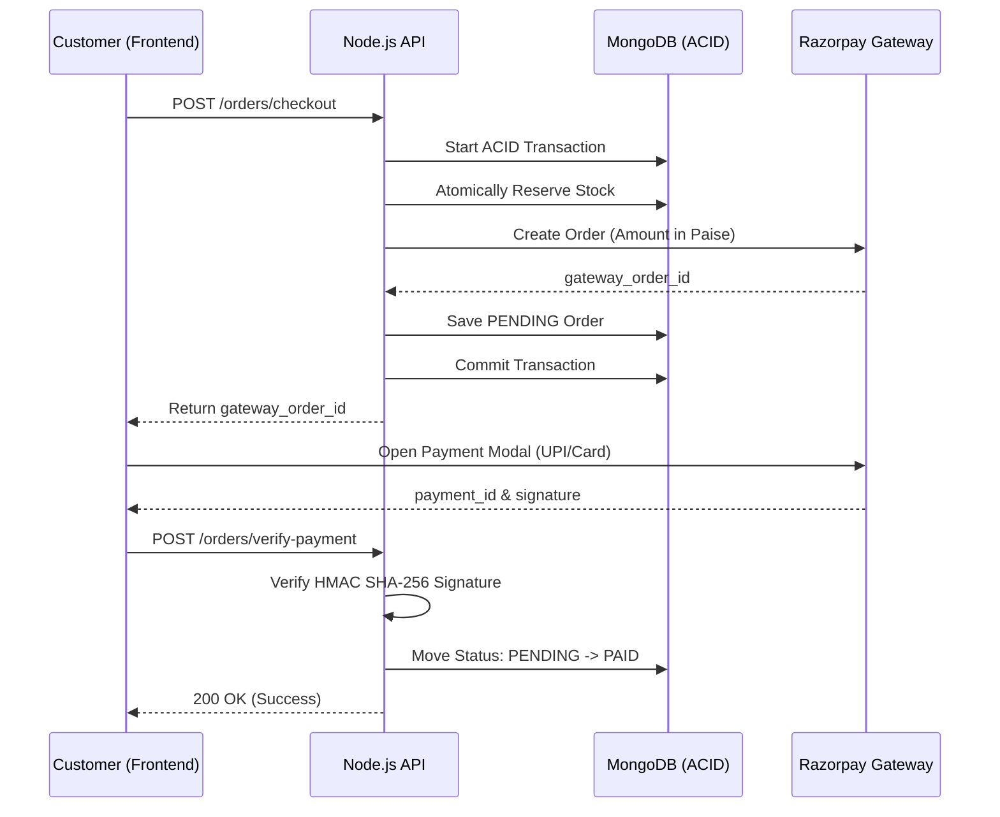

<div align="center">

  # Razorpay Integration Architecture
  
  **The cryptographic handshake engine ensuring secure, fraud-proof financial transactions and atomic stock synchronization.**

  [](https://razorpay.com/)
  [](https://en.wikipedia.org/wiki/HMAC)
  [](https://docs.razorpay.com/docs/webhooks)
  [](https://razorpay.com/docs/payments/payments/working-with-amounts/)

</div>

---

## Overview

The Reshma platform utilizes a **Non-Trust Frontend Pattern**. The backend never assumes a payment is successful based on a frontend notification; it requires mathematical proof via an HMAC SHA-256 signature verification. This architecture prevents financial spoofing and ensures that stock reservation is perfectly synchronized with actual revenue collection.

---

## 1. The Checkout Workflow

The system follows a 4-step secure handshake to ensure that stock reservation and financial transactions are perfectly synchronized.

### Workflow Visualization

### Protocol Visualization  

1.  **Order Initialization:** Backend generates a Razorpay Order ID to lock the currency and amount.
2.  **Stock Reservation:** Occurs within an ACID transaction *before* the payment modal opens.
3.  **Payment Execution:** User interacts directly with Razorpay's secure servers.
4.  **Cryptographic Verification:** Backend recalculates the signature using the `RAZORPAY_KEY_SECRET` to prove authenticity.  

---

## 2. Core Security Pillars

### A. HMAC SHA-256 Handshake
We utilize the native `crypto` module to verify the integrity of the payment data returned by the frontend. This ensures that the `payment_id` was actually issued by Razorpay for our specific `order_id`.

**Verification Logic:**
```typescript
const generatedSignature = crypto
    .createHmac('sha256', env.RAZORPAY_KEY_SECRET)
    .update(`${gatewayOrderId}|${gatewayPaymentId}`)
    .digest('hex');

const isValid = generatedSignature === gatewaySignature;
```  

### B. Idempotency Guard  

To prevent Double Fulfillment (e.g., a user refreshing the success page), the `verifyFrontendPayment` service checks the database state:

* If `paymentStatus === 'PAID'`, the system immediately exits and returns the existing record.
* This prevents duplicate BullMQ notification triggers and redundant database writes. 

### C. Paise Mathematical Constraint
Floating-point math in JavaScript can lead to rounding errors (e.g., `0.1 + 0.2` becomes `0.30000000000000004`).

* The Industry Standard: All amounts are converted to the smallest currency unit (Paise).
* Formula: `Math.round(totalAmount * 100)`.
* An order of ₹500.50 is strictly processed as `50050` paise.  

---  

## 3. Atomic State Management  

The integration is tightly coupled with MongoDB Sessions to prevent data corruption during payment failures.

| Component         | Responsibility                                                          |
|-------------------|-------------------------------------------------------------------------|
| Order Service     | Manages the `startSession` and `abortTransaction` logic.                |
| Product Model     | Handles the `$inc` decrement during reservation.                        |
| Razorpay Config   | A singleton instance initialized at server boot with validated ENVs.    |
| Payment Utils     | Pure mathematical functions for signature verification (CodeQL hardened). |  

--- 

## 4. Environment Requirements  
| Variable                   | Scope    | Security Level                                                      |
|----------------------------|----------|---------------------------------------------------------------------|
| `RAZORPAY_KEY_ID`          | Public   | Shared with Frontend.                                               |
| `RAZORPAY_KEY_SECRET`      | Private  | Strictly Backend. (CodeQL Secret Scanning).                         |
| `RAZORPAY_WEBHOOK_SECRET`  | Private  | Used for async Server-to-Server pings.                              |  

--- 

## 5. Failure Handling 

| Scenario              | System Response                                                                 |
|-----------------------|---------------------------------------------------------------------------------|
| Signature Mismatch    | Log Security Alert, return 400 Bad Request, keep order PENDING.                 |
| Network Timeout       | User can re-trigger verification; Idempotency logic handles duplicate hits.     |
| Insufficient Stock    | Transaction aborts before hitting Razorpay API; returns 409 Conflict.           |  

---