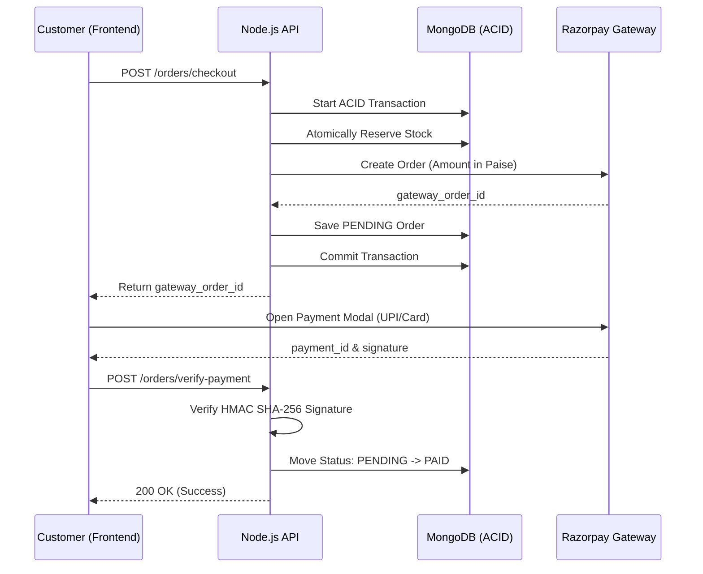

<div align="center">

  # Razorpay Integration Architecture

  **The cryptographic handshake engine ensuring secure, fraud-proof financial transactions and atomic stock synchronization.**

  [](https://razorpay.com/)
  [](https://en.wikipedia.org/wiki/HMAC)
  [](https://docs.razorpay.com/docs/webhooks)
  [](https://razorpay.com/docs/payments/payments/working-with-amounts/)

</div>

---

## Overview

Reshma‑Core uses a **Non‑Trust Frontend Pattern** – the backend never assumes a payment is successful based on a frontend notification. Instead, it requires **mathematical proof** via HMAC‑SHA‑256 signature verification. This prevents financial spoofing and ensures stock reservation is perfectly synchronised with actual revenue collection.

All payment‑related logic resides in the `OrderService` (`order.service.ts`), with helper utilities in `payment.utils.ts`.

---

## 1. The Checkout Workflow (4‑Step Handshake)



**Step details:**  

1. **Order initialisation** – Backend creates a Razorpay Order ID, locking the currency and amount.
2. **Stock reservation** – Within an ACID transaction, stock is atomically decremented using `$inc` + `$gte`.
3. **Payment execution** – User interacts directly with Razorpay’s secure servers.
4. **Cryptographic verification** – Backend recalculates the signature using `RAZORPAY_KEY_SECRET`.  

---  

## 2. Core Security Pillars

### A. HMAC‑SHA‑256 Handshake

The backend verifies the payment signature using the native `crypto` module:  

```typescript
const generatedSignature = crypto
  .createHmac('sha256', env.RAZORPAY_KEY_SECRET)
  .update(`${gatewayOrderId}|${gatewayPaymentId}`)
  .digest('hex');
const isValid = generatedSignature === gatewaySignature;
```  
This guarantees that the `payment_id` was genuinely issued by Razorpay for our `order_id`.  

### B. Idempotency Guard

If a user refreshes the success page, the `verifyFrontendPayment` service checks the database state:

- If `paymentStatus === 'PAID'`, the system immediately returns the existing record.
- Prevents duplicate BullMQ notifications and redundant database writes.

### C. Paise Mathematical Constraint

All amounts are converted to the smallest currency unit (paise) to avoid floating‑point rounding errors:  

```typescript
const amountInPaise = Math.round(totalAmount * 100);
```  

Example: ₹500.50 → 50050 paise.  

### D. Raw Body Integrity (HMAC Precision)

Standard JSON parsing alters the raw request string, breaking HMAC verification. In `app.ts`, the `express.json()` middleware captures the original buffer:  

```typescript
app.use(express.json({
  limit: '10kb',
  verify: (req, res, buf) => {
    if (req.originalUrl.includes('/webhook')) {
      req.rawBody = buf.toString('utf8');
    }
  }
}));
```  

All webhook verification logic uses `req.rawBody` instead of `req.body`.  

---  

## 3. Atomic State Management

The integration is tightly coupled with MongoDB ACID sessions:

| Component | Responsibility |
|-----------|----------------|
| `OrderService` | Starts the transaction, reserves stock, creates order, commits/aborts. |
| `ProductModel` | Handles `$inc` decrement during reservation (with `$gte` firewall). |
| `RazorpayConfig` | Singleton initialised at server boot with validated environment variables. |
| `PaymentUtils` | Pure signature verification functions (CodeQL‑hardened). |

**Transaction boundary:**

- Success → commit → order status `PENDING`, stock locked.
- Failure → rollback → no side effects.

---

## 4. Environment Variables

| Variable | Scope | Security Level |
|----------|-------|----------------|
| `RAZORPAY_KEY_ID` | Public | Shared with frontend. |
| `RAZORPAY_KEY_SECRET` | Private | Strictly backend – scanned by CodeQL. |
| `RAZORPAY_WEBHOOK_SECRET` | Private | Used for server‑to‑server webhook verification. |

---

## 5. Failure Handling

| Scenario | System Response |
|----------|----------------|
| Signature mismatch | Log security alert, return `400 Bad Request`, order remains `PENDING`. |
| Network timeout | User can re‑trigger verification; idempotency handles duplicates. |
| Insufficient stock | Transaction aborts before Razorpay call; returns `409 Conflict`. |

---

## 6. Asynchronous Fallback (Webhooks)

To guarantee financial consistency even if the frontend network fails, the system listens for Razorpay webhooks:

- **Trigger** – Razorpay fires an `order.paid` event to `/api/v1/orders/webhook`.
- **Verification** – The webhook handler compares the `x-razorpay-signature` against a hash of `req.rawBody` using `RAZORPAY_WEBHOOK_SECRET`.
- **Idempotency** – If the order is already `PAID` (frontend already succeeded), the webhook safely terminates. Otherwise, it applies the financial state change and proceeds to fulfillment.
- **Local webhook testing** – Use a tool like `ngrok` to expose your local webhook endpoint to the internet. Razorpay’s dashboard allows you to configure a test webhook URL.

---

## 7. Related Files

| File | Purpose |
|------|---------|
| `src/modules/orders/order.service.ts` | Checkout, stock reservation, webhook handling. |
| `src/modules/orders/order.public.controller.ts` | `verify-payment` endpoint. |
| `src/modules/orders/payment.utils.ts` | HMAC signature verification. |
| `src/modules/products/product.service.ts` | `reserveStock` method (used by `OrderService`). |
| `src/app.ts` | Raw body interceptor for webhooks. |
| `src/config/env.ts` | Razorpay environment variable validation. |  

---  

## Next Steps

- See the [Order Module](../modules/order-module.md) for the complete checkout pipeline.
- Understand [Background Jobs & Cron](./background-jobs-and-cron.md) for async invoice generation.
- Read [Security Hardening](./security-hardening.md) for raw body and rate limiting details.  

---  

*The Reshma-Core Team*  