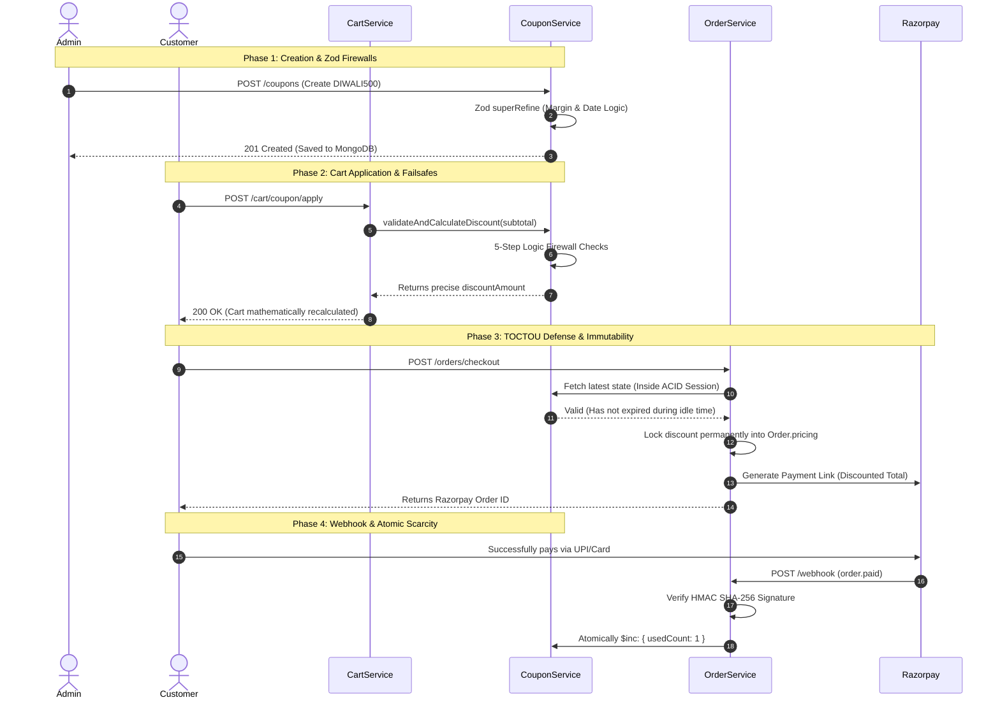

<div align="center">

  # Coupon & Promotional Module Architecture
  
  **The centralized, mathematically secure discount engine powering dynamic cart reductions, targeted acquisition hooks, and immutable financial order pricing.**

  [](#)
  [](#)
  [](#)
  [](#)

</div>

---

## 1. Executive Summary & Domain Boundaries

The Coupon Module (`src/modules/coupons/`) operates as the **Strict Mathematical and Validation Authority** for the Reshma-Core e-commerce platform. 

In highly scalable distributed systems, calculating financial discounts across multiple modules (e.g., letting the Cart calculate discounts, and then letting the Order module calculate them again) leads to fragmented logic, race conditions, and catastrophic financial discrepancies.

**The Domain Rule:** External modules (Cart, Orders) are **strictly forbidden** from executing discount math. They must pass the current cart subtotal and user context to `CouponService.validateAndCalculateDiscount()` to receive a cryptographically safe, fully verified discount integer.

---

## 2. The Core Mathematical Engine

The heart of the module is the evaluation pipeline. When a payload enters the calculation engine, it is subjected to five business-logic firewalls before a single arithmetic operation is processed.

### 2.1 The Five Validation Firewalls
1. **Temporal Firewall (Time Bounds):** 
   Validates the current system time against `startDate` and `expiryDate`. Protects against users hoarding codes from past seasonal sales.
2. **Scarcity Firewall (Concurrency Limits):** 
   Ensures `usedCount < usageLimit`. Because promotions represent lost revenue (marketing spend), global usage ceilings are hard-enforced.
3. **Margin Firewall (Minimum Cart Value):** 
   Ensures `subtotal >= minCartValue`. This is a critical business safeguard preventing negative margins. (e.g., A user cannot apply a ₹500 flat discount on a ₹400 cart to get products for free).
4. **Acquisition Firewall (First-Order Check):** 
   If `isFirstOrderOnly` is flagged, the engine executes a cross-collection query: `Order.countDocuments({ user: userId })`. If the count is `> 0`, the coupon drops. This is used for targeted Customer Acquisition Cost (CAC) marketing.
5. **Logistics Firewall (Payment Restrictions):** 
   Validates `paymentMethodRestriction` against the requested gateway. For example, offering a high-value discount *only* for `PREPAID` orders acts as a behavioral incentive to reduce costly RTO (Return to Origin) rates associated with `COD` (Cash on Delivery).

### 2.2 Mathematical Computation & Failsafes
Once the firewalls are cleared, the engine computes the exact rupee deduction.

**Formula 1: Percentage Constraints & The Hard Ceiling**
When `discountType === PERCENTAGE`, the system calculates the raw discount. However, to protect premium inventory, an Admin *must* define a `maxDiscountAmount`. 
```typescript
const rawDiscount = subtotal * (coupon.discountValue / 100);
calculatedDiscount = Math.min(rawDiscount, coupon.maxDiscountAmount);
```  

**Formula 2: The Subtotal Floor (Negative Invoice Prevention)**  
Even with flat discounts, we must guarantee the discount never exceeds the value of the cart itself. If a cart is ₹150, and the user applies a ₹200 flat discount, the system mathematically truncates the discount to ₹150.  

```typescript
calculatedDiscount = Math.min(calculatedDiscount, subtotal);
```  

**Formula 3: IEEE 754 Floating-Point Mitigation**  
JavaScript natively uses IEEE 754 double-precision floats, meaning calculations like `2000 * 0.15` can occasionally yield artifacts like `300.000000000004`. If this raw float is passed to Razorpay, the payment gateway will instantly reject the payload with a `400 Bad Request`.  

```typscript
// Rounds mathematically to exactly 2 decimal places before Paise conversion
calculatedDiscount = Math.round(calculatedDiscount * 100) / 100;
```  
---  

## 3. Architectural Decision Records (ADRs)

### ADR 1: The "Hidden Failsafe" (Cart Auto-Recalculation)

- **Context:** Coupons are highly volatile. A user applies a "SAVE500" coupon requiring a ₹2500 minimum. They then delete a ₹1000 item from their cart, dropping the subtotal to ₹1500.

- **Decision:** Every single time the `CartService` mutates (add, update, remove, merge), it triggers `recalculateCartTotals()`.

- **Consequence:** This background engine dynamically repings the `CouponService` with the new subtotal. If the subtotal violates the `minCartValue`, or if the coupon expired mid‑session, the cart physically drops the coupon (`appliedCoupon: null`, `discountAmount: 0`) and recalculates to full price automatically.

### ADR 2: The TOCTOU Firewall (Time‑Of‑Check to Time‑Of‑Use)

- **Context:** A user applies a valid coupon at 11:58 PM. They leave the checkout screen open, go make a cup of tea, and click "Pay" at 12:01 AM (after the coupon has expired or hit its global usage limit).

- **Decision:** The `OrderService` executes a final verification gate immediately before opening the Razorpay financial handshake.

- **Consequence:** The `initializeCheckout` function pulls the live `CouponModel` within the active ACID session. If the coupon expired during the user's idle time, the transaction physically aborts with a `409 Conflict`, forcing the user to refresh their cart and pay the corrected price.

### ADR 3: Atomic Scarcity Management (The Abandonment Problem)

- **Context:** How do we track `usedCount` accurately? If we increment it when a user clicks "Checkout", malicious users could apply a limited‑use code (e.g., 10 uses), abandon the Razorpay payment window, and permanently "starve" the remaining inventory of that code.

- **Decision:** We split the incrementation logic based on Payment Method.

  - **COD Orders:** Since Cash‑on‑Delivery bypasses external gateways and goes straight to `PROCESSING`, the `$inc: { usedCount: 1 }` operation fires synchronously during `initializeCheckout`.

  - **Razorpay Orders:** The `$inc` operation is strictly relegated to the `OrderService.processWebhook`. The coupon is only marked as "used" the exact millisecond Razorpay fires the `order.paid` event, confirming the funds have securely cleared the banking network.

### ADR 4: Historical Immutability (Snapshotting)

- **Context:** Prices and coupons change, but receipts are eternal. We cannot rely on Mongoose `.populate()` for historical invoices.

- **Decision:** When an order is created, `appliedCoupon` and `discountAmount` are locked permanently into the `IOrder.pricing` schema block.

- **Consequence:** If an Admin completely deletes the coupon code 6 months from now, the user's historical receipt, the mathematical totals, and the PDF invoice generator (`invoice.generator.ts`) remain 100% accurate and mathematically sound.  

---  

## 4. Security & OWASP Hardening  

The promotional module strictly enforces CodeQL security guidelines to mitigate common vulnerabilities.  

### A. CWE-117: Improper Output Neutralization (Log Injection) 
When logging failed coupon applications or updates, malicious actors can inject \r\n (carriage return/line feed) characters into the code string to forge fake Winston log entries, obscuring audits or triggering false alarms in Datadog/Splunk.

* **Mitigation:** The entire service leverages a private `safeLog()` utility `(message.replace(/[\r\n]/g, ""))` that physically strips control characters before they interact with Node.js output streams.  

### B. CWE-943: NoSQL Operator Injection  

Attackers may attempt to bypass the `getCoupons` admin filter via query objects in the URL (e.g., `GET /coupons?code[$ne]=INVALID`), attempting to force the database to return the first valid coupon.

* **Mitigation:** The `CouponController` explicitly checks `typeof req.query.code === 'string'`. It forces the Mongoose query to use strict equality wrappers: `code: { $eq: safeCode }`. Nested object injection is physically impossible because the Express query parser's object outputs are ignored.  

### C. Zod Payload Firewalls (Prototype Pollution & Logic Flaws)  
The `createCouponSchema` leverages Zod's `superRefine` block to enforce complex, cross-field business logic before the data ever touches the V8 engine heap:  

1. **Margin Protection Limit:** If an Admin sets `discountType === 'PERCENTAGE'`, Zod mathematically forces them to provide a `maxDiscountAmount` ceiling. The request throws a 400 error otherwise.  

2. Temporal Logic Check: Zod strictly calculates that `expiryDate` must occur chronologically later than `startDate`.  

3. Past Date Failsafe: Zod rejects `startDate` inputs that are in the past, allowing only a 5-minute threshold buffer to account for global network latency during API transit.  

---  

## 5. API & Presentation Layer

### A. Public Discovery API (Customer Conversion)

Coupons are only effective if users know they exist. The module exposes a Public API (`GET /api/v1/coupons/available`) to dynamically display active promotions to logged-in users .

- **Dynamic Validation Pipeline:** The API accepts an optional `?cartValue=X` query.

- **The `$expr` Operator:** Instead of fetching all coupons and filtering them in Node's memory (which causes heap memory bloat), the service uses MongoDB's highly optimized `$expr` operator to compare fields internally at the database level (`$expr: { $lt: ["$usedCount", "$usageLimit"] }`) .

- **Data Masking (Projection):** The Mongoose `.select()` projection intentionally strips internal metrics like `usedCount` and `usageLimit` from the JSON payload . Competitors analyzing network traffic cannot see how many times a code has been used.

### B. Fault Tolerance (`catchAsync`)

Every single controller method is wrapped in a custom `catchAsync` Higher‑Order Function (HOF) . If the MongoDB cluster times out during a `fetchCoupons` query, the promise rejection is automatically caught and forwarded to the global Error Middleware, preventing the Express server from hanging or crashing .

--- 

## 6. Database Schema & Indexing Optimization

To support high-throughput operations (specifically during flash sales where thousands of users are applying coupons to carts simultaneously), the `CouponModel` implements strategic indexing.

- **Compound Index (`{ code: 1, isActive: 1 }`):** Because `validateAndCalculateDiscount` queries by both `code` and `isActive` concurrently, this compound index allows MongoDB to instantly locate the document in memory without executing a full collection scan .

- **Unique Trimming:** The `code` field is set to `uppercase: true` and `trim: true` at the schema level . This prevents user-error inputs like `"  diwali500 "` from failing valid matching logic.  

--- 
## 7. Global Integration Workflow (The Coupon Lifecycle)

To fully understand how the Coupon Engine interacts with the rest of the Reshma-Core distributed system, review the sequence diagram below. It illustrates the complete lifecycle of a promotional code: from Admin creation, through the Cart recalculation loop, past the Order's TOCTOU firewall, and finally to the Razorpay webhook that securely increments the global usage count.



### Architectural Conclusion  

By treating the Coupon Module strictly as a **Mathematical Authority** rather than a state-manager, the Reshma-Core platform achieves enterprise-level financial consistency. The Cart handles the volatile user experience, the Order handles the immutable financial receipt, and the Coupon Engine acts as the unbreakable vault protecting the business's profit margins.  

The integration of strict Zod cross-field validation, TOCTOU vulnerability patching, and Webhook-driven scarcity guarantees that this engine will scale flawlessly during high-traffic flash sales without leaking inventory or miscalculating revenue.

---  

## 8. Related Files

| File | Purpose |
|------|---------|
| `src/modules/coupons/coupon.controller.ts` | HTTP layer – routes, filtering, admin endpoints. |
| `src/modules/coupons/coupon.service.ts` | Core logic – five firewalls, discount calculation, atomic scarcity. |
| `src/modules/coupons/coupon.model.ts` | Mongoose schema, indexes. |
| `src/modules/coupons/dtos/coupon.dto.ts` | Zod validation with superRefine cross‑field checks. |
| `src/modules/coupons/coupon.routes.ts` | Route definitions, rate limiting, RBAC. |
| `src/modules/coupons/interfaces/coupon.interface.ts` | TypeScript interfaces and enums. |  

---  

## See Also

- [Cart Module](./cart-module.md) – applies coupons and recalculates totals.
- [Order Module](./order-module.md) – final TOCTOU check and atomic scarcity.
- [Security Hardening](../architecture/security-hardening.md) – CWE mitigations.
- [Middleware & Validation](../architecture/middleware-and-validation.md) – rate limiting, RBAC.

---

*The Reshma-Core Team*