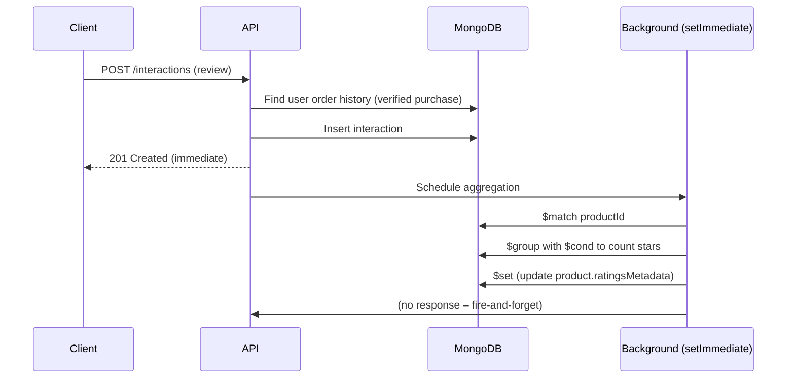
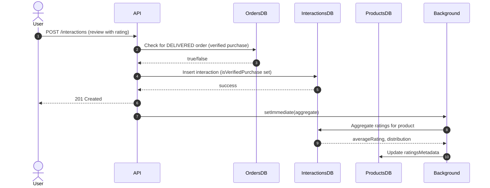

<div align="center">
  # Interaction & Review Module

  **The high-throughput, concurrency-safe engine powering product reviews, threaded comments, and dynamic mathematical aggregations.**

  [](#)
  [](#)
  [](#)
  [](#)

</div>

## 1. Overview

The Interaction Module (`src/modules/interactions/`) handles the lifecycle of user reviews, threaded comments, and helpful/unhelpful voting. It is optimised to decouple heavy write‑operations (math calculations) from read‑operations (catalog browsing).

**Base Route:** `/api/v1/interactions`

**Key capabilities:**
- **Polymorphic validation** – reviews require a rating; comments forbid ratings.
- **Verified purchase badge** – cross‑module trust layer with `Orders` collection.
- **Asynchronous aggregation** – average rating and star distribution are updated in the background.
- **Concurrency‑safe voting** – atomic MongoDB array operators prevent duplicate votes.
- **Pagination with hard limit** – prevents memory exhaustion (CWE‑400).

---

## 2. Schema Architecture & Design Decisions

### The Adjacency List Pattern (Threading)

To support infinite nesting (e.g., replying to a review, replying to a reply), the `Interaction` schema uses the **Adjacency List Pattern**:

- `parentId` references the `_id` of another document in the same collection.
- Top‑level reviews have `parentId: null`.

| Field | Type | Description |
|-------|------|-------------|
| `_id` | ObjectId | Unique identifier. |
| `productId` | ObjectId | Referenced product (indexed). |
| `user` | ObjectId | Author of the interaction. |
| `type` | enum | `REVIEW` or `COMMENT`. |
| `rating` | number (1-5) | Required for `REVIEW`, forbidden for `COMMENT`. |
| `content` | string | The review or comment text. |
| `parentId` | ObjectId | Parent interaction (null for top‑level). |
| `likes` | ObjectId[] | Array of user IDs who upvoted. |
| `dislikes` | ObjectId[] | Array of user IDs who downvoted. |
| `isVerifiedPurchase` | boolean | Set automatically based on order history. |
| `createdAt` / `updatedAt` | Date | Timestamps. |

**Indexes:**
- `{ productId: 1, type: 1, createdAt: -1 }` – optimises public review listing.
- `{ parentId: 1 }` – for fetching comment threads.

### Polymorphic Zod Validation

The Zod DTO uses `superRefine` to enforce context‑aware business rules:

```typescript
if (type === "REVIEW" && !rating) {
  ctx.addIssue({ message: "Rating required for reviews" });
}
if (type === "COMMENT" && rating) {
  ctx.addIssue({ message: "Rating forbidden on comments" });
}
```  

This prevents users from manipulating average ratings through nested threads.  

---  

## 3. Core Business Logic

### Cross‑Module Trust Layer (Verified Purchases)

The system does not trust the frontend to declare a "Verified Purchase". During creation, the service layer queries the Orders collection:  

```typescript
const hasDeliveredOrder = await Order.exists({
  user: userId,
  "items.product": productId,
  orderStatus: "DELIVERED"
});
isVerifiedPurchase = !!hasDeliveredOrder;
```  

The flag is permanently locked to `true` and never updated again.  

### Asynchronous Aggregation Engine  

Recalculating a product’s average rating and 5‑star distribution curve is computationally expensive. Therefore:  

- The aggregation pipeline is pushed to the background via `setImmediate()`.
- The HTTP `201 Created` response returns to the client instantly.
- The background pipeline uses MongoDB `$cond` to calculate the counts for 1‑star, 2‑star, etc., in a **single database pass**.
- After the aggregation, the product’s `ratingsMetadata` is updated atomically.  

**Sequence Diagram:**  



### Concurrency‑Safe Voting

Users can upvote or downvote an interaction. To handle race conditions (e.g., double‑clicking), the voting system uses **atomic MongoDB array operators**:

- **Like:** `$addToSet` adds the user ID to the `likes` array, `$pull` removes from `dislikes`.
- **Dislike:** `$addToSet` adds to `dislikes`, `$pull` removes from `likes`.

This guarantees that even if the frontend sends duplicate requests, the user cannot vote twice.  

**Code snippet:**  
```typescript
if (action === "LIKE") {
  update = { $addToSet: { likes: userId }, $pull: { dislikes: userId } };
} else if (action === "DISLIKE") {
  update = { $addToSet: { dislikes: userId }, $pull: { likes: userId } };
}
await Interaction.findOneAndUpdate({ _id: interactionId }, update);
```  
---  

## 4. Security Firewalls

| Threat | Mitigation |
|--------|------------|
| CWE‑400: Memory exhaustion | Public GET route uses `Math.min(limit, 50)` to cap pagination. |
| CWE‑117: Log injection | All BSON ObjectIds are cast to hex strings; error messages stripped of `\r\n`. |
| CWE‑943: NoSQL injection | Explicit `$eq` wrappers for all query parameters (not shown, but standard practice). |
| CWE‑1321: Prototype pollution | Zod `.strict()` schemas reject undocumented fields. |
| Review bombing | Partial unique index on `{ productId, user, type: "REVIEW" }` ensures one review per user per product. |

---

## 5. API Endpoints

| Method | Endpoint | Access | Description |
|--------|----------|--------|-------------|
| `GET` | `/interactions/product/:productId` | Public | Fetch paginated top‑level reviews (limit ≤ 50). |
| `POST` | `/interactions` | Protected | Create a review or threaded comment. |
| `PATCH` | `/interactions/:interactionId/vote` | Protected | Upvote or downvote an interaction. |


---  

**Pagination example:**  
```text
GET /interactions/product/64a7b...?page=2&limit=20
```  

The `limit` is automatically reduced to 50 if a higher value is sent.  

---  

## 6. Related Files

| File | Purpose |
|------|---------|
| `src/modules/interactions/interaction.controller.ts` | HTTP layer. |
| `src/modules/interactions/interaction.service.ts` | Core logic – verified purchase, aggregation, voting. |
| `src/modules/interactions/interaction.model.ts` | Mongoose schema, indexes. |
| `src/modules/interactions/interaction.routes.ts` | Route definitions with rate limiting and auth. |
| `src/modules/interactions/dtos/create-interaction.dto.ts` | Zod validation with superRefine. |
| `src/modules/interactions/dtos/vote-interaction.dto.ts` | Validation for vote action. |
| `src/modules/interactions/interfaces/interaction.interface.ts` | TypeScript interfaces. |
| `src/modules/products/models/base-product.model.ts` | Stores `ratingsMetadata`. |

---

## 7. Sequence Diagram (Full Lifecycle)  


---  

## See Also

- [Product Module](./product-module.md) – stores `ratingsMetadata`.
- [Order Module](./order-module.md) – source of verified purchase data.
- [Security Hardening](../architecture/security-hardening.md) – CWE mitigations.
- [Middleware & Validation](../architecture/middleware-and-validation.md) – rate limiting, RBAC.  

---  

*The Reshma-Core Team*  