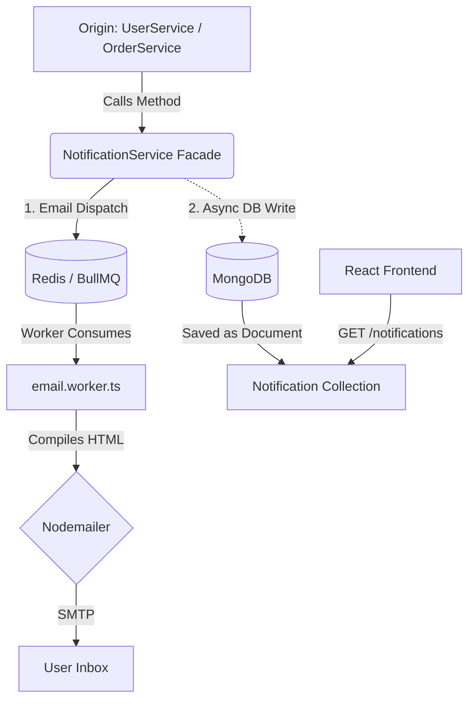

  # Notification & Queue Engine
  
  **The central nervous system of Reshma-Core. A hybrid Facade architecture managing persistent In-App alerts (MongoDB) and asynchronous transactional emails (BullMQ/Redis).**

  
  
  

---

## Overview

The Notification Module (`src/modules/notifications/`) utilizes the **Facade Design Pattern** to completely decouple business logic from messaging infrastructure. It handles two distinct notification streams:
1. **In-App Notifications:** Persistent alerts saved to MongoDB, displayed in the user's dashboard (e.g., "Welcome to Reshma Bangles" or "Security Alert").
2. **Email Notifications:** Asynchronous background jobs pushed to a Redis queue, constructed via strictly-typed HTML templates, and dispatched via SMTP.

---

## Architectural Flow & Performance Optimization

The module acts as a traffic router. When an event occurs in the system (e.g., a user changes their password), the origin service calls the `NotificationService`. 

**Performance Note (Fire-and-Forget):** 
While pushing to Redis is sub-millisecond, writing to a MongoDB cluster can cause latency spikes. To prevent notification dispatch from bottlenecking the main HTTP response, all `Notification.create()` DB writes intentionally omit the `await` keyword. They are offloaded to the Node.js background event loop with a `.catch()` block, guaranteeing that the HTTP response returns to the client instantly.  

## Core Components

### 1. The Facade Layer (`notification.service.ts`)

The unified entry point for the entire application. It contains highly specific trigger methods that abstract away the payload structures.

- `sendOtpEmail(to, firstname, otp)`: Dispatches an OTP to the email queue.

- `triggerWelcome(...)`: Hybrid Method. Dispatches a welcome email to BullMQ and triggers an asynchronous In-App dashboard alert.

- `sendPasswordUpdateConfirmation(...)`: Dispatches a security alert email and In-App notification after a password change.

- `sendOrderConfirmationNotification(...)`: (New) Dispatches the `ORDER_CONFIRMATION` job with `orderNumber` and `totalAmount`, while creating a persistent "Order Confirmed" alert in the user's bell icon.

- `sendOrderCancelledNotification(...)`: (New) Dispatches a cancellation alert with the specific reason (e.g., Payment Timeout), ensuring the user is informed of inventory restoration.

- `sendOrderShippedNotification(...)`: Dispatches strictly-typed HTML emails to BullMQ containing `trackingNumber` and `courierName`.  

### 2. The Presentation Layer (`notification.controller.ts`)

Unlike other controllers, this HTTP layer only handles the retrieval and management of In-App Notifications. It never dispatches emails.

- **Pagination:** Parses `page` and `limit` to handle long notification histories.

- **Security:** Guarantees data integrity by enforcing `req.user._id` ownership before fetching or updating a notification.

### 3. The Compiler & Strict Payload Validation

A strictly-typed utility (`compileEmailTemplate`) used exclusively by the background worker to transform raw Queue JSON into HTML.

- **Discriminated Unions:** The `EmailJobPayload` utilizes strict TS unions. For example, if a `PROFILE_UPDATE` job is dispatched, the compiler enforces that `changedField` and `time` variables must exist.

- **Order Snapshots:** Updated to handle `orderNumber` and `totalAmount` for professional, human-readable confirmation emails [cite: 1, 2].

- **Strict Exhaustiveness:** Utilizes TypeScript's `never` type. If a new `EmailJobType` is added but missing from the `switch` statement, the application will refuse to compile.

---  

## REST API Specifications (In-App Alerts)

Endpoints exposed to the React frontend to manage the user's bell-icon dashboard.

| Method | Endpoint                               | Access    | Purpose & Flow                                                                                   |
|--------|----------------------------------------|-----------|--------------------------------------------------------------------------------------------------|
| GET    | `/api/v1/notifications`                | Protected | Fetches paginated, unread notifications belonging strictly to the authenticated `req.user`.     |
| PATCH  | `/api/v1/notifications/:id/read`       | Protected | Marks a specific notification as `isRead: true`. Enforces ownership verification to prevent IDOR attacks. |

--- 

## Background Queue Architecture (BullMQ)

### 1. The Producer (`email.queue.ts`)

Pushes an `EmailJobPayload` to Redis. The payload contains only primitive data (strings, numbers) necessary to build the email, keeping the Redis memory footprint small.

### 2. The Consumer (`email.worker.ts`)

A background process initialized in `server.ts` that constantly listens to the Redis queue.

- Extracts the payload and passes it to `NotificationService.compileEmailTemplate()`.
- Injects output into `nodemailer` and communicates with the SMTP server [cite: 1].
- **Retry Logic:** Includes automatic exponential backoff in case the SMTP server temporarily drops the connection [cite: 1].  

---  

## Security & Reliability Dependencies

- **IDOR Protection:** The `markAsRead` query explicitly requires both the notification `_id` AND the `recipientId: req.user._id` [cite: 1].

- **Winston Telemetry:** Every job queued and alert triggered is logged via Winston to maintain an audit trail for delayed email investigations [cite: 1].

- **Express Rate Limiting:** Applied globally to prevent spamming the notification fetch endpoint [cite: 1].

- **Template Integrity:** Corrected naming conventions (e.g., `order-cancel.ts`) ensure the compiler never hits file-not-found errors [cite: 1].

---  

**Standard Documentation | Reshma-Core Architecture**