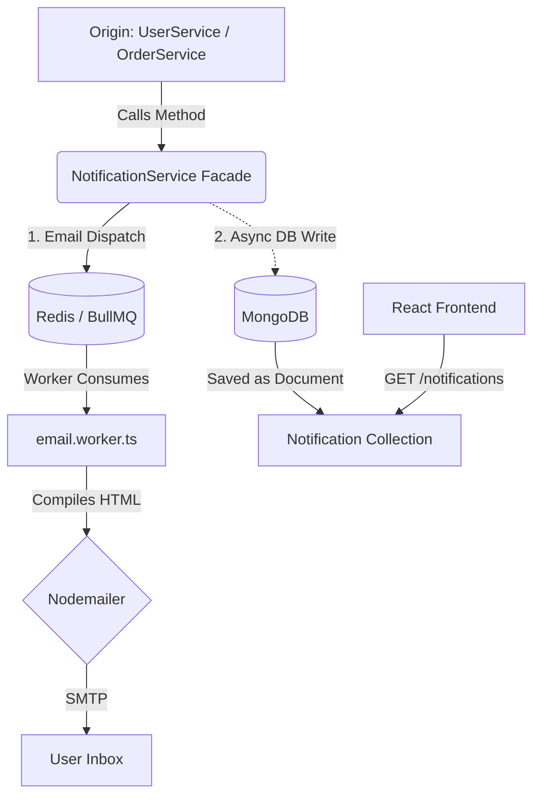

<div align="center">

  # Notification & Queue Engine

  **The central nervous system of Reshma-Core. A hybrid Facade architecture managing persistent In-App alerts (MongoDB) and asynchronous transactional emails (BullMQ/Redis).**

  [](https://bullmq.io/)
  [](https://redis.io/)
  [](https://nodemailer.com/)
  [](https://mjml.io/)

</div>

---

## Overview

The Notification Module uses the **Facade Design Pattern** to decouple business logic from messaging infrastructure. It handles two streams:

1. **In-App Notifications** – persistent alerts stored in MongoDB, displayed in the user’s dashboard (bell icon).
2. **Email Notifications** – asynchronous background jobs (BullMQ/Redis) that compile HTML templates (MJML) and dispatch via SMTP.

All email templates are strictly typed using **TypeScript discriminated unions**, ensuring compile‑time safety. In‑app notifications are written to MongoDB in a **fire‑and‑forget** manner to avoid blocking the HTTP response.

---

## Architectural Flow & Performance Optimization



**Performance note:**  

- Pushing to Redis (BullMQ) is sub‑millisecond.
- Writing to MongoDB can cause latency spikes, so `Notification.create()` calls **omit** `await` and use `.catch()` for error logging. The HTTP response returns instantly.  

---  

## Core Components

### 1. The Facade Layer (`notification.service.ts`)

Central entry point for the whole application. Provides specific trigger methods that abstract payload structures.

**Key methods:**

- `sendOtpEmail()` – queues OTP email.
- `triggerWelcome()` – hybrid: BullMQ email + async in‑app notification.
- `sendPasswordUpdateConfirmation()` – security alert email + in‑app.
- `sendOrderConfirmationNotification()` – order confirmation email + in‑app.
- `sendOrderCancelledNotification()` – cancellation email with reason.
- `sendOrderShippedNotification()` – tracking email + in‑app.
- `sendOrderDeliveredNotification()` – delivery email + in‑app.
- `sendReturnRequested/Approved/Rejected/RefundedNotification()` – return lifecycle emails + in‑app.
- `sendTicketCreatedNotification()` / `sendTicketReplyNotification()` – support ticket emails + in‑app.
- `sendDataExportEmail()` – DPDP/GDPR data export (attached JSON file).

**Fire‑and‑forget pattern for in‑app notifications:**  

```typescript
Notification.create({ recipientId, type, title, message, link })
  .catch(err => logger.error(`In-app notification failed: ${err.message}`));
```  

### 2. The Presentation Layer (`notification.controller.ts`)

Only handles **in‑app notifications** (bell icon). Never dispatches emails.

| Endpoint | Method | Description |
|----------|--------|-------------|
| `/api/v1/notifications` | `GET` | Paginated, unread notifications for the authenticated user. |
| `/api/v1/notifications/:id/read` | `PATCH` | Marks a notification as read (IDOR‑protected). |

### 3. The Compiler & Strict Payload Validation (`compileEmailTemplate`)

- Uses **TypeScript discriminated unions** (`EmailJobPayload`). Each job type has its own required data fields.
- The `switch` statement is **exhaustive**: if a new `EmailJobType` is added but not handled, the TypeScript compiler will error (using the `never` type).
- All templates are MJML‑based, compiled to HTML with dark mode support and responsive design.

**Exhaustiveness example**

```typescript
switch (payload.type) {
  case "OTP_VERIFICATION": return { subject, html: await otpVerificationTemplate(...) };
  // ... other cases
  default:
    const _exhaustiveCheck: never = payload;
    throw new Error(`Unhandled email type: ${payload.type}`);
}
```  

---  

## Background Queue Architecture (BullMQ)

### Producers

| Queue | Purpose | File |
|-------|---------|------|
| Email Queue | All transactional emails | `email.queue.ts` |
| Data Export Queue | DPDP/GDPR takeout | `export.queue.ts` |
| Invoice Queue | PDF generation | `invoice.queue.ts` |
| Search Sync Queue | Typesense eventual consistency | `product.service.ts` |

### Consumers (Workers)

| Worker | Purpose | Concurrency | Retry |
|--------|---------|-------------|-------|
| `email.worker.ts` | Compiles MJML, sends via Nodemailer | N/A (BullMQ default) | 3 attempts, exponential backoff |
| `export.worker.ts` | Fetches user data, creates JSON, emails | 5 | 3 attempts |
| `invoice.worker.ts` | Generates PDF, uploads to Cloudinary | 5 | 3 attempts (exponential) |
| Search sync (DLQ) | Retries failed Typesense ops | N/A | 10 attempts, exponential backoff |  

**Security:** All workers use `safeLog()` to strip `\r\n` from logs (CWE‑117 mitigation).  

---  

## Security & Compliance

| Concern | Mitigation |
|---------|-------------|
| IDOR (Insecure Direct Object Reference) | `Notification.findOneAndUpdate({ _id, recipientId: userId })` ensures ownership. |
| Log injection (CWE‑117) | `safeLog()` strips control characters before Winston logging. |
| DPDP/GDPR Right to Access | Asynchronous data export (`export.worker.ts`) – email with JSON attachment. |
| DPDP/GDPR Right to be Forgotten | Account deletion triggers `deleteUserCart`, `deleteUserWishlist` and anonymises orders. |
| Rate limiting | `standardLimiter` applied before authentication on `/notifications` routes. |
| Template integrity | MJML compilation errors are caught; fallback plain HTML prevents outage. |

---

## REST API Specifications (In-App Alerts)

| Method | Endpoint | Access | Description |
|--------|----------|--------|-------------|
| `GET` | `/api/v1/notifications` | Protected | Paginated, unread notifications (newest first). Supports `?page=1&limit=10`. |
| `PATCH` | `/api/v1/notifications/:notificationId/read` | Protected | Marks a single notification as read. Verifies `recipientId` matches `req.user._id`. |  

---  

## Related Files

| File | Purpose |
|------|---------|
| `src/modules/notifications/notification.controller.ts` | HTTP layer (in‑app only). |
| `src/modules/notifications/notification.service.ts` | Facade – dispatches emails and in‑app alerts. |
| `src/modules/notifications/notification.model.ts` | Mongoose schema for in‑app notifications. |
| `src/modules/notifications/interface/email.interface.ts` | Discriminated union types for email jobs. |
| `src/shared/queues/email.queue.ts` | BullMQ producer. |
| `src/shared/queues/email.worker.ts` | BullMQ consumer – compiles HTML, sends SMTP. |
| `src/shared/queues/export.queue.ts` & `export.worker.ts` | Data portability. |
| `src/modules/notifications/templates/*.ts` | MJML email templates (welcome, OTP, order, return, support, etc.). |
| `src/modules/notifications/templates/layout.ts` | Base MJML layout with dark mode, social links, footer. |  

---  

## See Also

- [Background Jobs & Cron](../architecture/background-jobs-and-cron.md) – detailed queue and worker architecture.
- [Order Module](./order-module.md) – triggers order‑related notifications.
- [User Module](./user-module.md) – triggers security alerts and data export.
- [Return Module](./return-module.md) – triggers return lifecycle emails.
- [Support Module](./support-module.md) – triggers ticket‑related alerts.
- [Security Hardening](../architecture/security-hardening.md) – CWE‑117 and IDOR mitigations.

---  

*The Reshma-Core Team*  