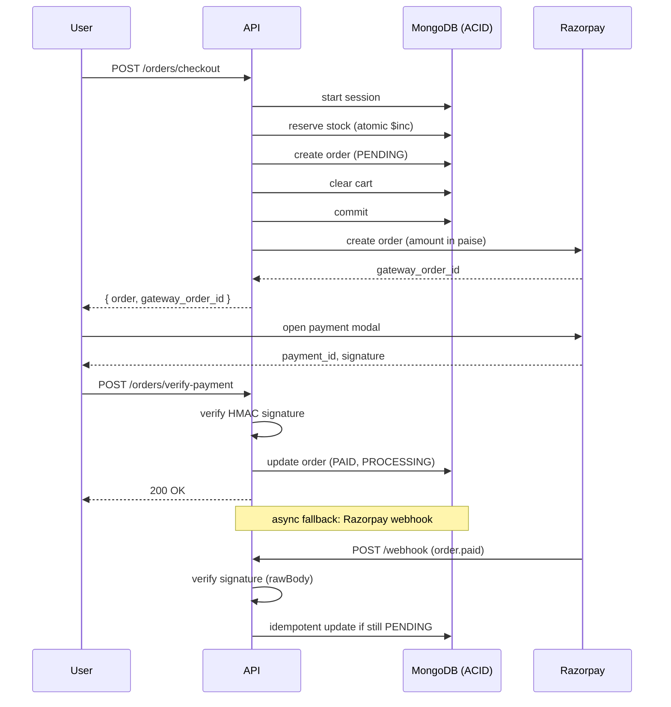
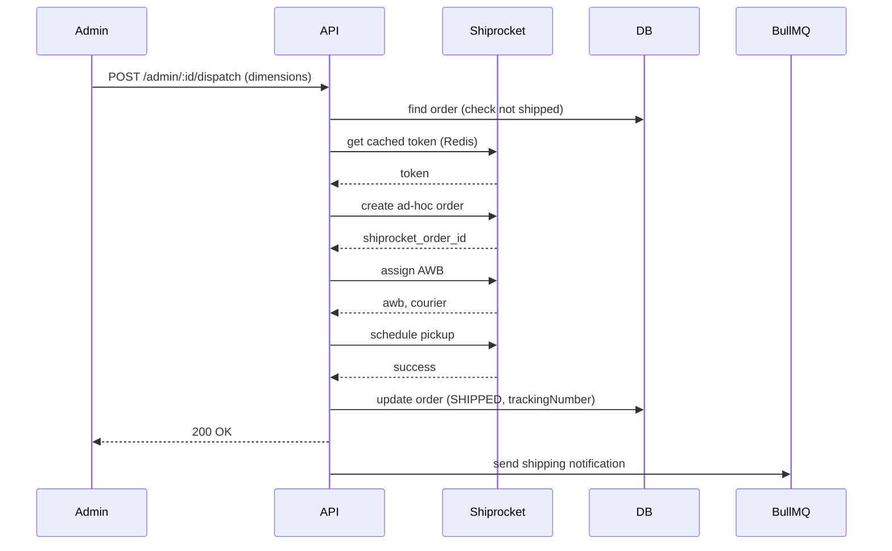
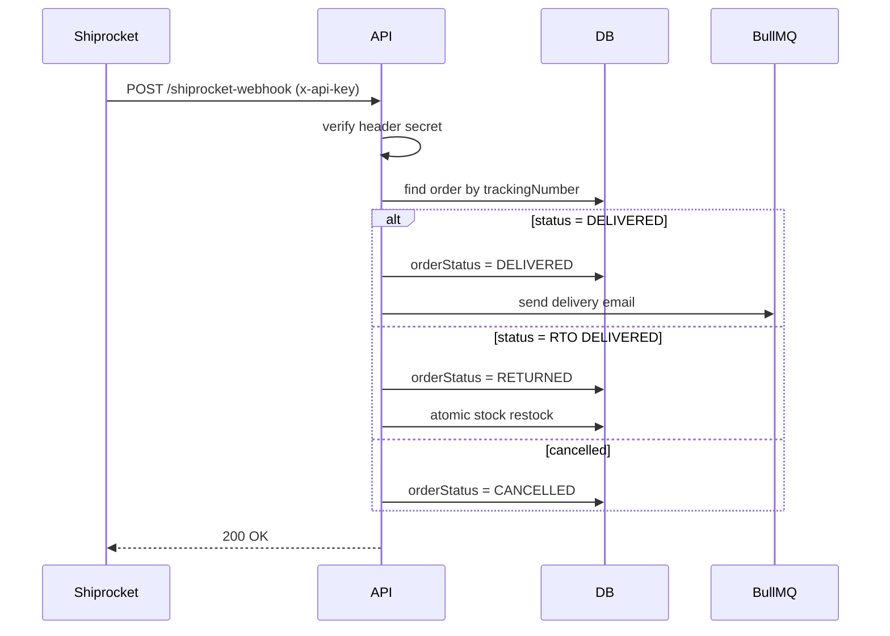

<div align="center">

  # Order & Checkout Module

  **The high-stakes financial engine managing cart finalization, payment verification, and immutable order records for the Reshma-Core platform.**

  [](https://www.mongodb.com/)
  [](https://razorpay.com/)
  [](https://bullmq.io/)
  [](https://pdfkit.org/)
  [](https://zod.dev/)

</div>

---

## 1. Overview

The Order Module (`src/modules/orders/`) is the financial source of truth. It transforms volatile cart data into immutable financial records using **MongoDB ACID transactions** and **cryptographic HMAC handshakes** (Razorpay). It handles checkout, payment verification, order state management, PDF invoicing, and logistics (Shiprocket).

All order routes are prefixed with `/api/v1/orders` and protected by rate limiting (`standardLimiter`, `checkoutLimiter`) and authentication (`protect`). Admin endpoints require `restrictTo("ADMIN")`.

---

## 2. Core Architectural Pillars

### ACID-Compliant Transactions
- **Atomic Boundary:** Stock deduction, order creation, cart clearing – all in one MongoDB session.
- **Auto-Rollback:** If any step fails (e.g., stock insufficient), the entire transaction is rolled back.
- **Implementation:** `mongoose.startSession()` + `session.startTransaction()` in `OrderService.initializeCheckout`.

### Historical Immutability & Tax Snapshotting
- **Deep-Copy Snapshotting:** At checkout, we capture `priceAtPurchase`, `sku`, `name`, `selectedAttributes`, `imageSnapshot`, and line‑item tax data (`hsnCode`, `taxableValue`, `gstRate`, `cgst`, `sgst`, `igst`).
- **Why:** Tax laws or product prices may change later. Frozen data guarantees legal audit compliance.

### Atomic Stock Reservation
- **MongoDB pattern:** `findOneAndUpdate` with `{ currentStock: { $gte: quantity } }` and `$inc: { currentStock: -quantity }`.
- **Race‑condition safe:** The atomic update prevents overselling under high concurrency.

---

## 3. Financial & Tax Compliance Engine (GST)

### Proportional Discounting
- Coupon discount is distributed across line items based on their weight in the cart.
- Prevents “refund exploit” – a returned item refunds exactly the discounted amount paid.

### Dynamic GST Brackets
- `STITCHED_APPAREL` uses 5% if discounted unit price ≤ ₹2500, else 18%.
- Other profiles have fixed rates (3%, 12%, 18%, etc.) – see `TaxProfile` enum in `tax.utils.ts`.

### State Arbitration
- Business origin: **West Bengal**.
- **Intra‑state** (WB → WB) → tax split 50/50 into `cgst` and `sgst`.
- **Inter‑state** (WB → other) → 100% `igst`.

### Shipping Service Tax
- Shipping charge (₹100 if subtotal ≤ ₹2000, else ₹0) includes 18% GST, isolated by `TaxEngine.calculateShippingTax`.

All tax logic is centralised in `tax.utils.ts` and invoked during checkout (`OrderService.initializeCheckout`).

---

## 4. Order Lifecycle & State Machine

```mermaid
graph LR
    A[PENDING] -->|payment success| B[PROCESSING]
    B -->|admin dispatch| C[SHIPPED]
    C -->|webhook delivered| D[DELIVERED]
    A -->|abandoned (cron)| E[CANCELLED]
    B -->|admin cancel| E
    D -->|return initiated| F[RETURN_REQUESTED]
    F -->|return approved & processed| G[RETURNED]
```  
- **Standard flow:** `PENDING` → `PROCESSING` → `SHIPPED` → `DELIVERED`
- **Exception flow:** `CANCELLED`, `RETURN_REQUESTED`, `RETURNED`
- **Abandoned order recovery:** Cron job (`order-recovery.cron.ts`) runs every 15 minutes, cancels orders older than 30 minutes, restores stock, and sends cancellation email.  

---  

## 5. Key Workflows (Sequence Diagrams)

### 5.1 Checkout & Payment (Razorpay)  



### 5.2 Shiprocket Dispatch  



### 5.3 Webhook & State Sync (Shiprocket)  



---  

## 6. Security & Firewalls

| Threat | Mitigation |
|--------|------------|
| Card‑testing bots | `checkoutLimiter` (5 per hour per IP) |
| NoSQL injection | Zod `.strict()` schemas + explicit `$eq` wrappers |
| Prototype pollution | `Object.create(null)` for sanitised payloads |
| IDOR (invoice access) | `Order.findOne({ _id, user: req.user._id })` |
| TOCTOU on coupons | Coupon re‑validated inside ACID session before payment |
| Webhook spoofing | HMAC SHA‑256 verification with `RAZORPAY_WEBHOOK_SECRET` |
| Shiprocket webhook impersonation | Static `x-api-key` header check |
| Double dispatch | Check `trackingNumber` exists before calling Shiprocket |
| Shipping unpaid orders | Reject if `paymentStatus !== "PAID"` |  

---  

## 7. Technical Implementations

### Webhook Raw Body Interceptor (`app.ts`)

- Captures `req.rawBody` for HMAC verification before JSON parsing.
- Used by Razorpay and Shiprocket webhooks.

### Asynchronous PDF Invoice Generation

- **Producer:** `OrderService` enqueues job via `InvoiceQueueManager.enqueueInvoiceGeneration`.
- **Worker:** `invoice.worker.ts` uses PDFKit to generate invoice, uploads to Cloudinary (buffer stream), saves `invoiceUrl` to order.
- **Concurrency:** 5 workers, 3 retries with exponential backoff.

### Automated Communications

- `OrderService` triggers `NotificationService` methods for order confirmation, cancellation, shipping, delivery.
- All notifications are fire‑and‑forget (BullMQ for emails, non‑blocking DB writes for in‑app alerts).

### Abandoned Order Recovery (Cron)

- Runs every 15 minutes (`order-recovery.cron.ts` with Redis distributed lock).
- Cancels `PENDING` orders older than 30 minutes, restocks inventory, sends cancellation email.

---

## 8. Related Files

| File | Purpose |
|------|---------|
| `order.service.ts` | Core checkout, payment verification, webhook processing, cron recovery. |
| `order.model.ts` | Mongoose schema, pre‑save hook for `orderNumber`. |
| `order.public.controller.ts` | Customer endpoints (checkout, verify, invoice, my orders). |
| `order.admin.controller.ts` | Admin endpoints (list, status update, dispatch). |
| `order.routes.ts` | Route definitions with rate limiting, auth, RBAC, validation. |
| `order.dto.ts` | Zod schemas for checkout, status update, dispatch. |
| `order.interface.ts` | TypeScript interfaces (`IOrder`, `IOrderItem`, webhook payloads). |
| `invoice.generator.ts` | PDFKit invoice generation (GST table, logo fetch, terms). |
| `tax.utils.ts` | `TaxEngine` – dynamic GST, state arbitration, shipping tax. |
| `shiprocket.service.ts` | Shiprocket dispatch orchestrator + webhook handler. |
| `payment.utils.ts` | HMAC signature verification (Razorpay). |
| `order-recovery.cron.ts` | Cron job with Redis distributed lock. |  

---  

## 9. See Also

- [Cart Module](./cart-module.md) – source of cart data for checkout.
- [Coupon Module](./coupon-module.md) – discount validation and atomic usage.
- [Notification Module](./notification-module.md) – email and in‑app alerts.
- [Background Jobs & Cron](../architecture/background-jobs-and-cron.md) – invoice queue, cron locking.
- [Logistics & Shipping](../architecture/logistics-and-shipping.md) – Shiprocket integration deep dive.
- [Security Hardening](../architecture/security-hardening.md) – HMAC, rate limiting, IDOR.

---  

*The Reshma-Core Team*  