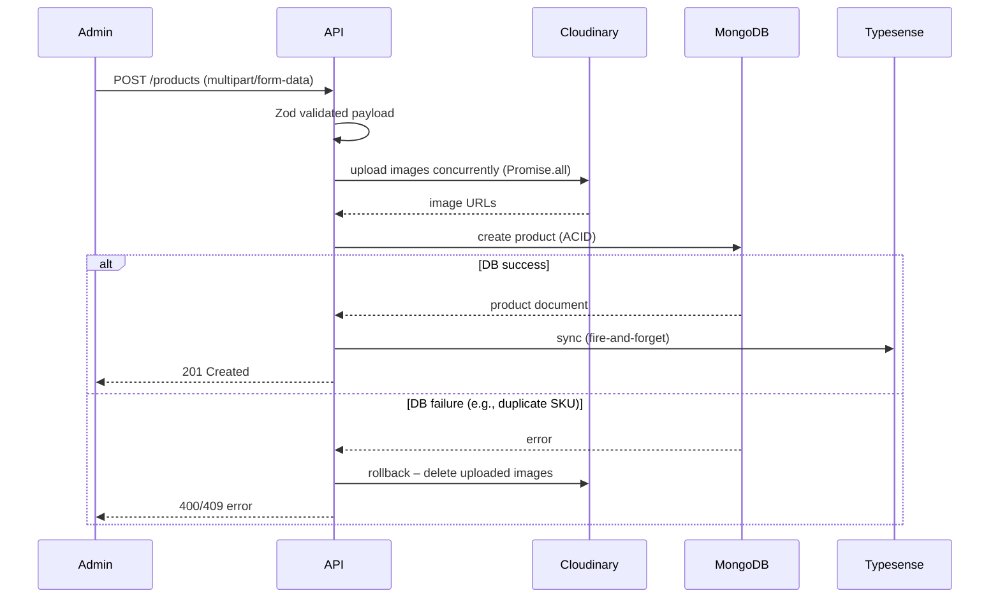

<div align="center">

  # Product Domain Module

  **The polymorphic catalog engine powering CRUD operations, category‑specific validation, and Cloudinary image management for the Reshma‑Core platform.**

  [](https://www.mongodb.com/)
  [](https://cloudinary.com/)
  [](https://zod.dev/)
  [](https://mongoosejs.com/)

</div>

---

## 1. Overview

The Product Module (`src/modules/products/`) is the core catalog engine. It handles CRUD operations for the polymorphic inventory, validates category‑specific payloads using Zod discriminated unions, and manages the Cloudinary image pipeline (memory‑stream uploads, automatic rollback on failure). It also synchronises product data to Typesense for fast search.

**Base Route:** `/api/v1/products`

---

## 2. Controller Architecture & API Endpoints

The presentation layer is split into two controllers to enforce security boundaries and keep files maintainable.

### Public Controller (`PublicProductController`)

Optimised for read‑heavy traffic. Uses MongoDB compound indexes, text search, and `.lean()` to strip Mongoose hydration overhead.

| Method | Endpoint | Description |
|--------|----------|-------------|
| `GET` | `/` | Fetch paginated catalog. Supports `page`, `limit`, `itemType`, `mainCategory`, `subCategory`, and full‑text search (`q`). |
| `GET` | `/:id` | Fetch a single product by ObjectId. |

Both routes are wrapped in `cacheMiddleware(300)` (5‑minute TTL) and protected by `standardLimiter`.

### Admin Controller (`AdminProductController`)

Requires a valid JWT and the `ADMIN` role (enforced by `protect` + `restrictTo("ADMIN")`).

| Method | Endpoint | Description |
|--------|----------|-------------|
| `POST` | `/` | Create a new product (multipart/form‑data, up to 5 images). |
| `PATCH` | `/:id` | Partially update product fields. |
| `DELETE` | `/:id` | Soft‑delete a product (`isActive: false`). Hard deletion never occurs to preserve historical orders. |

After each mutation, a **fire‑and‑forget** cache invalidation (`CacheManager.invalidateCachePattern`) clears the Redis edge cache.

---

## 3. Zod Validation Strategy (Discriminated Unions)

The admin creation endpoint uses `z.discriminatedUnion` to enforce the correct fields based on `itemType`. Defined in `product.admin.dto.ts`.

```typescript
export const CreateProductSchema = z.object({
  body: z.discriminatedUnion("itemType", [
    BangleSchema,
    ApparelSchema,
    FabricSchema,
    InnerwearSchema,
    AccessorySchema,
  ]),
});
```  

### How it protects the system:  

- If `itemType === "BANGLE"`, Zod requires `bangleSizes` and forbids `cupSizes`.
- If `itemType === "APPAREL"`, Zod requires `sizes` and forbids `bangleSizes`.
- All types must include `hsnCode` and `taxProfile` (legal GST requirement).

Invalid requests are rejected with `400 Bad Request` before reaching the service layer.  

---  

## 4. Business Logic & Service Layer (`product.service.ts`)

The service layer isolates database operations and handles distributed transactions. Below is the **product creation flow** with Cloudinary rollback.  



### Key service methods:  

| Method | Description |
|--------|-------------|
| `createProduct` | Uploads images to Cloudinary, saves product, rolls back images on DB failure. |
| `updateProduct` | Partially updates product, syncs changes to Typesense (if `isActive` toggled). |
| `softDeleteProduct` | Sets `isActive: false`, removes from Typesense index. |
| `getProducts` | Paginated, filtered catalog with text search. |
| `reserveStock` | Atomic `$inc` with `$gte` – used during checkout to prevent overselling. |  

---  

## 5. Legal Tax Compliance (Indian GST)

Every product stores:

- `hsnCode` – 4‑8 digit numeric string (e.g., `"7117"` for imitation jewellery).
- `taxProfile` – enum used by the `TaxEngine` (e.g., `"STITCHED_APPAREL"`, `"UNSTITCHED_FABRIC"`).

The tax engine dynamically resolves the GST rate based on the transaction value (post‑discount). For `STITCHED_APPAREL`, the rate changes from 18% to 5% if the discounted price falls below ₹2,500.

---

## 6. Edge Cache & Performance Shielding

| Feature | Implementation | Benefit |
|---------|----------------|---------|
| **Redis edge cache** | `cacheMiddleware(300)` on all GET routes. | Serves JSON from RAM (~2ms) for 5 minutes. 10,000 concurrent users → only 1 MongoDB query. |
| **Cache invalidation** | `CacheManager.invalidateCachePattern` fired after admin mutations. | Ensures public catalog sees fresh data immediately. |
| **Typesense DLQ** | Failed syncs go to `search-sync-queue` (BullMQ) with 10 attempts, exponential backoff (5s, 10s, 20s…). | Guarantees eventual consistency without blocking primary DB transaction. |

---

## 7. Security & Validation Firewalls

| Threat | Mitigation |
|--------|------------|
| **NoSQL injection** | Zod schemas + `Sanitizer.sanitize()` strips `$` and `.` keys. |
| **Prototype pollution** | `Sanitizer.PROHIBITED_KEYS` removes `__proto__`, `constructor`, `prototype`. |
| **Mass assignment** | Zod schemas only allow documented fields; extra fields are stripped. |
| **Malicious image uploads** | Multer MIME filter (only JPEG/PNG/WebP), 10MB limit, Cloudinary re‑encodes. |
| **DoS (public catalog)** | `standardLimiter` (100 req/15 min) + edge cache. |
| **Admin RBAC** | `restrictTo("ADMIN")` on all write endpoints. |  

---  

## 8. Related Files

| File | Purpose |
|------|---------|
| `src/modules/products/product.admin.controller.ts` | Admin CRUD, cache invalidation. |
| `src/modules/products/product.public.controller.ts` | Public listing and detail. |
| `src/modules/products/product.service.ts` | Core logic – creation, update, stock reservation, search sync. |
| `src/modules/products/models/base-product.model.ts` | Mongoose base schema, indexes, pre‑delete hook. |
| `src/modules/products/models/*.model.ts` | Discriminator models (bangle, apparel, fabric, innerwear, accessory). |
| `src/modules/products/interfaces/*.ts` | TypeScript interfaces for base and discriminators. |
| `src/modules/products/dtos/product.admin.dto.ts` | Zod discriminated union for creation/update. |
| `src/modules/products/dtos/product.public.dto.ts` | Query validation (pagination, filters). |
| `src/shared/middlewares/cache.middleware.ts` | Redis edge cache. |
| `src/shared/middlewares/upload.middleware.ts` | Multer memory storage, file filter. |
| `src/config/cloudinary.ts` | Upload/delete utilities. |
| `src/shared/queues/export.queue.ts` (search sync) | Dead‑letter queue for Typesense retries. |  

---  

## 9. See Also

- [Database Design – Polymorphic Catalog](../architecture/database-design.md#database-design--polymorphic-catalog)
- [Product Catalog Schema (Field Mapping)](../architecture/product-catalog.md)
- [Cart Module](./cart-module.md) – uses live product prices.
- [Order Module](./order-module.md) – uses `reserveStock` during checkout.
- [Tax & GST Engine](../architecture/legal-tax-compliance.md)
- [Security Hardening](../architecture/legal-tax-compliance.md) – sanitisation and rate limiting.
- [Edge Cache & Workers](../architecture/edge-cache.md)  

---  

*The Reshma-Core Team*  