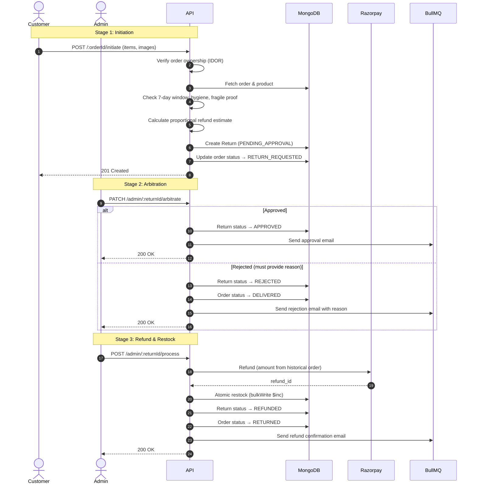

<div align="center">
  
  # Return & RMA Module

  **The strict, 3-stage reverse-logistics engine managing customer returns, financial refunds, and atomic inventory restocking.**

  [](#)
  [](#)
  [](#)

</div>

## 1. Overview

The Return Module (`src/modules/returns/`) handles the complex lifecycle of reversing an order – moving money backward and restoring inventory. It operates on a strictly enforced **3‑stage state machine** and uses **proportional discounting** to calculate refund amounts based on what the customer actually paid (not the live catalog price).

**Base Route:** `/api/v1/returns`  
**RMA lifecycle stages:** `PENDING_APPROVAL` → `APPROVED` / `REJECTED` → `REFUNDED`

---

## 2. The 3‑Stage State Machine (Sequence Diagram)



---  

## 3. State Machine & Status Transitions

| Status | Description | Who Can Transition | Next Possible Statuses |
|--------|-------------|--------------------|------------------------|
| `PENDING_APPROVAL` | Customer request submitted, awaiting admin review. | Admin | `APPROVED`, `REJECTED` |
| `APPROVED` | Return approved; customer must ship item back. | Admin (via process) | `REFUNDED` |
| `REJECTED` | Return declined. Order reverts to `DELIVERED`. | Admin | (terminal) |
| `REFUNDED` | Refund issued and inventory restocked. Order becomes `RETURNED`. | System (auto after gateway success) | (terminal) |

> **Note:** A unique index on `order` prevents duplicate return requests for the same order (double‑refund protection).  

---  

## 4. Financial Taint Severing & Proportional Discounting

The system never uses the live product price for refunds. Instead, it looks at the historical order snapshot and applies proportional discounting:

- **Formula:** `refundAmount = (rawItemTotal / rawOrderTotal) * actualPaidAmount`
- **Why:** If a user bought a ₹1000 item and a ₹1500 item, used a ₹500 coupon, and paid ₹2000, then returning the ₹1000 item should refund ₹800 (not ₹1000). The discount is proportionally distributed.

**Implementation:** `ReturnService.initiateReturn`  

```typescript
const rawSubtotal = order.items.reduce((sum, item) => sum + item.priceAtPurchase * item.quantity, 0);
const discountRatio = order.pricing.totalAmount / rawSubtotal;
const refundEstimate = rawItemTotal * discountRatio;
```  

This prevents coupon‑abuse refund exploits and keeps financial records accurate for GST audits.  

---  

## 5. Eligibility Firewalls (Stage 1)

| Condition | Enforcement | Error Response |
|-----------|-------------|----------------|
| **Order ownership** | `Order.findOne({ _id, user: userId })` | `404 Not Found` |
| **Order delivered** | `order.orderStatus === "DELIVERED"` | `400 Bad Request` |
| **7‑day window** | `daysSinceDelivery > 7` → reject | `400 Bad Request` |
| **Hygiene policy (INNERWEAR)** | `liveProduct.itemType === "INNERWEAR"` | `403 Forbidden` |
| **Fragile items require images** | `isFragile === true` and no images array | `400 Bad Request` |
| **Duplicate return** | Unique index on `order` (MongoDB 11000) | `409 Conflict` |

---

## 6. Refund & Restock (Stage 3 – Two‑Phase Execution)

To avoid database connection pool starvation, the refund is processed **outside** the ACID transaction:

1. **Gateway handshake** – Call Razorpay refund API (may take a few seconds).
2. **If success** – Open a MongoDB transaction to atomically:
   - Restock inventory using `bulkWrite` (`$inc` on each product).
   - Update return status to `REFUNDED`.
   - Update order status to `RETURNED`.
3. **If gateway fails** – Throw error; no database changes.

This pattern prevents long‑held database locks and ensures that a failed refund does not corrupt stock data.

---

## 7. Security & Firewalls

| Threat | Mitigation |
|--------|------------|
| **IDOR (return on someone else’s order)** | `Order.findOne({ _id, user: userId })` before creating return. |
| **NoSQL injection** | All `$eq` wrappers + Zod regex validation for ObjectId. |
| **Mass assignment / prototype pollution** | Zod `.strict()` schemas drop undocumented fields. |
| **Double refund** | Unique index on `order` in Return collection. |
| **Refund amount manipulation** | Refund estimate calculated on backend from historical order snapshot, never trusted from frontend. |
| **Log injection** | `safeLog()` strips `\r\n` from logs (CWE‑117). |
| **Rate limiting** | `standardLimiter` applied before authentication on public endpoints. |  

---  

## 8. Related Files

| File | Purpose |
|------|---------|
| `return.public.controller.ts` | Customer endpoints – initiate, history. |
| `return.admin.controller.ts` | Admin endpoints – list, arbitrate, process refund. |
| `return.service.ts` | Core logic – eligibility, proportional refund, arbitration, refund+restock transaction. |
| `return.model.ts` | Mongoose schema, unique index on `order`. |
| `return.interface.ts` | TypeScript enums (`ReturnStatus`, `ReturnReason`) and interfaces. |
| `return.dto.ts` | Zod validation (ObjectId regex, conditional `adminRejectionReason`). |
| `return.route.ts` | Route definitions with rate limiting, auth, RBAC. |

---

## See Also

- [Order Module](./order-module.md) – source of historical order snapshots.
- [Coupon Module](./coupon-module.md) – proportional discounting logic.
- [Notification Module](./notification-module.md) – return lifecycle emails.
- [Security Hardening](../architecture/security-hardening.md) – CWE‑117, rate limiting.
- [Legal & Tax Compliance](../architecture/legal-tax-compliance.md) – GST and financial record keeping.

---  

*The Reshma-Core Team*  