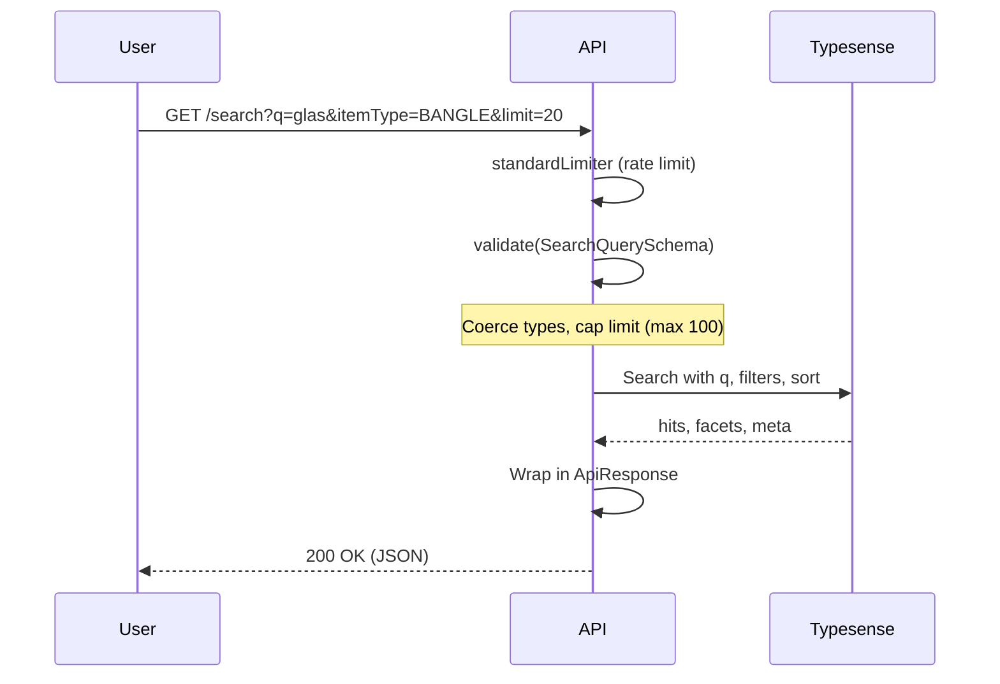

<div align="center">
  # Search & Discovery Module

  **The high-performance, sub-50ms RAM-based discovery engine powering typo-tolerant and faceted searches.**

  [](#)
  [](#)
  [](#)
  [](#)

</div>

## 1. Executive Summary & Architecture

The Search Module (`src/modules/search/`) implements a **Dual‑Database Architecture**:

- **MongoDB** – primary source of truth for ACID transactions, financial records, and polymorphic data.
- **Typesense** – a C++ based, purely in‑memory (RAM) search engine used for **typo‑tolerant, faceted, sub‑50ms searches**.

The module exposes a public `GET /api/v1/search` endpoint that queries Typesense directly, bypassing MongoDB for read‑heavy discovery operations.

**Key benefits:**
- **Typo tolerance** – `num_typos: 2` allows two typos per word.
- **Faceted filtering** – returns counts for `itemType` and `mainCategory` for UI refinement.
- **RAM performance** – Typesense keeps the entire index in memory, delivering consistent low latency.

---

## 2. Search Request Flow (Sequence Diagram)



**Steps:**  

1. **Rate limiting** – `standardLimiter` (100 requests per 15 min per IP) protects the RAM cluster.
2. **Zod validation** – `SearchQuerySchema` coerces `page`/`limit`/`price` to numbers, caps `limit` at 100, and defaults `q` to `*`.
3. **Typesense query** – `SearchService.executeSearch` builds the filter string and executes the search.
4. **Response** – Raw results are wrapped in `ApiResponse` for consistency.  

---  

## 3. Eventual Consistency Synchronisation (Product → Typesense)

To keep Typesense aligned with MongoDB without slowing down admin CRUD, the `ProductService` uses a **fire‑and‑forget eventual consistency pipeline** with a Dead Letter Queue (DLQ).  

```mermaid
graph LR
    A[Admin updates product] --> B[ProductService]
    B -->|MongoDB transaction| C[(MongoDB)]
    B -.->|Async sync| D[Typesense client]
    D -- success --> E[Index updated]
    D -- failure --> F[search-sync-queue (BullMQ)]
    F -->|retry (10 attempts, exponential backoff)| D
```  

**Key points:**

- The sync is **non‑blocking** – MongoDB transaction succeeds even if Typesense is temporarily unreachable.
- Failed syncs are pushed to a **BullMQ dead‑letter queue** with **10 attempts** and exponential backoff (starting at 5 seconds).
- The payload is **stripped** of heavy BSON data (e.g., nested variant objects) and images are set to `index: false` to preserve RAM.  

---  

## 4. Query Payload Firewall (Zod)

`SearchQuerySchema` (defined in `search.dto.ts`) acts as a strict gateway:

| Field | Type | Validation | Default | Notes |
|-------|------|------------|---------|-------|
| `q` | `string` | – | `"*"` | Wildcard returns everything if empty. |
| `page` | `number` | `z.coerce.number().int().min(1)` | `1` | Auto‑coerced from string. |
| `limit` | `number` | `z.coerce.number().int().min(1).max(100)` | `20` | Hard cap of 100 prevents memory exhaustion. |
| `itemType` | `string` | optional | – | Facet filter (exact match). |
| `mainCategory` | `string` | optional | – | Facet filter. |
| `minPrice` / `maxPrice` | `number` | `z.coerce.number().min(0)` | – | Price range filter. |
| `sortBy` | `enum` | `"basePrice:asc"`, `"basePrice:desc"`, `"createdAt:desc"` | – | Strictly controlled to prevent injection. |

**Security:** Zod coercion and caps block malicious payloads like `limit=999999` or `page=-1`.

---

## 5. Typesense Search Configuration

| Parameter | Value | Description |
|-----------|-------|-------------|
| `query_by` | `name,description,tags,sku` | Fields indexed for text search. |
| `num_typos` | `2` | Allows up to two typos per word. |
| `typo_tokens_threshold` | `1` | Minimum word length for typo correction. |
| `facet_by` | `itemType, mainCategory` | Returns counts for faceted filtering. |
| `per_page` | `limit` | Capped at 100. |
| `filter_by` | dynamically built | `itemType:=[BANGLE] && basePrice:>=100` etc. |

**Strict SDK Typings:** The service uses `ITypesenseProductDoc` generic to avoid object defaults, satisfying `exactOptionalPropertyTypes` and preventing CodeQL “Type Confusion” alerts.

---

## 6. Security & Rate Limiting

| Threat | Mitigation |
|--------|------------|
| **DoS / scraping attacks** | `standardLimiter` (100 requests / 15 min per IP) applied to `/search`. |
| **Memory exhaustion** | `limit` capped at 100 in Zod schema. |
| **NoSQL / injection** | Zod type coercion + strict filter building; Typesense uses its own safe parser. |
| **Typosquatting / bad queries** | `num_typos: 2` ensures usability while limiting resource use. |  

---  

## 7. Related Files

| File | Purpose |
|------|---------|
| `src/modules/search/search.controller.ts` | HTTP layer, calls service, wraps response. |
| `src/modules/search/search.service.ts` | Builds Typesense query, executes, returns raw results. |
| `src/modules/search/search.routes.ts` | Route definition with `standardLimiter` and `validate`. |
| `src/modules/search/dtos/search.dto.ts` | Zod schema for query validation. |
| `src/config/typesense.ts` | Typesense client initialisation and schema management. |
| `src/modules/products/product.service.ts` | Product → Typesense sync and DLQ. |
| `src/shared/queues/search-sync-queue` | BullMQ dead‑letter queue for retries. |

---

## See Also

- [Product Module](./product-module.md) – source of product data and sync hooks.
- [Background Jobs & Cron](../architecture/background-jobs-and-cron.md) – DLQ and exponential backoff details.
- [Database Design](../architecture/database-design.md) – Indexing – why MongoDB text search is not used for typo‑tolerant search.
- [Security Hardening](../architecture/security-hardening.md) – rate limiting and validation.  

---  

*The Reshma-Core Team*  