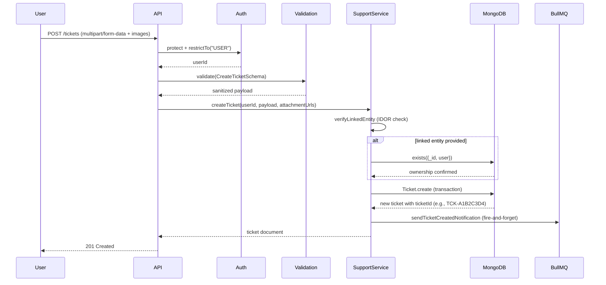
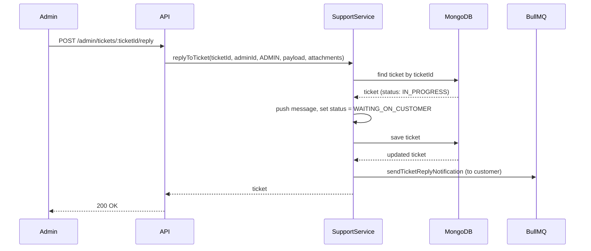
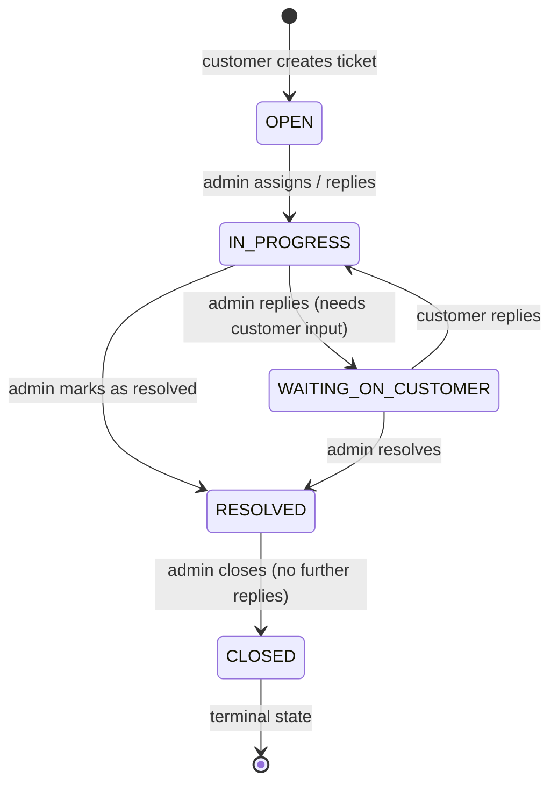

<div align="center">

  # Customer Support Module
  
  **The decentralized, state-driven ticketing engine powering polymorphic customer inquiries, threaded conversations, and DPDP‑compliant privacy redaction.**

  [](#)
  [](#)
  [](#)
  [](#)
  [](#)

</div>

---

## 1. Executive Summary & Architecture

The Support Module (`src/modules/support/`) is the central communication hub bridging customers and administrators. It manages **threaded conversations**, supports photographic evidence via Cloudinary, and legally intertwines with the platform’s DPDP/GDPR compliance engines.

**Base Route:** `/api/v1/support`

**Key architectural decisions:**

| Decision | Implementation | Consequence |
|----------|----------------|--------------|
| **Embedded messages** | Messages stored as sub‑document array inside `Ticket` model. | One database read fetches entire conversation → O(1) dashboard load. |
| **Polymorphic linking** | `linkedEntity` object with `entityType` (`Order`/`Product`/`Return`) and `entityId`. | Single ticket can reference multiple domain entities without relational joins. |
| **State machine SLA** | Status transitions: `OPEN` → `IN_PROGRESS` → `WAITING_ON_CUSTOMER` → `RESOLVED` → `CLOSED`. | Auto‑shifts based on sender role; closed tickets are locked forever. |
| **Privacy by design** | `anonymizeUserTickets` scrubs user PII on account deletion but keeps admin replies for QA. | Satisfies “Right to be Forgotten” without losing business analytics. |

---

## 2. API Endpoints (Public & Admin)

All routes require a valid JWT (`protect` middleware).  
Public routes are restricted to `USER` role; admin routes to `ADMIN` role.

### Public (Customer) Endpoints

| Method | Route | Description | Validation |
|--------|-------|-------------|-------------|
| `POST` | `/tickets` | Create a new ticket | `CreateTicketSchema` |
| `POST` | `/tickets/:ticketId/reply` | Reply to existing ticket | `ReplyTicketSchema` |
| `GET` | `/tickets/me` | Fetch user’s ticket history (paginated) | Query params: `page`, `limit` |

### Admin Endpoints

| Method | Route | Description | Validation |
|--------|-------|-------------|-------------|
| `GET` | `/admin/tickets` | View all tickets with filtering | Query: `status`, `priority`, `category` |
| `POST` | `/admin/tickets/:ticketId/reply` | Admin replies to customer | `ReplyTicketSchema` + Cloudinary upload |
| `PATCH` | `/admin/tickets/:ticketId/state` | Update status, priority, or assignment | `UpdateTicketStateSchema` |

> **Security note:** Customer-facing schemas explicitly exclude `status`, `priority`, and `assignedAdmin`. Malicious users cannot escalate their own tickets.

---

## 3. Request Flow Sequence Diagrams

### 3.1 Create a New Ticket



### 3.2 Admin Reply (State Machine Trigger)  



---  

## 4. Security & Payload Firewalls (Zod)

All incoming payloads are validated using Zod schemas (`support.dto.ts`). The schemas act as a **strict gateway** before data ever reaches the service layer.

### `CreateTicketSchema` (Customer)

| Field | Type | Validation | Notes |
|-------|------|------------|-------|
| `subject` | `string` | min 5, max 150 | Trimmed automatically |
| `category` | enum `TicketCategory` | – | Prevents arbitrary string injection |
| `message` | `string` | min 10, max 3000 | Initial issue description |
| `linkedEntity` | `object` (optional) | `entityType` + `entityId` (valid ObjectId) | Polymorphic linking |

### `ReplyTicketSchema` (Both Roles)

| Field | Type | Validation |
|-------|------|------------|
| `message` | `string` | min 2, max 3000 |

### `UpdateTicketStateSchema` (Admin Only)

| Field | Type | Validation |
|-------|------|------------|
| `status` | enum `TicketStatus` | optional |
| `priority` | enum `TicketPriority` | optional |
| `assignedAdmin` | `string` (ObjectId) | optional, but at least one field required |

### Additional security controls

- **Role hardcoding in controllers** – `MessageSenderRole.USER` is hardcoded in `SupportPublicController.replyToTicket`. A customer cannot spoof an admin reply even by manipulating the request body.
- **Log injection prevention** – `SupportService.safeLog` strips CR/LF characters before logging user IDs.
- **NoSQL injection** – All queries use `$eq` operator with Mongoose, and Zod coerces types.
- **IDOR protection** – `verifyLinkedEntity` cross‑checks that the user actually owns the linked Order or Return before ticket creation.  

---  

## 5. The State Machine & SLA  

Tickets follow a strict state machine to keep the arbitration queue clean and prevent dead conversation threads.  



**State lock:** If a ticket’s status is `CLOSED`, `SupportService.replyToTicket` throws a `403 Forbidden` error — forcing the customer to open a new ticket.  

**Auto‑state shifts based on sender role:**  
| Sender | Previous Status | New Status |
|--------|----------------|------------|
| Admin (any) | `IN_PROGRESS`, `OPEN`, `RESOLVED` | `WAITING_ON_CUSTOMER` |
| Customer | `WAITING_ON_CUSTOMER` | `IN_PROGRESS` |
| Customer | `OPEN` | stays `OPEN` |
| Customer | `RESOLVED` | stays `RESOLVED` (no auto‑reopen) |  

---  

## 6. DPDP / GDPR Compliance (Privacy Engine)

The Support Module is deeply hooked into the platform’s privacy engine, satisfying **Right to be Forgotten** and **Right to Access**.

### 6.1 Right to be Forgotten (Anonymization)

When a user deletes their account (`UserService.deleteAccount`), the ACID transaction triggers `SupportService.anonymizeUserTickets`:

- Sets `ticket.user = null` (severs identity link).
- Iterates through `messages` array, finds messages where `senderRole === USER` and `senderId === userId`.
- Overwrites message with `"[Redacted via DPDP/GDPR Right to be Forgotten]"`.
- Clears `attachments` array (destroys photographic PII).
- Leaves admin messages untouched.

**Result:** Business retains ticket analytics and admin replies for QA, but all customer PII is irreversibly destroyed.

### 6.2 Right to Access (Data Portability)

When the Data Export Worker compiles a user’s JSON footprint, it fetches all tickets where `user === userId` and includes them in the `activity.supportTickets` payload — satisfying data portability laws.

### 6.3 Assured Anonymity for Future Reporting

Because `user` is nullable and messages are scrubbed in place, analytics aggregations (e.g., “number of tickets per category”) remain accurate without exposing personal data.

---

## 7. Database Design (MongoDB)

The Ticket model uses an **embedded message array** for optimal read performance.  

### Schema Highlights  

```typescript
const MessageSchema = {
  senderRole: String,      // USER | ADMIN
  senderId: ObjectId,      // reference to User
  message: String,         // max 3000 chars
  attachments: [String],   // Cloudinary URLs
  isRead: Boolean,
  createdAt: Date
};

const TicketSchema = {
  ticketId: String,        // human-readable: TCK-XXXXXX
  user: ObjectId | null,   // null after anonymization
  subject: String,
  category: enum,
  priority: enum,
  status: enum,
  assignedAdmin: ObjectId,
  linkedEntity: {          // polymorphic
    entityType: enum,
    entityId: ObjectId
  },
  messages: [MessageSchema]
};
```  

### Indexes (Performance & Security)  

| Index | Purpose |
|-------|---------|
| `ticketId: unique` | Fast lookup by human‑readable ID |
| `user: 1` | Fetch user’s own tickets (used in `/tickets/me`) |
| `status: 1, priority: -1, createdAt: -1` | Compound index for admin dashboard sorting – prevents unoptimised full collection scans (CWE‑400). |

### Automated ID Generation

Mongoose `pre‑validate` hook generates a unique `ticketId` (e.g., `TCK-9A4B2C3D`) using `crypto.randomBytes(4)` if not provided. This is both human‑friendly and URL‑safe.

---

## 8. Asynchronous Notifications (BullMQ)

To avoid blocking the HTTP response, all email/SMS notifications are dispatched **fire‑and‑forget** using `setImmediate` (or BullMQ in production).

| Event | Notification | Recipient |
|-------|--------------|-----------|
| Ticket created | `sendTicketCreatedNotification` | Customer |
| Admin replies | `sendTicketReplyNotification` | Customer |
| Status change (optional) | (extensible) | Admin / Customer |

If the notification queue fails, the error is logged but the ticket operation succeeds — ensuring **eventual consistency** and zero downtime for support operations.  

---  

## 9. File Structure Reference

| File | Responsibility |
|------|----------------|
| `support.routes.ts` | Route definitions, middleware chain (rate limit, auth, validation, upload) |
| `support.public.controller.ts` | Customer‑facing endpoints, hardcodes `USER` role in replies |
| `support.admin.controller.ts` | Admin dashboard endpoints, state management |
| `support.service.ts` | Core business logic: create, reply, update state, anonymize, fetch |
| `support.model.ts` | Mongoose schemas and model, `pre‑validate` hook for `ticketId` |
| `support.interface.ts` | TypeScript enums and interfaces (`ITicket`, `ITicketMessage`, etc.) |
| `support.dto.ts` | Zod validation schemas for request bodies |

### Related external modules

- `src/modules/notifications/notification.service.ts` – email dispatcher
- `src/shared/middlewares/upload.middleware.ts` – Cloudinary multer integration
- `src/shared/middlewares/role.middleware.ts` – `restrictTo` guard
- `src/shared/middlewares/rate-limit.middleware.ts` – `standardLimiter`   

--- 

## 10. Security Hardening Summary  

| Threat | Mitigation |
|--------|------------|
| **Privilege escalatio**n | `CreateTicketSchema` excludes admin fields; `restrictTo` middleware; sender role hardcoded |
| **IDOR (cross‑user ticket access)** | `fetchTickets` uses `{ user: { $eq: userId } }`; `verifyLinkedEntity` checks ownership |
| **NoSQL injection** | Mongoose `$eq` operator + Zod type coercion |
| **Log injection** | `safeLog` strips `\r` and `\n` |
| **Large payload / DoS** | Zod caps message at 3000 chars; `upload.array` limits to 3 images; rate limiter (100 per 15 min) |
| **Closed ticket revival** | State machine rejects any reply when `status === CLOSED` |
| **PII leakage after deletion** | `anonymizeUserTickets` scrubs messages and nullifies `user` reference |  

---  

## See Also

- [User Module](./user-module.md) – account deletion triggers anonymization.
- [Order Module](./order-module.md) – polymorphic linking for `ORDER_ISSUE` tickets.
- [Returns Module](./return-module.md) – linked entity type `RETURN`.
- [Media & Storage](../architecture/media-and-storage.md) – attachment handling and URL generation.
- [Background Jobs](../architecture/background-jobs-and-cron.md) – notification queues and retries.

---  

*The Reshma-Core Team*  