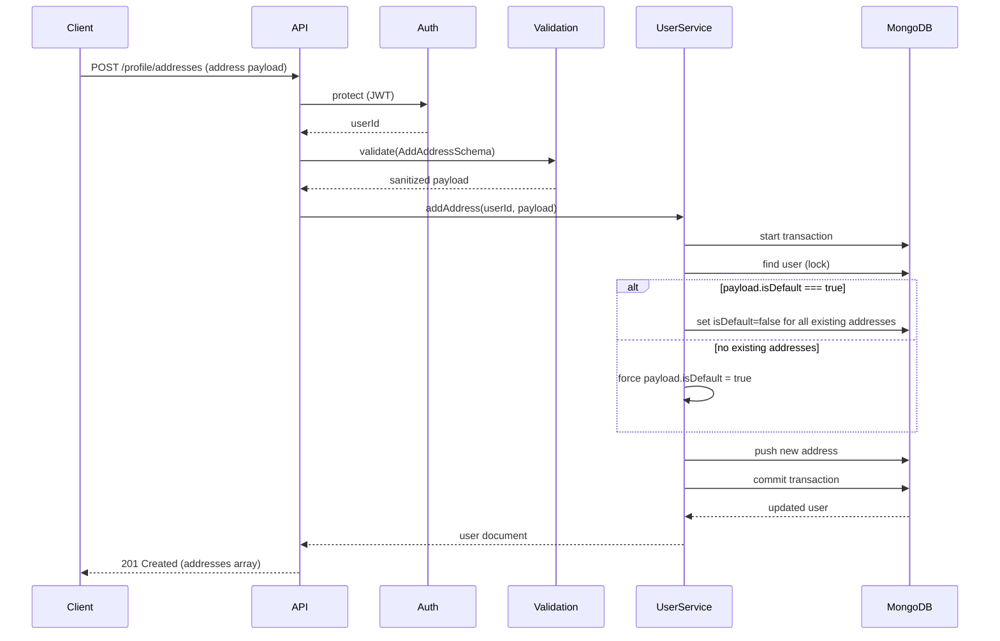
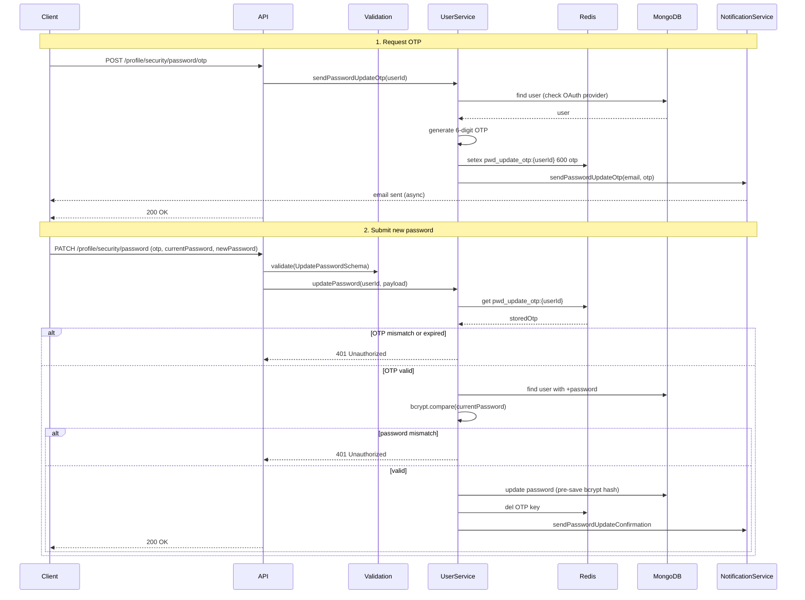
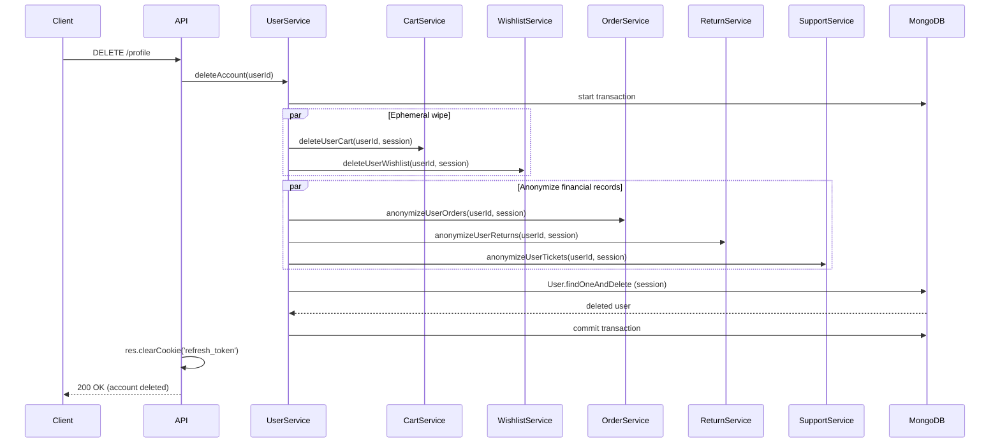

<div align="center">

  # User Identity & Logistics Module
  
  **The central hub for customer identity, address management, account security, and DPDP‑compliant data governance.**

  [](#)
  [](#)
  [](#)
  [](#)
  [](#)

</div>

---

## 1. Executive Summary & Architecture

The User Module (`src/modules/users/`) is the source of truth for customer identity, logistics (address book), and security credentials. It implements **enterprise‑grade protections** against mass assignment, session hijacking, and PII leakage, while fully supporting DPDP/GDPR rights (Right to be Forgotten, Data Portability).

**Base Route:** `/api/v1/users`

**Key architectural decisions:**

| Decision | Implementation | Consequence |
|----------|----------------|--------------|
| **Embedded address book** | `AddressSchema` as sub‑document array inside `User` model. | Single DB read fetches profile + all addresses → O(1) performance. |
| **Atomic default address toggle** | ACID transaction demotes previous default when new one is set. | No inconsistent state (zero or multiple defaults) even on crash. |
| **Step‑up authentication** | Password change requires OTP (Redis, 10m TTL) + current password hash. | Prevents session hijacking; OAuth accounts are blocked. |
| **Memory‑stream avatars** | Multer buffer → Cloudinary direct upload (no disk write). | Zero server storage, lower latency, CDN delivery. |
| **Saga deletion** | Transaction across Cart, Wishlist, Orders, Returns, Support + User deletion. | Full “Right to be Forgotten” without breaking financial audit trails. |

---

## 2. API Endpoints (All Private, require JWT)

All routes are prefixed with `/api/v1/users` and protected by `protect` middleware.  
Rate limiting (`standardLimiter`) applies globally.

### Profile Management

| Method | Route | Description | Validation |
|--------|-------|-------------|-------------|
| `GET` | `/profile` | Fetch authenticated user’s profile + address book | – |
| `PATCH` | `/profile` | Update demographics (firstname, lastname, phone, gender, dob) | `UpdateProfileSchema` (strict) |
| `POST` | `/profile/avatar` | Upload avatar (multipart/form-data, single file) | Multer validation |
| `DELETE` | `/profile` | Right to be Forgotten – delete account & anonymize data | – |
| `POST` | `/profile/export` | Request data export (BullMQ async) | – |

### Address Book (Logistics)

| Method | Route | Description | Validation |
|--------|-------|-------------|-------------|
| `POST` | `/profile/addresses` | Add new address (auto‑demote default if needed) | `AddAddressSchema` |
| `PATCH` | `/profile/addresses/:addressId` | Update address fields or toggle default | `UpdateAddressSchema` (partial) |
| `DELETE` | `/profile/addresses/:addressId` | Remove address; reassign default automatically | – |

### Security & Credentials

| Method | Route | Description | Validation |
|--------|-------|-------------|-------------|
| `POST` | `/profile/security/password/otp` | Request OTP for password change (email) | – |
| `PATCH` | `/profile/security/password` | Change password using OTP + current password | `UpdatePasswordSchema` |

---

## 3. Request Flow Sequence Diagrams

### 3.1 Add Address (with Default Toggle)



### 3.2 Password Change (Step‑Up Authentication)  



### 3.3 Right to be Forgotten (Account Deletion Saga)  



---  

## 4. Security & Payload Firewalls (Zod)

All incoming payloads are validated using strict Zod schemas. The `.strict()` modifier rejects any extra field, preventing **mass assignment** attacks.

### `UpdateProfileSchema`

| Field | Type | Validation | Notes |
|-------|------|------------|-------|
| `firstname` | `string` | min 2, max 50, optional | – |
| `lastname` | `string` | min 2, max 50, optional | – |
| `phone` | `string` | regex `^[6-9]\d{9}$` (Indian 10‑digit) | optional, unique |
| `gender` | `enum` | `"MALE" \| "FEMALE" \| "OTHER"` | optional |
| `dob` | `string` (ISO 8601) | `.datetime()` | optional |

### `AddAddressSchema`

| Field | Type | Validation | Default |
|-------|------|------------|---------|
| `street` | `string` | min 5, max 100 | required |
| `city` | `string` | min 2, max 50 | required |
| `state` | `string` | min 2, max 50 | required |
| `pincode` | `string` | regex `^[1-9][0-9]{5}$` | required |
| `label` | `enum` | `"HOME" \| "WORK" \| "OTHER"` | required |
| `isDefault` | `boolean` | optional | `false` |

### `UpdateAddressSchema`

Same as `AddAddressSchema` but all fields are `.partial()` – allows updating a single field.

### `UpdatePasswordSchema`

| Field | Type | Validation |
|-------|------|------------|
| `otp` | `string` | length 6 |
| `currentPassword` | `string` | min 1 |
| `newPassword` | `string` | min 8, at least one uppercase, one number, one special character |

### Additional security controls

- **Role hardcoding** – No role update exposed at all. Only `ADMIN` can be assigned via database seed scripts.
- **Log injection prevention** – `deleteAccount` uses `safeUserId = String(userId).replace(/[\r\n]/g, "")`.
- **NoSQL injection** – All queries use `$eq` operator with Mongoose.
- **Password hashing** – `bcrypt` with salt rounds = 12, triggered by `pre‑save` hook.
- **OTP expiry** – 10 minutes (600 seconds) TTL in Redis.

---

## 5. Database Design (MongoDB)

The User schema is the aggregate root for identity and logistics. It embeds addresses (max 10) to keep read operations optimal.  

### Schema Highlights  

```typescript
const AddressSchema = {
  street: String, city: String, state: String,
  pincode: String, label: "HOME"|"WORK"|"OTHER",
  isDefault: Boolean
};

const UserSchema = {
  authProvider: "LOCAL"|"GOOGLE",
  googleId: { type: String, sparse: true, unique: true },
  email: { type: String, unique: true, lowercase: true },
  password: { type: String, select: false },  // hidden by default
  role: "ADMIN"|"USER",
  firstname: String, lastname: String,
  phone: { type: String, sparse: true, unique: true },
  avatar: String (Cloudinary URL),
  gender: enum, dob: Date,
  addresses: [AddressSchema],
  wishlist: [ObjectId] (ref "Product"),
  razorpayCustomerId: String,
  loyaltyPoints: Number,
  preferences: { newsletter: Boolean, smsAlerts: Boolean, privacyPolicyAcceptedAt: Date },
  isEmailVerified: Boolean,
  isActive: Boolean,
  lastLogin: Date
};
```  

### Indexes (Performance & Uniqueness)  

| Index | Purpose |
|-------|---------|
| `email: unique` | Fast authentication lookup. |
| `googleId: unique, sparse` | Allows multiple null values for local users. |
| `phone: unique, sparse` | Only indexed when present. |
| `razorpayCustomerId: sparse` | Optional vault reference. |  

### Pre‑save Hook (Password Hashing)  

```typescript
UserSchema.pre("save", async function () {
  if (!this.isModified("password") || !this.password) return;
  const salt = await bcrypt.genSalt(12);
  this.password = await bcrypt.hash(this.password, salt);
});
```  

### Instance Method  

```typescript
UserSchema.methods.comparePassword = async function (candidatePassword: string): Promise<boolean> {
  if (!this.password) return false;
  return bcrypt.compare(candidatePassword, this.password);
};
```  

---  

## 4. Security & Payload Firewalls (Zod)

All incoming payloads are validated using strict Zod schemas. The `.strict()` modifier rejects any extra field, preventing mass assignment attacks.

### UpdateProfileSchema

| Field | Type | Validation | Notes |
|-------|------|------------|-------|
| `firstname` | `string` | min 2, max 50, optional | – |
| `lastname` | `string` | min 2, max 50, optional | – |
| `phone` | `string` | regex `^[6-9]\d{9}$` (Indian 10‑digit) | optional, unique |
| `gender` | `enum` | `"MALE" \| "FEMALE" \| "OTHER"` | optional |
| `dob` | `string` (ISO 8601) | `.datetime()` | optional |

### AddAddressSchema

| Field | Type | Validation | Default |
|-------|------|------------|---------|
| `street` | `string` | min 5, max 100 | required |
| `city` | `string` | min 2, max 50 | required |
| `state` | `string` | min 2, max 50 | required |
| `pincode` | `string` | regex `^[1-9][0-9]{5}$` | required |
| `label` | `enum` | `"HOME" \| "WORK" \| "OTHER"` | required |
| `isDefault` | `boolean` | optional | `false` |

### UpdateAddressSchema

Same as `AddAddressSchema` but all fields are `.partial()` – allows updating a single field.

### UpdatePasswordSchema

| Field | Type | Validation |
|-------|------|------------|
| `otp` | `string` | length 6 |
| `currentPassword` | `string` | min 1 |
| `newPassword` | `string` | min 8, at least one uppercase, one number, one special character |

### Additional security controls

- **Role hardcoding** – No role update exposed at all. Only `ADMIN` can be assigned via database seed scripts.
- **Log injection prevention** – `deleteAccount` uses `safeUserId = String(userId).replace(/[\r\n]/g, "")`.
- **NoSQL injection** – All queries use `$eq` operator with Mongoose.
- **Password hashing** – `bcrypt` with salt rounds = 12, triggered by `pre‑save` hook.
- **OTP expiry** – 10 minutes (600 seconds) TTL in Redis.

---

## 5. Database Design (MongoDB)

The User schema is the aggregate root for identity and logistics. It embeds addresses (max 10) to keep read operations optimal.

| Index | Purpose |
|-------|---------|
| `email: unique` | Fast authentication lookup. |
| `googleId: unique, sparse` | Allows multiple null values for local users. |
| `phone: unique, sparse` | Only indexed when present. |
| `razorpayCustomerId: sparse` | Optional vault reference. |

---

## 6. DPDP / GDPR Compliance (Privacy Engine)

### 6.1 Right to be Forgotten (Account Deletion Saga)

When a user calls `DELETE /profile`, the system executes an **ACID transaction** across multiple modules:

| Step | Module | Action |
|------|--------|--------|
| 1 | Cart | `deleteUserCart` – wipes ephemeral cart items |
| 2 | Wishlist | `deleteUserWishlist` – removes all wishlist references |
| 3 | Orders | `anonymizeUserOrders` – scrambles PII (name, address) but keeps order line items for tax audit |
| 4 | Returns | `anonymizeUserReturns` – same as orders |
| 5 | Support | `anonymizeUserTickets` – nullifies user reference, redacts user messages, destroys attachments |
| 6 | User | `findOneAndDelete` – permanently removes the user document |

**Result:** Business retains historical analytics (orders, tickets) without any personally identifiable information. The user’s refresh token cookie is cleared.

### 6.2 Right to Access (Data Portability)

`POST /profile/export` enqueues a job in **BullMQ** (`ExportQueueManager`). The worker compiles all user data (profile, orders, returns, tickets) into a JSON file and emails it to the user. The API returns `202 Accepted` immediately – non‑blocking.

### 6.3 Privacy‑Preserving Defaults

- `privacyPolicyAcceptedAt` timestamp proves consent.
- `isActive` soft‑delete flag allows banning without destroying foreign key references.
- `avatar` stored on Cloudinary; can be purged separately.

---

## 7. Asynchronous Notifications & Queue Integration

| Event | Notification Method | Queue |
|-------|---------------------|-------|
| Password update OTP | Email (via `NotificationService`) | None (synchronous, but email is async) |
| Password change confirmation | Email + In‑app (Bell icon) | BullMQ for email, fire‑and‑forget for DB |
| Data export completion | Email with JSON attachment | BullMQ (`ExportQueueManager`) |

**Design principle:** Security‑critical alerts (OTP) are sent synchronously to guarantee delivery before API responds. Non‑critical notifications (export) are queued.

---

## 8. File Structure Reference

| File | Responsibility |
|------|----------------|
| `user.routes.ts` | Route definitions, middleware chain (rate limit, auth, validation, upload) |
| `user.controller.ts` | HTTP boundary: extracts user ID, calls service, wraps `ApiResponse` |
| `user.service.ts` | Core business logic: profile CRUD, address book, password change, deletion saga |
| `user.model.ts` | Mongoose schema, `pre‑save` hook, `comparePassword` method |
| `user.interface.ts` | TypeScript interfaces (`IUser`, `IAddress`, `IUserPreferences`) |
| `dtos/update-profile.dto.ts` | Zod schema for profile updates (strict) |
| `dtos/address.dto.ts` | Zod schemas for add/update address (strict, partial) |
| `dtos/security.dto.ts` | Zod schema for password change (OTP + current + new) |   

### Related external modules

- `src/modules/notifications/notification.service.ts` – email and in‑app alerts
- `src/modules/orders/order.service.ts` – order anonymization
- `src/modules/returns/return.service.ts` – return anonymization
- `src/modules/support/support.service.ts` – ticket anonymization
- `src/shared/queues/export.queue.ts` – BullMQ data export worker
- `src/config/cloudinary.ts` – `uploadBufferToCloudinary` utility
- `src/config/redis.ts` – Redis client for OTP storage  

---  

## 9. Security Hardening Summary

| Threat | Mitigation |
|--------|------------|
| **Mass assignment** | Zod `.strict()` schemas reject extra fields (e.g., `role`, `loyaltyPoints`). |
| **Session hijacking (password change)** | Step‑up authentication: OTP (Redis, 10m) + current password hash. |
| **NoSQL injection** | Mongoose `$eq` operator + Zod type coercion. |
| **Log injection** | `safeUserId` strips CR/LF in `deleteAccount`. |
| **Password leak via query** | `select: false` on `password` field; only explicitly selected with `+password`. |
| **OAuth password bypass** | `sendPasswordUpdateOtp` checks `authProvider !== "GOOGLE"`. |
| **Address book bloat** | Service layer hard cap at 10 addresses per user. |
| **Avatar disk fill** | Direct memory‑stream to Cloudinary – no local file write. |
| **Default address inconsistency** | ACID transaction demotes previous default atomically. |  

---  

## See Also

- [Authentication Module](./auth-module.md) – JWT issuance and refresh logic.
- [Order Module](./order-module.md) – order anonymization on account deletion.
- [Return Module](./return-module.md) – return anonymization.
- [Support Module](./support-module.md) – ticket anonymization (redacts user messages).
- [Media & Storage](../architecture/media-and-storage.md) – avatar streaming.  

---  

*The Reshma-Core Team*  