  # Wishlist Module Architecture
  
  **The read-optimized, concurrency-safe sandbox for deferred purchase intent and customer retention.**

  
  
  

## 1. Executive Summary & Domain Boundaries

The Wishlist Module (`src/modules/wishlists/`) handles deferred purchase intent. Unlike a Cart—which is highly volatile and tightly coupled to checkout math—a Wishlist acts as persistent, long-term storage. Because users treat wishlists as indefinite bookmarks, this module is engineered strictly for **Read Optimization** and **Data Hygiene**. 

**Base Route:** `/api/v1/wishlists`

## 2. Database Architecture & BSON Optimization

A naive approach to wishlists is embedding an array of `ObjectId` strings directly on the `User` document. We explicitly rejected this to protect the Node.js memory heap. If a user bookmarks 500 items, dragging that array into memory during every login or profile update creates severe BSON bloat.

### A. The Dedicated Collection
We implemented a dedicated `Wishlist` collection enforcing a strict One-to-One relationship with the User via a `unique: true` database index. This ensures wishlist queries are isolated from core identity operations.

### B. Sub-Document Optimization (`_id: false`)
Within the `items` array, MongoDB natively generates a unique 24-character hex `_id` for every sub-document. For a wishlist, this is wasted disk space. We explicitly set `{ _id: false }` on the `WishlistItemSchema`. We query and mutate items relying entirely on the referenced `product` ObjectId, significantly reducing the overall RAM footprint of the collection.

### C. Zero-Price Persistence
Prices and inventory fluctuate. The Wishlist schema intentionally omits pricing or `isActive` status. It stores only the `product` ID and an `addedAt` timestamp[cite: 9].  

The service layer dynamically injects the live state via Mongoose `.populate()` at runtime[cite: 9].

---

## 3. Concurrency & The "Lost Update" Problem

Handling rapid, concurrent mutations in Node.js (which runs on a single-threaded event loop) requires delegating lock management to the MongoDB C++ storage engine. We **completely bypass** Mongoose's `.save()` method for item additions to avoid Race Conditions[cite: 9].

### The Threat Vector
If a user rapidly taps "Add to Wishlist" on two different products across two browser tabs, Node.js might pull the document into memory twice simultaneously. If both threads call `.save()`, the slower thread overwrites the database, permanently deleting the first item (The "Lost Update" Problem).

### The Atomic Solution
The `addItem` service method relies exclusively on MongoDB Atomic Operators[cite: 9]:

1. **Idempotency Firewall:** The `$push` operation is explicitly guarded by a query parameter: `"items.product": { $ne: safeProductId }`[cite: 9].  

    This physically prevents MongoDB from inserting duplicate products, even if the frontend fails to debounce user clicks[cite: 9].

2. **Atomic Execution:** `Wishlist.updateOne({ ... }, { $push: ... })` executes entirely within the database engine[cite: 9], ensuring absolute mathematical consistency without requiring heavy multi-document ACID transactions.

---

## 4. Initialization & State Management Workflows

### A. Lazy Initialization & The E11000 Catcher
Creating a blank wishlist for every user at registration wastes database capacity. Instead, the module uses **Lazy Initialization**[cite: 9].  

When `addItem` is called, it checks if a wishlist exists[cite: 9].  

If not, it attempts to create one[cite: 9].  

However, to handle the edge case of concurrent initializations, the creation block is wrapped in a `try/catch` specifically targeting MongoDB Error `11000` (Duplicate Key)[cite: 9].  

If a parallel thread already created the document a millisecond prior, the service gracefully catches the error and proceeds to the `$push` execution[cite: 9].

### B. The Self-Healing Read Cycle
E-commerce catalogs change. Admins delete products or toggle `isActive: false`. 
When `getWishlist` is invoked, it populates the items[cite: 9].  

The service iterates through the array and identifies "Ghost Items" (products that return `null` or `isActive: false`)[cite: 9].  

It collects these dead ObjectIds and fires an asynchronous, atomic `$pull` command to silently purge them from the database[cite: 9].  

The user is returned a mathematically clean array without experiencing application crashes.

---

## 5. Inter-Domain Communication: Move to Cart

Bridging the Wishlist and the Cart is the most delicate operation in this module. The Wishlist must transfer the item without exposing the business to inventory vulnerabilities (like bypassing stock limits).

* **The Setup:** The user triggers `POST /move-to-cart/:productId` and provides their `selectedAttributes` (e.g., Size, Color)[cite: 9].
* **The Handoff:** The `WishlistService` intentionally refuses to execute cart logic. It directly calls `CartService.addItem(safeUserId, payload)`[cite: 9].
* **ACID Assurance:** `CartService` operates within a strict MongoDB `startSession()` transaction. It checks live stock, reserves the inventory, and recalculates promotional coupons.
* **The Cleanup:** If (and only if) the `CartService` resolves successfully, the `WishlistService` executes an atomic `$pull` to surgically remove the item from the wishlist[cite: 9]. If the cart rejects the item (e.g., Out of Stock), the execution throws an `AppError`, preserving the item safely in the user's wishlist[cite: 9].

---

## 6. Visual Workflow (Move To Cart Lifecycle)

```mermaid
sequenceDiagram
    autonumber
    actor User
    participant WishlistController
    participant WishlistService
    participant CartService
    participant MongoDB

    User->>WishlistController: POST /move-to-cart/:productId (Size: M)
    WishlistController->>WishlistService: moveToCart(userId, productId, payload)
    
    %% Verification Phase
    WishlistService->>MongoDB: findOne(Wishlist)
    MongoDB-->>WishlistService: Returns Document
    WishlistService->>WishlistService: Verify item exists in array

    %% Cross-Module Handoff
    Note over WishlistService, CartService: Cross-Module Delegation
    WishlistService->>CartService: CartService.addItem(userId, payload)
    
    %% Cart ACID Transaction
    rect rgb(30, 30, 30)
        Note right of CartService: Cart ACID Session
        CartService->>MongoDB: Check Product Stock
        MongoDB-->>CartService: Stock = 5
        CartService->>MongoDB: Atomic Cart $push
        CartService->>CartService: Recalculate Coupons
        CartService-->>WishlistService: Success (Returns updated Cart)
    end

    %% Wishlist Cleanup
    Note over WishlistService, MongoDB: Atomic Cleanup
    WishlistService->>MongoDB: updateOne({ $pull: { items: { product: productId } } })
    WishlistService-->>WishlistController: Returns healed Wishlist
    WishlistController-->>User: 200 OK (Item Moved)
```  

--- 

## 7. Security & OWASP Hardening

The Wishlist module sits behind multiple layers of strict validation to prevent malicious exploitation [cite: 9].

### A. CWE-400: Uncontrolled Resource Consumption (Memory Exhaustion)

To prevent bad actors from overloading the database and crashing the Node.js V8 heap during `.populate()` execution, the `addItem` service implements a hard capacity firewall [cite: 9].  

If `wishlist.items.length >= 100`, the API instantly rejects the request with a `400 Bad Request` [cite: 9].

### B. CWE-943: NoSQL Operator Injection

The `wishlist.dto.ts` applies the `objectIdValidator` to every incoming parameter [cite: 9].  

By strictly forcing the `productId` to match the regex `/^[0-9a-fA-F]{24}$/`, we make it mathematically impossible for an attacker to pass a MongoDB query object (e.g., `{ "$ne": null }`) through the URL or Body [cite: 9].

### C. CWE-117: Improper Output Neutralization (Log Injection)

All user-controlled inputs (User IDs, Product IDs) are funneled through the `safeLog()` private utility before reaching the Winston logger [cite: 9].  

This `.replace(/[\r\n]/g, "")` operation strips carriage returns, preventing attackers from forging fake, multiline log entries to obscure their activity [cite: 9].

### D. CWE-1321: Improperly Controlled Modification of Object Prototype Attributes

The `AddWishlistItemSchema` and `MoveToCartSchema` invoke Zod's `.strict()` method [cite: 9].  

Any request containing undocumented keys is physically dropped before the Express Controller executes, entirely neutralizing Prototype Pollution attempts [cite: 9].

---

**Standard Documentation | Reshma-Core Architecture**