<div align="center">

  # Wishlist Module Architecture
  
  **The read‑optimized, concurrency‑safe sandbox for deferred purchase intent and customer retention.**

  [](#)
  [](#)
  [](#)
  [](#)

</div>

---

## 1. Executive Summary & Domain Boundaries

The Wishlist Module (`src/modules/wishlists/`) handles **deferred purchase intent**. Unlike a Cart—which is highly volatile and tightly coupled to checkout math—a Wishlist acts as persistent, long‑term storage. Because users treat wishlists as indefinite bookmarks, this module is engineered strictly for **Read Optimization**, **Data Hygiene**, and **Atomic Concurrency Control**.

**Base Route:** `/api/v1/wishlists`

**Key architectural decisions:**

| Decision | Implementation | Consequence |
|----------|----------------|--------------|
| **Dedicated collection** | `Wishlist` model with `user: { unique: true }` | Queries isolated from `User` document; no profile bloat. |
| **Sub‑document `_id: false`** | `WishlistItemSchema` disables automatic `_id` generation | Saves disk space and RAM for large wishlists. |
| **Zero‑price persistence** | Stores only `product` ObjectId + `addedAt` timestamp | Live prices/inventory fetched via `.populate()` at read time. |
| **Atomic `$push` with idempotency guard** | `updateOne({ "items.product": { $ne: productId } }, { $push })` | Prevents duplicates even without frontend debouncing. |
| **Self‑healing read cycle** | `getWishlist` filters out inactive products and purges them via `$pull` | Users never see ghost items; database stays clean. |
| **Lazy initialization + E11000 catcher** | Create only on first add; catch duplicate key race | Zero waste for inactive users; handles concurrent first writes. |

---

## 2. API Endpoints (All Private, require JWT)

All routes are prefixed with `/api/v1/wishlists` and protected by `standardLimiter` + `protect` middleware.

| Method | Route | Description | Validation |
|--------|-------|-------------|-------------|
| `GET` | `/` | Fetch user’s wishlist (self‑healing) | – |
| `POST` | `/add` | Add product to wishlist | `AddWishlistItemSchema` |
| `DELETE` | `/item/:productId` | Remove a specific product | `RemoveWishlistItemSchema` (params) |
| `POST` | `/move-to-cart/:productId` | Transfer item to cart (atomic cross‑module) | `MoveToCartSchema` (params + body) |
| `DELETE` | `/clear` | Empty entire wishlist | – |

> **Note:** All payloads are validated with Zod `.strict()`, rejecting any extra fields.

---

## 3. Database Architecture & BSON Optimization

### 3.1 Dedicated Collection (Not Embedded in User)

A naive approach would embed a `wishlist` array directly on the `User` document. We explicitly rejected this because a user could bookmark hundreds of products, dragging massive BSON objects into memory during every login or profile update.

**Solution:** A separate `Wishlist` collection with a `unique: true` index on `user` guarantees a one‑to‑one relationship and isolates wishlist queries from core identity operations.

### 3.2 Sub‑document Optimization (`_id: false`)

MongoDB automatically generates a 24‑byte `_id` for every sub‑document in an array. For a wishlist, this is wasted disk space and RAM. The schema explicitly disables it:

```typescript
const WishlistItemSchema = new Schema(
  { product: { type: Schema.Types.ObjectId, ref: "BaseProduct", required: true }, addedAt: { type: Date, default: Date.now } },
  { _id: false }   // ← prevents bloat
);
```  

### 3.3 Zero‑Price Persistence  

Prices, discounts, and `isActive` status change daily. Storing them in the wishlist would cause stale data. The schema stores **only** the `product` ID and an `addedAt` timestamp. Live data is injected at read time via Mongoose `.populate()`.  

---  

## 4. Concurrency & The "Lost Update" Problem

### 4.1 The Threat Vector

If a user rapidly taps "Add to Wishlist" on two different products across two browser tabs, Node.js might pull the same wishlist document into memory twice. If both threads call `.save()`, the slower thread overwrites the database, permanently deleting the first item – the classic **Lost Update** problem.

### 4.2 The Atomic Solution

The `addItem` method **never** uses `.save()`. Instead, it relies on MongoDB atomic update operators:  

```typescript
await Wishlist.updateOne(
  {
    user: { $eq: safeUserId },
    "items.product": { $ne: safeProductId }   // ← idempotency guard
  },
  { $push: { items: { product: new Types.ObjectId(safeProductId) } } }
);
```  

- **Idempotency Firewall:** The query condition "items.product": { $ne: safeProductId } prevents MongoDB from inserting a duplicate, even if the frontend fails to debounce clicks.
- **Atomic Execution:** The entire updateOne runs inside the database engine – no race conditions.  

---  

## 5. Initialization & State Management

### 5.1 Lazy Initialization + E11000 Catcher

Creating a blank wishlist for every user at registration wastes capacity. Instead, the module creates the wishlist **only** when the user adds their first item.

However, two concurrent `addItem` requests could both see “no wishlist exists” and both attempt to create one. The second would hit a **duplicate key error (E11000)**. The service gracefully handles this:  

```typescript
try {
  await Wishlist.create([{ user: safeUserId, items: [] }]);
} catch (err: unknown) {
  const mongoError = err as { code?: number };
  if (mongoError.code !== 11000) throw err;   // ignore duplicate key
}
```  

If a parallel thread already created the document, the error is swallowed and execution proceeds to the atomic $push.  

### 5.2 Self‑Healing Read Cycle

When `getWishlist` is called:

1. It populates the `items.product` field with live product data.
2. It iterates through the array, identifying “ghost items” (products that are `null`, deleted, or `isActive: false`).
3. It collects their ObjectIds and fires an **atomic** `$pull` to silently purge them from the database.
4. The user receives a mathematically clean array without ever seeing broken references.  

```typescript
if (deadProductIds.length > 0) {
  await Wishlist.updateOne(
    { user: { $eq: safeUserId } },
    { $pull: { items: { product: { $in: deadProductIds } } } }
  );
}
```  

---  

## 6. Inter‑Domain Communication: Move to Cart

The most delicate operation is transferring an item from the wishlist to the cart. This must guarantee that inventory limits are respected and that the item is **not** removed from the wishlist if the cart operation fails.

### Sequence Diagram  

```mermaid
sequenceDiagram
    autonumber
    actor User
    participant Controller
    participant WishlistService
    participant CartService
    participant MongoDB

    User->>Controller: POST /move-to-cart/:productId (quantity, selectedAttributes)
    Controller->>WishlistService: moveToCart(userId, productId, payload)
    
    rect rgb(30,30,30)
        Note over WishlistService,MongoDB: 1. Verification
        WishlistService->>MongoDB: find wishlist for user
        MongoDB-->>WishlistService: wishlist document
        WishlistService->>WishlistService: verify item exists
    end

    rect rgb(40,40,40)
        Note over WishlistService,CartService: 2. Cross‑module handoff
        WishlistService->>CartService: CartService.addItem(userId, payload)
        CartService->>MongoDB: start transaction, check stock
        MongoDB-->>CartService: stock available
        CartService->>MongoDB: atomic cart $push, commit
        CartService-->>WishlistService: success (updated cart)
    end

    rect rgb(30,30,30)
        Note over WishlistService,MongoDB: 3. Atomic cleanup
        WishlistService->>MongoDB: updateOne({ $pull: { items: { product: productId } } })
        MongoDB-->>WishlistService: acknowledged
    end

    WishlistService-->>Controller: fresh wishlist
    Controller-->>User: 200 OK (item moved)
```  



**Critical guarantee:** If `CartService.addItem` fails (e.g., out of stock, invalid attributes), it throws an `AppError`. The wishlist `$pull` is **never** executed, leaving the item safely in the wishlist.  

---  

## 7. Security & OWASP Hardening

The Wishlist module sits behind multiple layers of strict validation and operational guards.

### A. CWE‑400: Uncontrolled Resource Consumption (Memory Exhaustion)

To prevent a malicious user from filling their wishlist with thousands of items (which would bloat the database and crash the Node.js heap during `.populate()`), the `addItem` service implements a **hard capacity firewall**:  

```typescript
if (existingWishlist.items.length >= 100) {
  throw new AppError(HTTP_STATUS.BAD_REQUEST, "Wishlist capacity limit (100) reached.");
}
```  

### B. CWE‑943: NoSQL Operator Injection  
All incoming `productId` parameters are validated against a strict regex in `wishlist.dto.ts`:  
```typescript
const objectIdValidator = z.string().regex(/^[0-9a-fA-F]{24}$/, "Invalid Product ID format");
```  

This makes it mathematically impossible for an attacker to pass a MongoDB operator object (e.g., `{ "$ne": null }`) through the URL or request body.  

### C. CWE‑117: Improper Output Neutralization (Log Injection)  

Every user‑controlled input (userId, productId) passed to the logger is sanitized with:  

```typescript
private static safeLog(message: string): string {
  return message.replace(/[\r\n]/g, "");
}
```  

This strips carriage returns and line feeds, preventing attackers from forging fake multi‑line log entries.  

### D. CWE‑1321: Prototype Pollution  

All Zod schemas use `.strict()`, which rejects any request containing undocumented keys. This neutralises prototype pollution attempts that try to inject `__proto__` or `constructor` properties.  

---  

## 8. File Structure Reference

| File | Responsibility |
|------|----------------|
| `wishlist.routes.ts` | Route definitions with `standardLimiter`, `protect`, `validate` |
| `wishlist.controller.ts` | HTTP boundary; wraps methods with `catchAsync`; calls service |
| `wishlist.service.ts` | Core logic: add (atomic), remove, clear, moveToCart, self‑healing read, DPDP deletion |
| `wishlist.model.ts` | Mongoose schemas (`WishlistItemSchema` with `_id: false`, `WishlistSchema` with unique user index) |
| `wishlist.interface.ts` | TypeScript interfaces (`IWishlistItem`, `IWishlist`) |
| `wishlist.dto.ts` | Zod schemas: `objectIdValidator`, `AddWishlistItemSchema`, `RemoveWishlistItemSchema`, `MoveToCartSchema` |

### Related external modules

- `src/modules/cart/cart.service.ts` – consumed by `moveToCart`
- `src/modules/products/models/base-product.model.ts` – populated for live product data
- `src/shared/middlewares/rate-limit.middleware.ts` – `standardLimiter`
- `src/shared/middlewares/auth.middleware.ts` – `protect`  

---  

## 9. DPDP / GDPR Integration

When a user exercises their Right to be Forgotten (account deletion), the `UserService.deleteAccount` saga calls `WishlistService.deleteUserWishlist` within the same ACID transaction. This permanently removes the entire wishlist document, ensuring no orphaned data remains.  

```typescript
public static async deleteUserWishlist(userId: string, session: mongoose.ClientSession) {
  return await Wishlist.deleteOne({ user: { $eq: safeUserId } }, { session });
}
```  

---  

## 10. Summary of Operational Guarantees

| Concern | Guarantee |
|---------|------------|
| **Duplicate items** | Atomic `$push` with `$ne` guard prevents duplicates at database level. |
| **Lost updates** | No `.save()` – only atomic `updateOne` and `findOneAndUpdate`. |
| **Concurrent first write** | `E11000` catcher handles duplicate key gracefully. |
| **Ghost/deleted products** | Self‑healing read purges them automatically. |
| **Inventory integrity on move‑to‑cart** | Cart transaction must succeed before wishlist `$pull`; otherwise item stays. |
| **Wishlist bloat** | Hard cap at 100 items. |
| **NoSQL injection** | Zod `objectIdValidator` regex rejects operators. |
| **Log injection** | `safeLog` strips CR/LF. |   

---  

## See Also

- [Cart Module](./cart-module.md) – cross‑module handoff for `moveToCart`.
- [Product Module](./product-module.md) – `BaseProduct` population and `isActive` flag.
- [User Module](./user-module.md) – account deletion saga that calls `deleteUserWishlist`.
- [Security Hardening](../architecture/security-hardening.md) – rate limiting, validation, and OWASP controls.
- [Database Design](../architecture/database-design.md) – embedded vs. referenced decisions.  

--- 

*The Reshma-Core Team*  